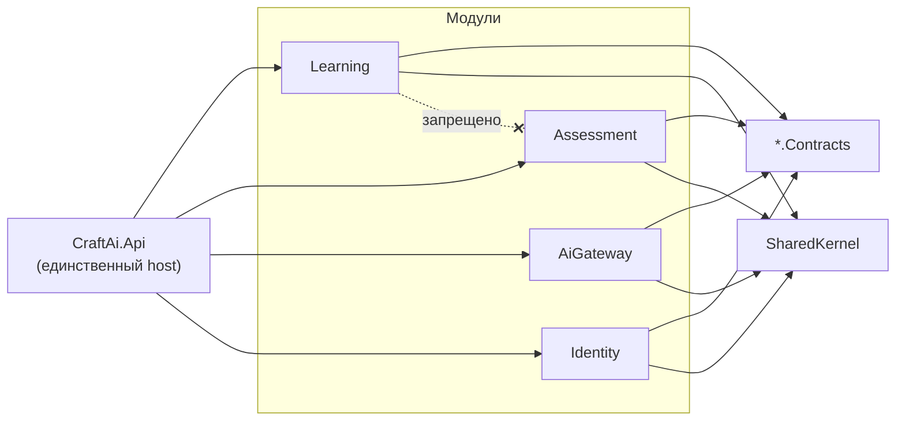

# План работ: инициализация каркаса платформы `platform/`

**Задача.** Создать в репозитории каталог `platform/` с двумя подпроектами:
`front` — пустой монорепозиторий Nx + Angular с Tailwind CSS v4, `back` — backend
на .NET 10.

**Смежные документы.**
[02-moduli-matrix-builder-pisa.md](02-moduli-matrix-builder-pisa.md) — состав
продуктовых модулей и их отображение на модули кода.
[03-design-system.md](03-design-system.md) — дизайн-система кабинета на бренде
`eighth-version` (шаг 2.5 ниже).
[04-landing-migration.md](04-landing-migration.md) — перенос публичного сайта
`eighth-version/` в это же Nx-приложение как второе приложение `apps/landing`
(SSR + `@angular/localize`); отдельный этап после шага 2 ниже.
[../adr/](../adr/README.md) — принятые решения по стеку: [ADR-0001](../adr/0001-backend-stack-dotnet.md)
(бэкенд) и [ADR-0002](../adr/0002-frontend-stack-angular-tailwind.md) (фронтенд).

**Результат этапа.** Работающий скелет: оба проекта собираются, запускаются
локально, отдают health-check и «пустую» страницу, покрыты CI. Бизнес-логики нет —
она приходит на этапе 1 по [ТЗ](../tz/README.md).

**Что этот этап НЕ делает:** не реализует ни одного требования FR-*, не создаёт
схему БД предметной области, не переносит контент из `eighth-version/` — перенос
публичного сайта в `apps/landing` описан отдельно, в [04-landing-migration.md](04-landing-migration.md).

---

## 1. Итоговая структура каталогов

```
ai-sana/
├── eighth-version/              # существующий публичный сайт — не трогаем
├── docs/
│   ├── tz/                      # техническое задание
│   └── plan/                    # этот план
└── platform/                    # ← создаётся на этом этапе
    ├── README.md                # как поднять оба проекта локально
    ├── .editorconfig            # единые правила для .ts и .cs
    ├── docker-compose.yml       # PostgreSQL + Redis для локальной разработки
    ├── front/                   # Nx workspace (Angular)
    └── back/                    # .NET solution
```

---

## 2. Решения по стеку

### 2.1. Frontend — принятое решение

> **Стек утверждён:** Nx + Angular + Tailwind CSS v4. Решение и сверка с
> официальными скиллами Angular — [ADR-0002](../adr/0002-frontend-stack-angular-tailwind.md);
> таблица стека в [части 1 ТЗ](../tz/01-tz-platforma.md) приведена в соответствие.

| Решение | Значение | Обоснование |
|---|---|---|
| Монорепозиторий | Nx | Требование заказчика. Даёт границы модулей, кэш сборки, единый линт |
| Фреймворк | Angular (последняя стабильная) | Требование заказчика. Строгая структура и типизация подходят для долгоживущей платформы с большой командой |
| Пресет Nx | `angular-monorepo` | Сразу создаёт `apps/` + `libs/`, в отличие от standalone-варианта |
| Приложение | одно: `craft-web` | Кабинеты ученика/учителя/администрации — роли внутри одного SPA, а не разные приложения |
| Стили | Tailwind CSS v4 поверх токенов дизайн-системы | Утилиты закрывают раскладку и плотность, бренд-слой остаётся в CSS-переменных с лендинга — см. [03-design-system.md](03-design-system.md) |
| Конфигурация Tailwind | Только CSS (`@import 'tailwindcss'` + `@theme`), без `tailwind.config.js` | Требование Tailwind v4: файла конфигурации больше нет, тема задаётся переменными |
| Токены и глобальные стили | SCSS в `libs/shared/ui-tokens` | Токены, `@font-face`, reset и a11y-база не выражаются утилитами |
| Тесты | Jest (unit) + Playwright (e2e) | Playwright уже используется в репозитории (`.playwright-mcp/`) |
| SSR | выключен | Кабинет за авторизацией, SEO не нужен; SSR усложняет разработку без выгоды |
| Nx Cloud | отключён | Не заводим внешнюю зависимость до решения по CI |

### 2.2. Backend — принятое решение

> **Стек утверждён:** .NET 10 (LTS) + ASP.NET Core, модульный монолит, а не
> микросервисы. Решение и сверка с официальными скиллами .NET —
> [ADR-0001](../adr/0001-backend-stack-dotnet.md); вопрос Q-7 из ТЗ закрыт.

**Почему модульный монолит:**

- Нагрузка по ТЗ (60 000 учеников, 5 000 одновременно) закрывается несколькими
  экземплярами одного приложения — распределённая система здесь не нужна.
- Команда 12–16 человек. Микросервисы для такой команды дают распределённые
  транзакции, сложный локальный запуск и рост инфраструктурных затрат без выгоды.
- Учебные данные сильно связаны: прогресс → попытка → оценка → отчёт. Разрезать это
  по сервисам — значит получить согласованность через события там, где достаточно
  одной транзакции БД.
- Модульность сохраняется на уровне кода: у каждого модуля своя схема в БД, свой
  публичный контракт и запрет на прямые ссылки между внутренностями модулей.
  Если модуль (например, AiGateway) придётся выделить в отдельный сервис — граница
  уже проведена и вынос будет механическим.

**Почему вертикальные срезы (Vertical Slice), а не классическая многослойка:**

- Каноническая Clean Architecture на каждый модуль даёт 4 проекта и цепочку
  интерфейс → сервис → репозиторий → EF на каждую операцию. Для CRUD-подобных
  сценариев (а их в LMS большинство) это накладные расходы без пользы.
- Вертикальный срез = одна папка на сценарий: endpoint, обработчик, запрос/ответ,
  валидатор. Изменение сценария затрагивает одну папку, а не пять проектов.
- Домен там, где он есть: правила статуса ученика, оценивание, лимиты ИИ живут
  в `Domain/` модуля и покрываются модульными тестами.

| Решение | Значение | Обоснование |
|---|---|---|
| Платформа | .NET 10 (LTS) | LTS обязателен: школьная система живёт годами, обновления безопасности нужны предсказуемо |
| Тип приложения | ASP.NET Core Web API, Minimal APIs с `MapGroup` по модулям | Меньше церемоний, чем контроллеры; удобно группировать срезы |
| Архитектура | Модульный монолит + вертикальные срезы внутри модулей | См. выше |
| Посредник (mediator) | **Не используем.** Обработчики — обычные классы в DI, вызываются из endpoint напрямую | Убирает лишний слой косвенности и снимает лицензионный риск популярных библиотек |
| ORM | EF Core 10 + Npgsql | Миграции, LINQ, schema-per-module |
| БД | PostgreSQL 16+ | По ТЗ (раздел 5.3 части 1) |
| Мультиарендность | Общая БД, колонка `organization_id`, глобальные фильтры EF Core + резолв арендатора в middleware; опционально Row-Level Security в Postgres как второй рубеж | FR-CORE-01 — изоляция школ обязана работать на сервере, а не в запросах вручную |
| Аутентификация | ASP.NET Core Identity + собственная выдача JWT с ротацией refresh-токенов | Достаточно для FR-CORE-03/06; внешний OIDC (INT-03) подключается как схема аутентификации, свой IdentityServer не нужен |
| Реальное время | SignalR + Redis backplane | Дашборд учителя, FR-MTX-13 (≤ 5 с), масштабирование на несколько экземпляров |
| Фоновые задачи | Hangfire (или Quartz.NET) | Отчёты, срезы, рассылки, пересчёт аналитики |
| Кэш / очереди | Redis | Сессии урока, лимиты ИИ, backplane |
| Локальная оркестрация | .NET Aspire (AppHost + ServiceDefaults) | Один `dotnet run` поднимает API + Postgres + Redis; ServiceDefaults сразу даёт OpenTelemetry, health-checks и политики устойчивости (NFR-OBS-01…03) |
| Валидация | FluentValidation **или** фильтры Minimal API + DataAnnotations | Решается на шаге 0 после проверки лицензии |
| Контракт API | Встроенный `Microsoft.AspNetCore.OpenApi` + Scalar UI | API-01: OpenAPI 3.1 публикуется вместе с релизом |
| Миграции | Отдельный `MigrationService`, запускаемый до раскатки | Миграции на старте приложения ломают rolling update (NFR-MNT-05) |
| Тесты | xUnit + `WebApplicationFactory` + Testcontainers (настоящий Postgres) + NetArchTest | Интеграционные тесты на реальной БД; NetArchTest стережёт границы модулей |
| Версии пакетов | Central Package Management (`Directory.Packages.props`) | Одна версия пакета на весь solution |

> **Проверить на шаге 0:** часть популярных .NET-библиотек (MediatR, AutoMapper,
> FluentValidation, Hangfire) за последние годы меняла модель лицензирования.
> Перед добавлением любой из них — проверить актуальную лицензию и коммерческие
> пороги. План намеренно составлен так, что без mediator и AutoMapper он работает.

### 2.3. Версии

Фактические версии фиксируются на шаге 0 и записываются сюда:

| Компонент | Планируемая | Фактическая (заполнить) |
|---|---|---|
| .NET SDK | 10.x (LTS) | |
| Node.js | 22.x LTS | 22.22.2 |
| Nx | последняя стабильная | 21.6.11 — см. примечание ниже |
| Angular | последняя стабильная | 20.3.0 |
| PostgreSQL | 16+ | |

> **Примечание по Nx.** `create-nx-workspace@latest` (23.2.1) на момент выполнения
> шага 2 сменил генерацию воркспейса на шаблонный движок (`nrwl/angular-template`
> вместо классического пресета `angular-monorepo`): вместо `apps/`+`libs/` с Jest
> получаются `packages/`, Vitest, `canvas`, `msw` и файлы AI-агентов — не то, что
> описано в этом плане. Кроме того, установка зависимостей падала с багом npm/arborist
> (`Cannot read properties of null (reading 'edgesOut')`), воспроизводимым дважды подряд
> после очистки кэша. Зафиксирована последняя стабильная версия `21.x`
> (`create-nx-workspace@21.6.11`), которая всё ещё генерирует классическую структуру
> `apps/`+`libs/` с Jest, как и предполагает раздел 2.1. Пересмотреть при следующем
> апдейте зависимостей фронтенда.

---

## 3. Целевая структура backend

```
platform/back/
├── CraftAi.sln
├── global.json                          # пин версии SDK
├── Directory.Build.props                # nullable, TreatWarningsAsErrors, LangVersion
├── Directory.Packages.props             # централизованные версии пакетов
├── src/
│   ├── Bootstrap/
│   │   ├── CraftAi.Api/                 # единственный веб-хост, собирает модули
│   │   ├── CraftAi.AppHost/             # .NET Aspire: оркестрация локально
│   │   ├── CraftAi.ServiceDefaults/     # OTel, health-checks, resilience
│   │   └── CraftAi.MigrationService/    # применение миграций отдельным шагом
│   ├── Shared/
│   │   ├── CraftAi.SharedKernel/        # Result, типизированные Id, ошибки, ITimeProvider
│   │   └── CraftAi.Contracts/           # межмодульные контракты и интеграционные события
│   └── Modules/
│       ├── Identity/                    # FR-CORE-03…06, FR-RBAC-*
│       ├── Organizations/               # FR-CORE-01, 02, 08
│       ├── Content/                     # FR-CNT-*, FR-CMS-*, ЦО/ТУП, методкарты
│       ├── Learning/                    # FR-MTX-*, FR-SIM-* — ядро CRAFT MATRIX
│       ├── Assessment/                  # FR-ASM-* — движок заданий и оценивания
│       ├── AiGateway/                   # FR-AI-*
│       ├── Builder/                     # FR-BLD-* — надстройка CRAFT BUILDER
│       ├── Pisa/                        # FR-PSA-* — надстройка CRAFT PISA
│       ├── Analytics/                   # FR-ANL-*
│       └── Notifications/               # FR-NTF-*

Отдельного модуля `Matrix` нет: CRAFT MATRIX собирается из Content + Learning +
Assessment. Разбор состава всех трёх продуктовых модулей —
в [02-moduli-matrix-builder-pisa.md](02-moduli-matrix-builder-pisa.md).
└── tests/
    ├── CraftAi.Architecture.Tests/      # границы модулей
    ├── CraftAi.Api.IntegrationTests/    # Testcontainers + WebApplicationFactory
    └── CraftAi.Modules.<X>.UnitTests/
```

Каждый модуль — два проекта:

```
Modules/Learning/
├── CraftAi.Modules.Learning.Contracts/  # что модуль обещает наружу (интерфейсы, DTO, события)
└── CraftAi.Modules.Learning/            # реализация; наружу не видна
    ├── LearningModule.cs                # AddLearningModule() + MapLearningEndpoints()
    ├── Features/                        # вертикальные срезы
    │   └── SubmitAttempt/
    │       ├── SubmitAttemptEndpoint.cs
    │       ├── SubmitAttemptHandler.cs
    │       ├── SubmitAttemptRequest.cs
    │       └── SubmitAttemptValidator.cs
    ├── Domain/                          # правила: статус ученика, прогресс
    └── Persistence/
        ├── LearningDbContext.cs         # схема learning
        ├── Configurations/
        └── Migrations/
```

**Правило зависимостей (проверяется тестом):** `CraftAi.Modules.A` может ссылаться
на `CraftAi.Modules.B.Contracts`, но **никогда** на `CraftAi.Modules.B`.
`CraftAi.Api` ссылается на все модули и ни на что больше не влияет.



---

## 4. Пошаговый план

### Шаг 0. Предусловия (до начала работы)

- [ ] Установить .NET SDK 10 (LTS). **В текущем окружении `dotnet` отсутствует** —
      без него шаги 3–6 выполнить нельзя.
- [ ] Проверить Node.js ≥ 22 LTS и npm (в окружении: Node 22.22, npm 10.9 — есть).
- [ ] Проверить Docker (есть: 29.3) — нужен для Testcontainers и `docker-compose`.
- [ ] Зафиксировать фактические версии в таблице 2.3.
- [ ] Принять решения из раздела 7 (открытые вопросы), как минимум по репозиторию
      и по способу выпуска JWT.

**DoD:** `dotnet --info`, `node -v`, `docker info` выполняются без ошибок; таблица 2.3 заполнена.

---

### Шаг 1. Каталог `platform/` и общие файлы

```bash
mkdir -p platform
cd platform
```

Создать:

- [ ] `platform/README.md` — как поднять front и back локально (пять команд, не больше).
- [ ] `platform/.editorconfig` — общие правила отступов + секция `[*.cs]`
      (`dotnet_diagnostic`, порядок using, `file_scoped_namespace`).
- [ ] `platform/docker-compose.yml` — `postgres:16` и `redis:7` с проброшенными
      портами и именованными томами. Нужен для тех, кто не пользуется Aspire.
- [ ] Обновить корневой `.gitignore`: `node_modules/`, `dist/`, `.nx/`, `bin/`, `obj/`,
      `.angular/`, `*.user`.

**DoD:** `docker compose up -d` поднимает Postgres и Redis, `docker compose down -v` их убирает.

---

### Шаг 2. `platform/front` — пустой Nx + Angular

```bash
cd platform
npx create-nx-workspace@21.6.11 front \
  --preset=angular-monorepo \
  --appName=craft-web \
  --style=scss \
  --ssr=false \
  --unitTestRunner=jest \
  --e2eTestRunner=playwright \
  --bundler=esbuild \
  --packageManager=npm \
  --nxCloud=skip \
  --interactive=false
```

> Пин на `21.6.11`, а не `@latest` — см. примечание по Nx в разделе 2.3: `@latest`
> (23.2.1) генерирует другую структуру и падает на баге npm/arborist при установке.
> При обновлении Nx перепроверить, что классический пресет `angular-monorepo`
> (`apps/`+`libs/`, Jest) всё ещё доступен, прежде чем поднимать версию.

Далее:

- [x] Проверить структуру: `apps/craft-web/`, `libs/` (пустой), `nx.json`, `tsconfig.base.json`.
      Второе приложение, `apps/landing`, в этот скелет не входит — оно добавляется
      отдельным этапом по [04-landing-migration.md](04-landing-migration.md).
- [x] Включить строгий режим TypeScript (`strict: true`, `strictTemplates: true` в
      `angular.compilerOptions`) — сразу, потом включать больно.
      Генератор уже включает оба флага по умолчанию в `apps/craft-web/tsconfig.json`.
- [x] Настроить границы модулей в ESLint (`@nx/enforce-module-boundaries`) с тегами
      `type:app`, `type:feature`, `type:ui`, `type:data-access`, `type:util` —
      правила заводим сейчас, библиотеки появятся позже. `craft-web` помечен `type:app`.
- [x] Прописать proxy на backend: `apps/craft-web/proxy.conf.json` → `/api` на `https://localhost:5001`.
      Подключен в `serve`-таргете (`project.json`, `options.proxyConfig`).
- [x] Убрать сгенерированный демо-контент со стартовой страницы, оставить пустой
      layout с заголовком «CRAFT AI».
- [x] `.nvmrc` с версией Node.
- [x] Подключить Tailwind CSS. Генератор `@nx/angular:setup-tailwind` в Nx 21 всё ещё
      ставит Tailwind v3 с `tailwind.config.js` — использован ручной вариант из плана:
      `npm i -D tailwindcss@4 @tailwindcss/postcss@4 postcss`, `.postcssrc.json` с
      плагином `@tailwindcss/postcss`, `@use 'tailwindcss';` в `styles.scss`.
- [x] Убедиться, что `tailwind.config.js` **не создан**: в v4 тема живёт в CSS
      (`@theme`), файл конфигурации ломает сборку. Подтверждено — файла нет,
      собранный CSS содержит `@layer theme,base,components,utilities`.

**DoD:**
```bash
cd platform/front
npx nx build craft-web        # успешная сборка — OK
npx nx test craft-web         # тесты проходят — OK
npx nx lint craft-web         # без ошибок — OK
npx nx serve craft-web        # открывается на localhost:4200 — OK (curl 200, app-root в разметке)
```

---

### Шаг 2.5. Дизайн-система кабинета

Полное описание — в [03-design-system.md](03-design-system.md), раздел 6.
Коротко: `libs/shared/ui-tokens` (токены с лендинга + шкала плотности),
`libs/shared/ui` на Angular CDK, три эталонных компонента, Storybook,
Stylelint с запретом hex вне токенов, блок `@theme` для Tailwind на тех же
токенах.

**DoD:** Storybook открывается; `button`, `status-badge`, `data-table` проходят
axe без нарушений A и AA; `data-module` переключает акцент MATRIX/BUILDER/PISA;
`data-density` переключает высоту строки таблицы.

**Оценка:** 4–6 дней (дизайнер + фронтенд).

---

### Шаг 3. `platform/back` — solution и каркас

```bash
cd platform && mkdir back && cd back

dotnet new globaljson --sdk-version <версия из шага 0> --roll-forward latestMinor
dotnet new sln -n CraftAi
dotnet new gitignore

# Aspire-шаблоны (если ещё не установлены)
dotnet new install Aspire.ProjectTemplates

# Bootstrap
dotnet new aspire-servicedefaults -o src/Bootstrap/CraftAi.ServiceDefaults
dotnet new aspire-apphost        -o src/Bootstrap/CraftAi.AppHost
dotnet new webapi                -o src/Bootstrap/CraftAi.Api
dotnet new worker                -o src/Bootstrap/CraftAi.MigrationService

# Shared
dotnet new classlib -o src/Shared/CraftAi.SharedKernel
dotnet new classlib -o src/Shared/CraftAi.Contracts

# Модули (по два проекта на каждый)
for m in Identity Organizations Content Learning Assessment AiGateway Builder Pisa Analytics Notifications; do
  dotnet new classlib -o "src/Modules/$m/CraftAi.Modules.$m"
  dotnet new classlib -o "src/Modules/$m/CraftAi.Modules.$m.Contracts"
done

# Тесты
dotnet new xunit -o tests/CraftAi.Architecture.Tests
dotnet new xunit -o tests/CraftAi.Api.IntegrationTests

dotnet sln add $(find src tests -name '*.csproj')
```

Далее:

- [ ] `Directory.Build.props`: `<Nullable>enable</Nullable>`, `<ImplicitUsings>enable</ImplicitUsings>`,
      `<TreatWarningsAsErrors>true</TreatWarningsAsErrors>`, `<LangVersion>latest</LangVersion>`,
      `<EnforceCodeStyleInBuild>true</EnforceCodeStyleInBuild>`.
- [ ] `Directory.Packages.props` с `<ManagePackageVersionsCentrally>true</ManagePackageVersionsCentrally>`.
- [ ] Проставить ссылки между проектами по правилу из раздела 3.
- [ ] В каждом модуле — заглушка `<Module>Module.cs` с методами
      `Add<Module>Module(IServiceCollection, IConfiguration)` и
      `Map<Module>Endpoints(IEndpointRouteBuilder)`; в `Program.cs` API вызываются все десять.
- [ ] В `CraftAi.Api`: подключить `ServiceDefaults`, OpenAPI, Scalar UI, глобальный
      обработчик ошибок в формате `ProblemDetails` (API-04), заголовок `X-Request-Id` (API-03).
- [ ] В `CraftAi.AppHost`: описать `postgres`, `redis` и ссылку на `CraftAi.Api`.
- [ ] Тест в `CraftAi.Architecture.Tests` (NetArchTest): ни один
      `CraftAi.Modules.*` не ссылается на другой `CraftAi.Modules.*` (кроме `.Contracts`).
- [ ] Health-check `/health` (liveness) и `/health/ready` (readiness с проверкой БД).

**DoD:**
```bash
cd platform/back
dotnet build                                  # 0 warnings, 0 errors
dotnet test                                   # архитектурный тест проходит
dotnet run --project src/Bootstrap/CraftAi.AppHost   # dashboard, API, Postgres, Redis
curl -k https://localhost:5001/health         # Healthy
# /scalar отдаёт OpenAPI-документ
```

---

### Шаг 4. Пустой контур данных

Схема предметной области — задача этапа 1 по ТЗ. Здесь проверяем только, что
цепочка «код → миграция → БД» работает.

- [ ] В модуле `Organizations` — `OrganizationsDbContext` со схемой `organizations`
      и одной сущностью `Organization` (Id, Name, CreatedAt).
- [ ] Первая миграция: `dotnet ef migrations add Initial -p ... -s src/Bootstrap/CraftAi.Api`.
- [ ] `MigrationService` применяет миграции всех модулей и завершается кодом 0.
- [ ] Интеграционный тест: Testcontainers поднимает Postgres, миграции применяются,
      `GET /api/v1/organizations` возвращает пустой массив.

**DoD:** `dotnet test` проходит на чистой машине, где Postgres не установлен (поднимается контейнером).

---

### Шаг 5. Связка front ↔ back

- [ ] Endpoint-заглушка `GET /api/v1/ping` → `{ "status": "ok", "version": "..." }`.
- [ ] Angular через proxy дёргает `/api/v1/ping` и выводит ответ на стартовой странице —
      это единственная «функциональность» скелета, доказывающая, что контур замкнут.
- [ ] Генерация типизированного клиента из OpenAPI в Nx-библиотеку
      `libs/shared/api-client` (NSwag или `openapi-generator`), команда — таргет Nx
      `nx run craft-web:generate-api`. Клиент **не** коммитим руками — только генерируем.
- [ ] CORS в API для `http://localhost:4200` только в среде Development.

**DoD:** `nx serve craft-web` + запущенный AppHost → на странице виден ответ backend.

---

### Шаг 6. CI

- [ ] `.github/workflows/platform-front.yml`: `nx affected -t lint,test,build`.
- [ ] `.github/workflows/platform-back.yml`: `dotnet build` → `dotnet test`
      (Testcontainers работают в GitHub Actions без доп. настройки) → `dotnet format --verify-no-changes`.
- [ ] Оба workflow запускаются только при изменениях в `platform/**` (`paths:`),
      чтобы правки лендинга не гоняли сборку.
- [ ] Кэш: `~/.nuget/packages` и `node_modules` / `.nx/cache`.

**DoD:** оба workflow зелёные на pull request в ветку разработки.

---

### Шаг 7. Документация и передача

- [ ] `platform/README.md`: предусловия, запуск front, запуск back, запуск обоих,
      как накатить миграцию, как сгенерировать API-клиент.
- [ ] `platform/back/README.md`: правила добавления нового модуля и нового
      вертикального среза (шаблон папки `Features/<ИмяСценария>/`).
- [ ] ADR-0001 «Модульный монолит вместо микросервисов» и ADR-0002 «Вертикальные
      срезы вместо многослойной архитектуры» — по решению отвечать в течение проекта.

---

## 5. Соглашения

| Что | Правило |
|---|---|
| Namespace | `CraftAi.Modules.Learning.Features.SubmitAttempt` — совпадает с путём папки |
| Имя среза | Глагол + существительное: `StartLessonSession`, `SubmitAttempt`, `ExportClassReport` |
| Схема БД | Одна на модуль, имя = имя модуля в нижнем регистре |
| Таблицы и колонки | `snake_case` (соглашение PostgreSQL), настраивается конвенцией EF |
| Angular | Standalone-компоненты, `OnPush`, сигналы; NgModule не используем |
| Ветки | `feature/platform-<кратко>` от ветки разработки |
| Коммиты | Conventional Commits (`feat(back): ...`, `chore(front): ...`) |

---

## 6. Definition of Done этапа

1. `platform/front` и `platform/back` существуют, собираются и запускаются по инструкции из `platform/README.md` на чистой машине.
2. `dotnet build` — ноль предупреждений (включён `TreatWarningsAsErrors`).
3. `dotnet test` и `nx affected -t test` — зелёные, включая архитектурный тест границ модулей.
4. Один `dotnet run` на AppHost поднимает API + Postgres + Redis; `/health` отвечает `Healthy`.
5. Angular отображает ответ `/api/v1/ping` через proxy.
6. Оба CI-workflow проходят на pull request.
7. `platform/README.md` и `platform/back/README.md` написаны; ADR-0001 и ADR-0002 зафиксированы.
8. Бизнес-логики нет: ни одно требование FR-* не реализовано и не «частично реализовано».

**Оценка трудоёмкости:** 3–5 рабочих дней для одного инженера, знакомого с Nx и .NET.
Основное время — не генерация проектов (полдня), а `Directory.*.props`, границы
модулей, Testcontainers и CI.

---

## 7. Открытые вопросы этапа

| № | Вопрос | Варианты | Рекомендация |
|---|---|---|---|
| P-1 | Платформа живёт в этом же репозитории или в отдельном? | (а) `ai-sana/platform/` — как в задаче; (б) отдельный репозиторий | (а) на время скелета: проще синхронизировать с ТЗ. Разделить, когда подключится вторая команда |
| P-2 | Выпуск JWT: собственный код или OpenIddict? | (а) ASP.NET Core Identity + свой выпуск токенов; (б) OpenIddict | (а) — платформа не выступает OIDC-провайдером для третьих лиц, требуется только вход в свой кабинет |
| P-3 | Фоновые задачи: Hangfire или Quartz.NET? | Hangfire (есть панель, проще retry) / Quartz (только планирование) | Hangfire; проверить лицензию Core на шаге 0 |
| P-4 | Валидация: FluentValidation или встроенная? | | Решить на шаге 0 после проверки лицензии; API-контракт от выбора не зависит |
| P-5 | Хранение файлов локально при разработке | MinIO в docker-compose / файловая система | MinIO — ближе к продакшену (S3-совместимое хранилище по ТЗ) |
| P-6 | Нужен ли отдельный Angular-app для кабинета администрации? | Один app с ролевой маршрутизацией / два app | Один app: общий дизайн, общая авторизация, меньше дублирования |

---

## 8. Связь с ТЗ

Этап закладывает техническую основу под требования, но не реализует их:

| Элемент скелета | Требования, которые он готовит |
|---|---|
| Мультиарендность (фильтры EF + middleware) | FR-CORE-01, FR-RBAC-02 |
| Модуль `AiGateway` как отдельная граница | FR-AI-01…12, PD-04 |
| SignalR + Redis backplane | FR-MTX-13, NFR-PRF-03 |
| `MigrationService` отдельным шагом | NFR-MNT-05, NFR-MNT-06 |
| ServiceDefaults (OpenTelemetry, health-checks) | NFR-OBS-01…03, NFR-REL-01 |
| OpenAPI + генерация клиента | API-01, NFR-MNT-04 |
| Строгий TS + ESLint-границы в Nx | NFR-MNT-01…03 |
| Testcontainers | NFR-MNT-01, критерии приёмки 12.2 |
