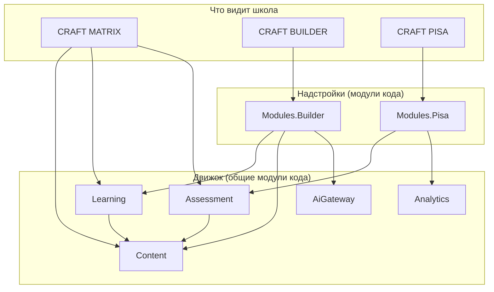

# Модули MATRIX, BUILDER, PISA: что в них лежит

Дополнение к [плану инициализации](01-bootstrap-platform.md). Отвечает на вопрос
«что будет внутри модулей MATRIX, BUILDER и PISA» и фиксирует, почему деление кода
на backend **не совпадает** с делением продукта на три модуля.

---

## 1. Главное: продуктовый модуль ≠ модуль кода

MATRIX, BUILDER и PISA — это то, что покупает школа и что видит пользователь.
Внутри они на 70 % состоят из одного и того же: урок, шаг, попытка, автопроверка,
прогресс, оценка, дашборд. Если сделать в коде три модуля по названиям продуктов,
этот общий движок придётся написать трижды и потом трижды чинить.

Поэтому backend делится на **движок** (общий) и **надстройки** (продуктовое):

| Продукт | Что берёт из движка | Что добавляет своего | Отдельный модуль кода? |
|---|---|---|---|
| **CRAFT MATRIX** | Content, Learning, Assessment — целиком | Ничего уникального: MATRIX **и есть** движок + учебная программа ГОСО | **Нет** |
| **CRAFT BUILDER** | Content, Learning, AiGateway | Тренажёр промптов, песочница кода, портфолио, рубрики проектов | **Да** — `Modules/Builder` |
| **CRAFT PISA** | Assessment (движок тестирования), Analytics | Рамка OECD, шкалы и уровни, диагностика готовности, отчёты УоО | **Да** — `Modules/Pisa` |

> **Почему у MATRIX нет своего модуля — это хорошая новость, а не пробел.**
> Она означает, что BUILDER и PISA переиспользуют один движок прохождения уроков,
> а не копируют его. Если бы у MATRIX появился свой модуль, у нас было бы три
> независимые реализации прогресса ученика с тремя разными наборами багов.

Итоговый состав backend — **10 модулей** вместо восьми из плана:

```
src/Modules/
├── Identity/          # учётные записи, роли, RBAC
├── Organizations/     # школы, классы, учебный год
├── Content/           # курсы, уроки, шаги, ЦО/ТУП, авторская студия
├── Learning/          # прохождение, прогресс, сессия урока, статусы, дашборд
├── Assessment/        # задания, автопроверка, банк, варианты, тестирование
├── AiGateway/         # единая точка обращения к LLM
├── Builder/           # ← надстройка CRAFT BUILDER
├── Pisa/              # ← надстройка CRAFT PISA
├── Analytics/         # дашборды, отчёты, экспорт
└── Notifications/     # уведомления
```



---

## 2. CRAFT MATRIX — где живёт её логика

Своего модуля нет; всё специфичное для MATRIX — это конкретные вертикальные срезы
в трёх общих модулях.

### 2.1. `Modules/Content` — учебная программа и методика

```
Content/Features/
├── Curriculum/
│   ├── ImportLearningObjectives/     # справочник ЦО из ГОСО/ТУП        FR-CNT-03
│   ├── BuildAnnualPlan/              # КТП из курса по ТУП              FR-CNT-06
│   └── GetProgramCoverage/           # «какие ЦО класс прошёл»          FR-MTX-22
├── MethodCards/
│   ├── GetMethodCard/                # методическая карта урока         FR-MTX-20
│   └── ExportMethodCardPdf/          # печать A4, казахские глифы       FR-MTX-21
├── Authoring/                        # авторская студия                 FR-CMS-01…05
└── Versioning/                       # публикация и версии контента     FR-CNT-04
```

### 2.2. `Modules/Learning` — урок, прогресс, дашборд учителя

Это ядро MATRIX и самая ценная часть системы.

```
Learning/
├── Features/
│   ├── StudentFlow/
│   │   ├── StartStep/                # начало шага, фиксация времени    FR-MTX-01
│   │   ├── SubmitAttempt/            # попытка + автопроверка + статус  FR-MTX-04
│   │   ├── CompleteStep/             # закрытие шага, разблокировка     FR-CNT-08
│   │   └── SyncOfflineQueue/         # досыл ответов после обрыва связи NFR-NET-02
│   ├── LessonSession/
│   │   ├── StartLessonSession/       # «начать урок» для класса         FR-MTX-10
│   │   ├── GetClassDashboard/        # снимок дашборда                  FR-MTX-11
│   │   ├── StreamClassDashboard/     # SignalR-хаб, ≤ 5 с              FR-MTX-13
│   │   ├── GetStepHeatmap/           # где застревает класс             FR-MTX-16
│   │   ├── MarkHelpProvided/         # «помощь оказана», сброс статуса  FR-MTX-15
│   │   └── FinishLessonSession/      # сводка + черновик оценок F       FR-MTX-18
│   └── Simulators/
│       ├── GetSimulatorConfig/       # конфигурация симулятора          FR-SIM-01
│       └── ReportSimulatorEvent/     # started / error / hint / finished FR-SIM-01
├── Domain/
│   ├── StudentStatusPolicy.cs        # ← сердце MATRIX                  FR-MTX-12
│   ├── ProgressCalculator.cs
│   └── StepUnlockRules.cs
└── Persistence/                      # схема learning
    └── таблицы: lesson_sessions, progress, attempts, help_events
```

**`StudentStatusPolicy` — единственное место, где считается светофор.** Пороги
настраиваются на уровне организации и урока (FR-MTX-12), поэтому политика получает
их параметром, а не читает конфиг сама:

```csharp
public sealed record StatusThresholds(
    int WrongAttemptsForYellow,      // 2
    int WrongAttemptsForRed,         // 3
    double SlowdownRatioYellow,      // 1.25 от медианы класса
    double SlowdownRatioRed,         // 1.50
    TimeSpan IdleForRed);            // 5 минут

public static class StudentStatusPolicy
{
    public static StudentStatus Evaluate(StepProgress p, ClassPace pace, StatusThresholds t, DateTimeOffset now)
    {
        if (p.IsCompleted) return StudentStatus.Done;

        var idle = now - p.LastActivityAt;
        var ratio = pace.MedianStepDuration > TimeSpan.Zero
            ? p.ElapsedOnStep / pace.MedianStepDuration
            : 1.0;

        if (p.ConsecutiveWrongAttempts >= t.WrongAttemptsForRed) return StudentStatus.Red;
        if (idle >= t.IdleForRed)                                return StudentStatus.Red;
        if (ratio >= t.SlowdownRatioRed)                         return StudentStatus.Red;

        if (p.ConsecutiveWrongAttempts >= t.WrongAttemptsForYellow) return StudentStatus.Yellow;
        if (ratio >= t.SlowdownRatioYellow)                         return StudentStatus.Yellow;
        if (p.HintsUsed >= 2)                                       return StudentStatus.Yellow;

        return StudentStatus.Green;
    }
}
```

Чистая функция без БД и без времени внутри — покрывается модульными тестами
таблицей случаев, включая граничные (ровно 2 ошибки, ровно 1.25 медианы).

### 2.3. `Modules/Assessment` — оценивание F/P

```
Assessment/Features/
├── Grading/
│   ├── DraftFormativeGrades/    # черновик F по итогам урока      FR-MTX-18
│   ├── ConfirmGrades/           # подтверждение учителем          FR-ASM-01
│   ├── OverrideGrade/           # правка с указанием причины      FR-ASM-04
│   └── ExportClassJournal/      # журнал класса в XLSX            FR-ASM-05
└── Scales/
    ├── FormativeDescriptors/    # дескрипторы F/P, 2–4 классы     FR-ASM-01
    └── PointScales/             # баллы 5–11 и перевод в отметку  FR-ASM-02
```

---

## 3. `Modules/Builder` — CRAFT BUILDER

Отдельный модуль, потому что здесь три вещи, которых нет больше нигде: оценка
качества промпта, исполнение ученического кода и портфолио.

```
Modules/Builder/
├── CraftAi.Modules.Builder.Contracts/
│   ├── IPortfolioReader.cs           # Analytics читает портфолио через этот контракт
│   └── Events/ProjectPublished.cs
└── CraftAi.Modules.Builder/
    ├── BuilderModule.cs
    ├── Features/
    │   ├── PromptTrainer/
    │   │   ├── EvaluatePrompt/       # оценка качества промпта в %     FR-BLD-03
    │   │   └── GetPromptExercise/    # блоки: роль, стек, краевые, шум
    │   ├── Sandbox/
    │   │   ├── CreateSandboxSession/ # выдача токена и origin песочницы FR-BLD-04
    │   │   ├── SaveSnapshot/         # сохранение кода после итерации   FR-BLD-06
    │   │   └── GetIterationChain/    # цепочка «промпт → код → правка»  FR-BLD-06
    │   ├── Portfolio/
    │   │   ├── PublishPortfolioItem/ # артефакт в портфолио            FR-BLD-07
    │   │   ├── SetVisibility/        # ссылка «только по ссылке»       FR-BLD-07
    │   │   └── ExportPortfolioPdf/   # PDF для приёмных комиссий       FR-BLD-07
    │   ├── ProjectReview/
    │   │   ├── GradeByRubric/        # рубрика в 2–3 клика             FR-BLD-09
    │   │   └── RequestRevision/
    │   ├── Integrity/
    │   │   └── DetectAnomalies/      # совпадения, ноль итераций       FR-BLD-10
    │   └── Agents/                   # v1.1                            FR-BLD-08
    │       ├── CreateAgent/
    │       └── RunAgent/
    ├── Domain/
    │   ├── PromptRubric.cs           # детерминированная рубрика
    │   ├── ProjectRubric.cs          # работоспособность, качество промптов…
    │   ├── IterationChain.cs
    │   └── SandboxPolicy.cs          # лимиты, разрешённые API
    └── Persistence/                  # схема builder
        └── prompt_attempts, sandbox_sessions, code_snapshots,
            portfolio_items, project_grades, integrity_signals
```

### 3.1. Тренажёр промптов считается кодом, а не моделью

`FR-BLD-03` требует детерминированной оценки. Если качество промпта оценивает
языковая модель, один и тот же ответ ученика будет получать разные проценты, и
объяснить оценку родителю или методисту станет невозможно.

```csharp
public sealed class PromptRubric
{
    // Критерии из ТЗ: контекст, технические требования, критерии валидации
    public PromptScore Evaluate(PromptSubmission s) => new(
        Context:    s.HasRole && s.HasAudience,
        Technical:  s.HasStack && s.HasStructure,
        Validation: s.HasEdgeCases && s.HasAcceptanceCriteria,
        NoisePenalty: s.IrrelevantBlocks * 10);
}
```

Проценты 25 / 65 / 95 из тренажёра на публичном сайте — это три состояния этой
рубрики, а не «мнение» ИИ. Модель используется дальше — чтобы показать,
**какой результат** даёт собранный промпт, но не чтобы его оценить.

### 3.2. Песочница в v1 не требует серверного рантайма

`FR-BLD-04` ограничивает стек v1 клиентским HTML/CSS/JavaScript. Значит код
ученика исполняется **в браузере самого ученика**, в `iframe` на отдельном
origin (`sandbox.craft.kz`), с `sandbox`-атрибутом и строгой CSP. Backend только
хранит снимки кода и историю итераций.

Это закрывает `NFR-SEC-04` (отдельный домен, нет доступа к cookie и API платформы)
без контейнеров, очередей и оркестрации — экономия месяца работы на этапе 3.
Серверный изолированный рантайм понадобится только тогда, когда в курс добавят
Python или серверный код; `SandboxPolicy` в домене — точка, где это переключится.

### 3.3. Зависимости

`Builder` обращается наружу только через контракты: `AiGateway.Contracts`
(генерация кода и ответов), `Learning.Contracts` (отметить шаг курса выполненным),
`Content.Contracts` (описание модуля курса). Прямых ссылок на внутренности
других модулей нет — это стережёт архитектурный тест.

---

## 4. `Modules/Pisa` — CRAFT PISA

Отдельный модуль-надстройка. Механику «показать задание — принять ответ —
проверить» он **не пишет заново**, а берёт из `Assessment`. Своё у него —
рамка оценивания, шкалы и управленческая аналитика.

```
Modules/Pisa/
├── CraftAi.Modules.Pisa.Contracts/
│   ├── IReadinessReader.cs               # Analytics берёт готовность отсюда
│   └── Events/AssessmentWaveCompleted.cs
└── CraftAi.Modules.Pisa/
    ├── PisaModule.cs
    ├── Features/
    │   ├── ItemBank/
    │   │   ├── CreateItem/               # задание собственной разработки  FR-PSA-01
    │   │   ├── ReviewItem/               # экспертная рецензия методиста   R-11
    │   │   ├── SearchItems/              # фильтры по направлению/навыку   FR-PSA-01
    │   │   └── CalibrateDifficulty/      # калибровка на пилоте            R-11
    │   ├── Trainers/
    │   │   ├── StartTrainer/             # 3 направления грамотности       FR-PSA-02
    │   │   ├── SubmitTrainerAnswer/
    │   │   └── ExplainSolution/          # разбор ошибки, а не «неверно»   FR-PSA-04
    │   ├── MediaAiLiteracy/              # спецмодуль PISA-2029            FR-PSA-03
    │   │   ├── DetectFake/               # фейки и дипфейки
    │   │   ├── AnalyzeHallucination/     # ошибки и предвзятость ИИ        FR-AI-10
    │   │   └── SynthesizeMultimodal/     # график + таблица + ИИ-сводка
    │   ├── Waves/
    │   │   ├── PlanAssessmentWave/       # входной / промежуточный / итоговый FR-PSA-10
    │   │   ├── GenerateVariants/         # равная сложность, без повторов  FR-PSA-11
    │   │   ├── RunWave/                  # таймер, автосдача, обрыв связи  FR-PSA-12
    │   │   └── FlagAnomalies/            # антисписывание базового уровня  FR-PSA-13
    │   ├── Scoring/
    │   │   ├── ScoreRun/                 # балл и уровень по направлениям  FR-PSA-14
    │   │   └── CompareWaves/             # входной vs текущий срез         FR-PSA-22
    │   └── Readiness/
    │       ├── BuildReadinessSnapshot/   # готовность класса и параллели   FR-PSA-20
    │       ├── BuildRiskHeatmap/         # тепловая карта рисков           FR-PSA-21
    │       ├── GenerateRecommendations/  # «усилить блок гипотез в 8–9»    FR-PSA-24
    │       └── ExportDistrictReport/     # обезличенный отчёт для УоО      FR-PSA-23
    ├── Domain/
    │   ├── OecdFramework.cs              # направление, когнитивный процесс, контекст
    │   ├── VariantGenerator.cs           # балансировка сложности вариантов
    │   ├── ProficiencyScale.cs           # балл → уровень
    │   ├── ReadinessSnapshot.cs
    │   └── RecommendationRules.cs        # правила, не модель
    └── Persistence/                      # схема pisa
        └── items, stimuli, item_reviews, waves, wave_variants,
            wave_runs, run_answers, readiness_snapshots
```

### 4.1. Почему PISA отделена от Assessment

| | `Assessment` | `Pisa` |
|---|---|---|
| Что оценивает | Школьную успеваемость по ЦО | Функциональную грамотность вне привязки к ЦО |
| Шкала | F/P и баллы 5–11 по правилам школы | Уровни по рамке OECD |
| Потребитель | Учитель, журнал класса | Завуч, директор, УоО |
| Ритм | Каждый урок | 2–3 среза в год |
| Меняется от | ИМП и ГОСО РК | Спецификации OECD |

Разные источники изменений — разные модули. Общий у них движок заданий и попыток,
и он лежит в `Assessment`.

### 4.2. Рекомендации — правила, а не модель

`FR-PSA-24` требует, чтобы каждая рекомендация называла основание: какие
показатели и на какой выборке. Поэтому `RecommendationRules` — детерминированные
правила с явным порогом и минимальным размером выборки (`FR-ANL-07`: агрегаты
меньше 5 учеников не показываются). Директор должен иметь возможность проверить
вывод руками — с генерацией моделью это невозможно.

---

## 5. Frontend: здесь деление по продуктам как раз уместно

На backend продуктовое деление вредно (дублирование движка), на frontend —
естественно: пользователь ходит по продуктам, а не по модулям кода.

```
platform/front/
├── apps/craft-web/                       # один SPA, роли — маршрутизацией
└── libs/
    ├── shared/
    │   ├── ui/                           # компоненты — см. 03-design-system.md
    │   ├── ui-tokens/                    # токены, перенесённые с лендинга
    │   ├── data-access/                  # HTTP-клиент, интерцепторы, авторизация
    │   ├── api-client/                   # ← генерируется из OpenAPI, не пишется руками
    │   └── i18n/                         # RU/KZ
    ├── simulators/                       # общий контракт симулятора  FR-SIM-01
    ├── matrix/
    │   ├── feature-lesson/               # прохождение урока учеником
    │   ├── feature-teacher-dashboard/    # светофор класса, SignalR
    │   └── feature-method-cards/
    ├── builder/
    │   ├── feature-prompt-trainer/
    │   ├── feature-sandbox/              # iframe на sandbox-origin
    │   └── feature-portfolio/
    └── pisa/
        ├── feature-trainers/
        ├── feature-wave-run/             # прохождение среза, таймер
        └── feature-readiness/            # управленческий дашборд
```

Границы стережёт `@nx/enforce-module-boundaries`: `matrix/*` не может
импортировать из `builder/*` — только через `shared/*`.

Дерево развёрнуто до конкретных библиотек и тегов в
[05-kabinet-craft-web.md §5](05-kabinet-craft-web.md) — там же правила границ
`scope:*` и запрет на импорт сгенерированного API-клиента из компонентов.

---

## 6. Что это меняет в плане инициализации

В [шаге 3 плана](01-bootstrap-platform.md#шаг-3-platformback--solution-и-каркас)
список модулей становится таким (10 вместо 8):

```bash
for m in Identity Organizations Content Learning Assessment AiGateway Builder Pisa Analytics Notifications; do
  dotnet new classlib -o "src/Modules/$m/CraftAi.Modules.$m"
  dotnet new classlib -o "src/Modules/$m/CraftAi.Modules.$m.Contracts"
done
```

Модуля `Matrix` в списке нет — и это осознанное решение, а не пропуск.

---

## 7. Порядок реализации

| Очередь | Что | Почему так |
|---|---|---|
| 1 | `Content` + `Learning` + `Assessment.Grading` | Это MATRIX. Без движка две другие надстройки строить не на чем |
| 2 | `Assessment` (движок заданий) + `Pisa` | PISA переиспользует движок; диагностика — то, что администрация видит первым |
| 3 | `AiGateway` + `Builder` | Самая рискованная часть (ИИ, песочница, комплаенс) — после того как ядро проверено в школе |

Совпадает с этапами 1–3 [ТЗ](../tz/02-tz-nfr-i-priemka.md#131-этапы).

---

## 8. Открытые вопросы

| № | Вопрос | Рекомендация |
|---|---|---|
| M-1 | Нужен ли модуль `Curriculum` отдельно от `Content`? | Пока нет. Выделить, если справочник ЦО начнёт жить своим циклом (импорт из внешнего реестра МП РК) |
| M-2 | Где хранится история ИИ-диалогов ученика — в `AiGateway` или в `Builder`? | В `AiGateway`: срок хранения и доступ регулируются политикой ПДн (PD-05) единообразно для всех модулей |
| M-3 | Портфолио — только BUILDER или общее для всех модулей? | Начать в `Builder`. Если MATRIX-проекты тоже пойдут в портфолио, вынести в отдельный модуль `Portfolio` |
| M-4 | Отдельный домен `sandbox.craft.kz` — покупаем сразу? | Да, до этапа 3: без отдельного origin изоляция песочницы недостижима |
