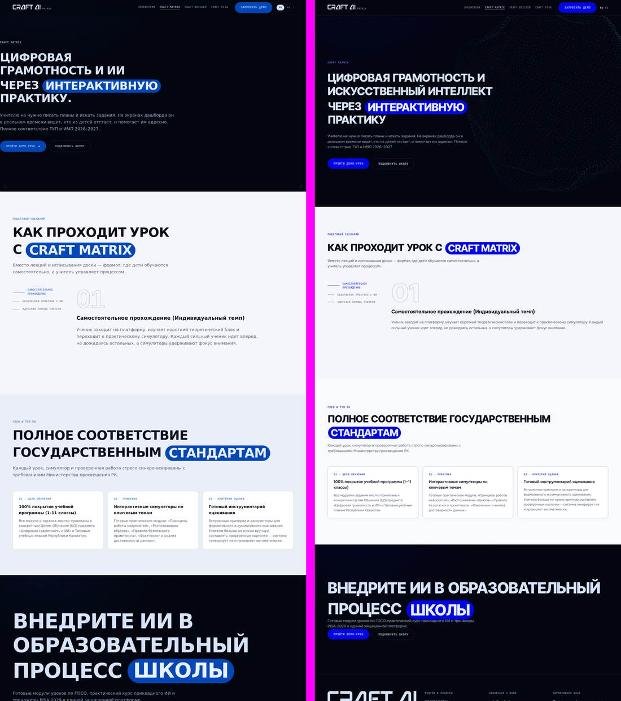
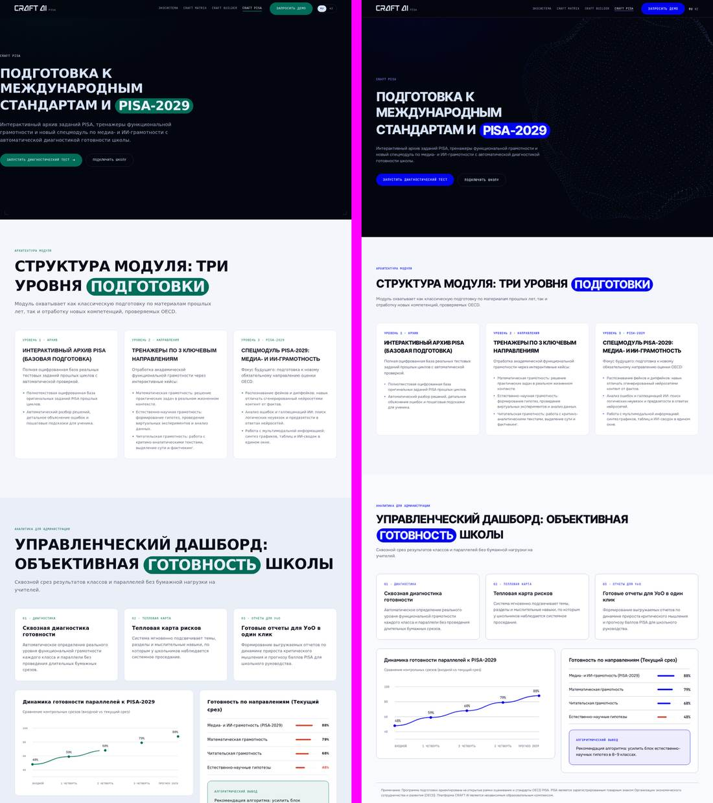
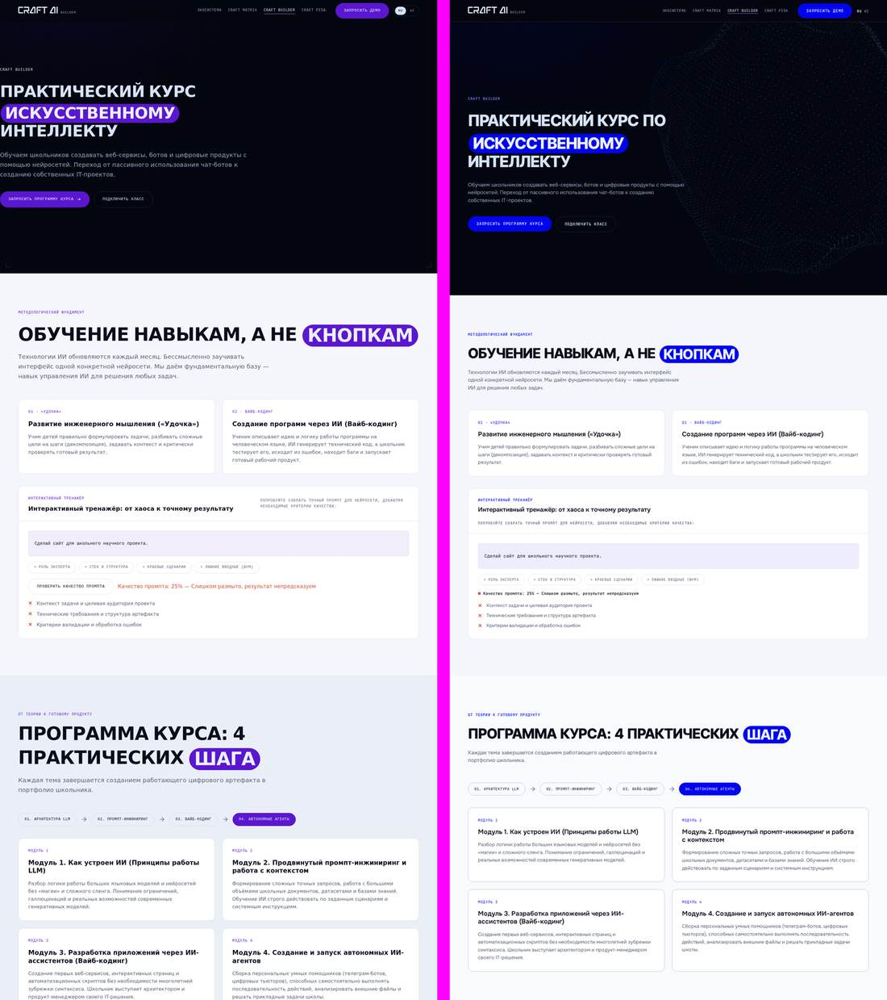
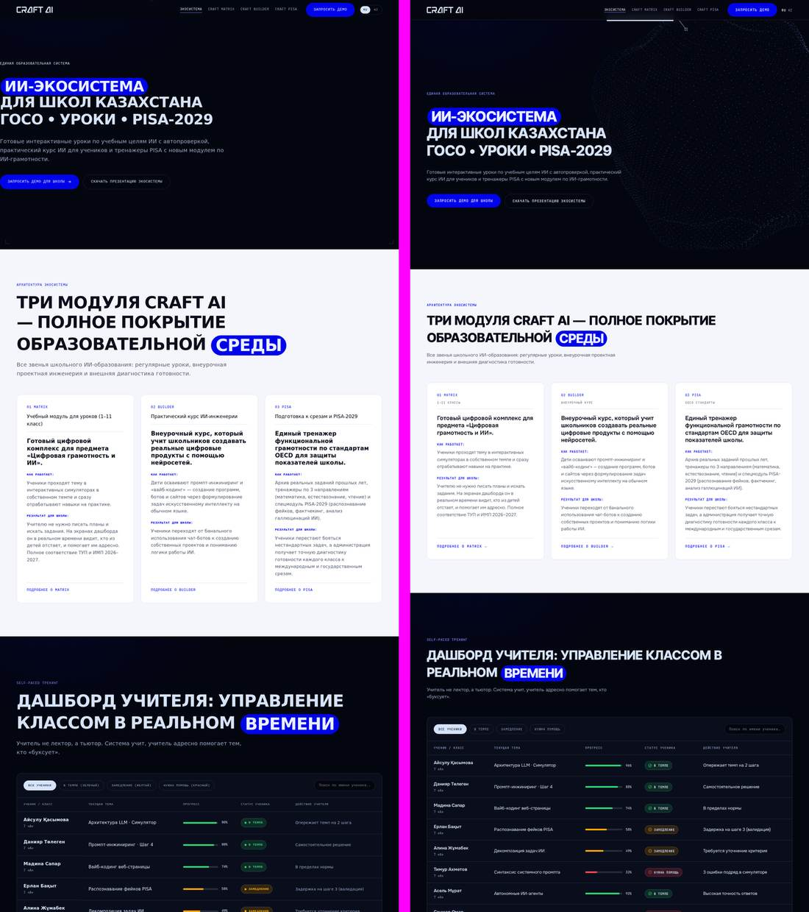
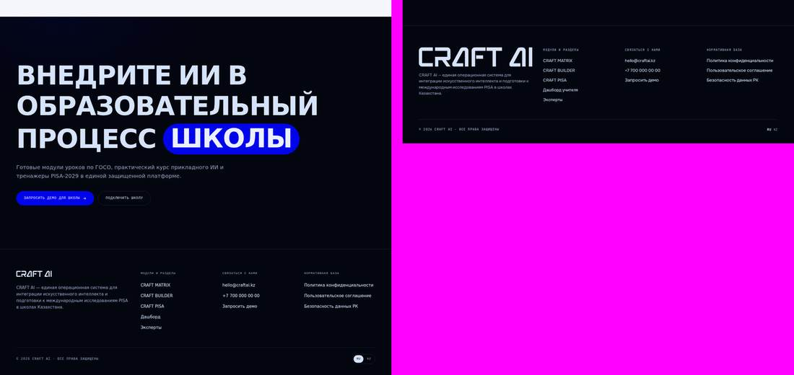
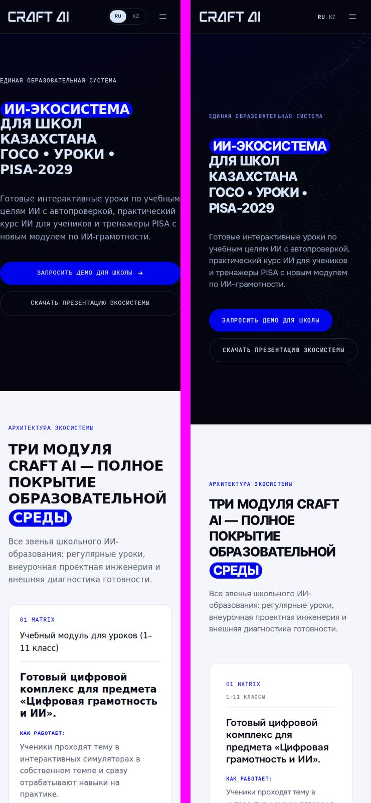
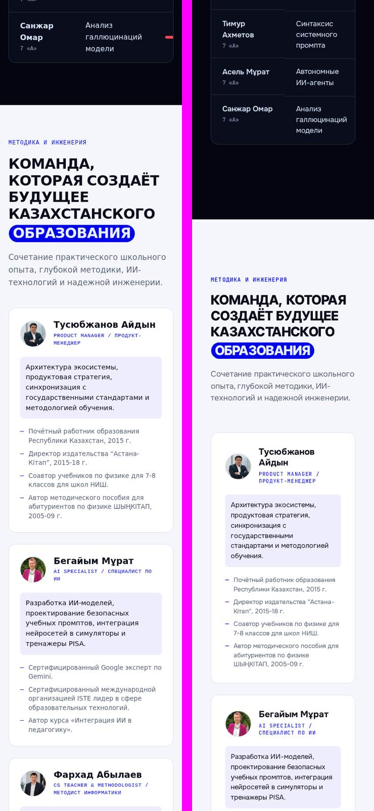
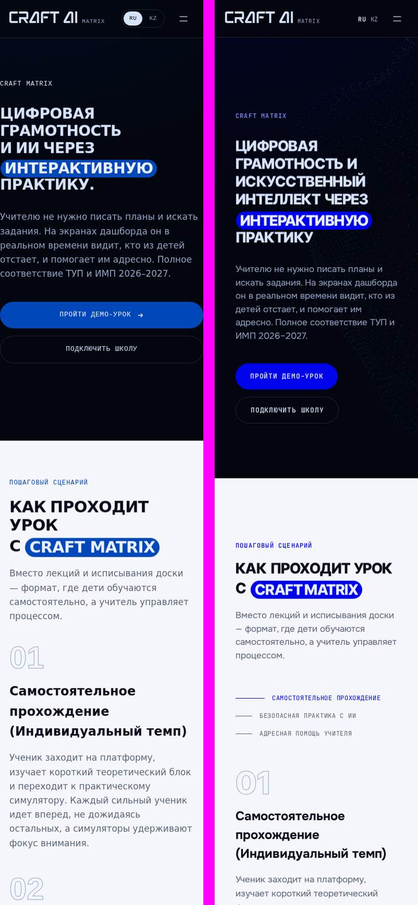
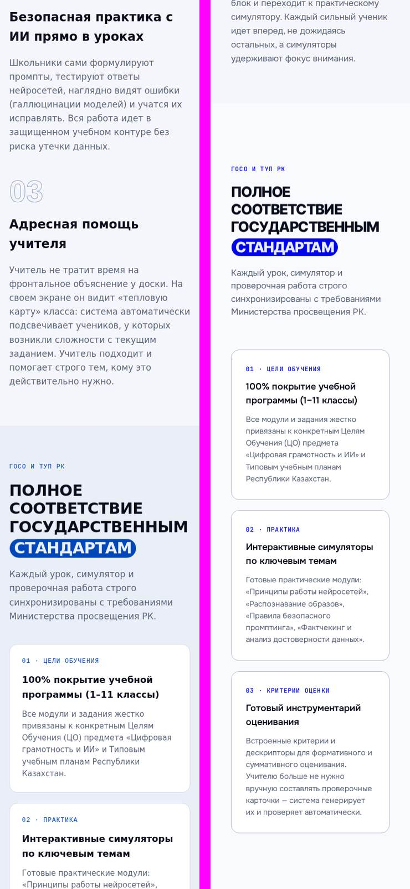
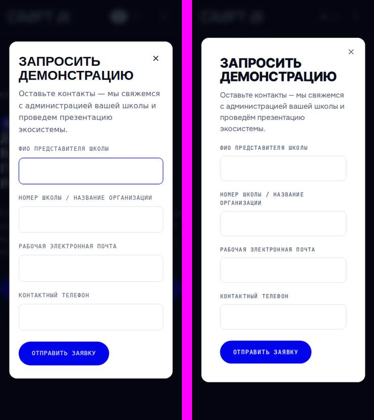

# Аудит переноса лендинга: `eighth-version` → `apps/landing`

Проверка паритета между старым статическим лендингом (`eighth-version/`) и
Angular-версией (`platform/front/apps/landing`, она же craftai.kz) после
выполнения плана [04-landing-migration.md](04-landing-migration.md).

**Статус.** 19 из 24 находок ниже исправлены — см.
[04-landing-migration-fixes.md](04-landing-migration-fixes.md) для списка
коммитов и того, что оставлено сознательно.

**Что сравнивалось:** 4 страницы (Экосистема, MATRIX, BUILDER, PISA) × 2
вьюпорта (390 × 844 и 1440 × 900), плюс замеры на 360, 414, 600, 768, 900,
1024, 1180, 1280, 1600, 1920 px.

**Как сравнивалось:**

- обе версии подняты локально: старая — статикой из `eighth-version/`, новая —
  продакшен-сборкой `npx nx build landing --configuration=production` с
  пререндером восьми маршрутов (тот же артефакт, что отдаёт craftai.kz);
- полностраничные скриншоты в Chromium со сквозной прокруткой (чтобы
  отработали ревилы);
- вычисленные стили 40 селекторов на каждой странице и вьюпорте;
- ширина переполнения документа на 10 брейкпойнтах;
- инвентарь классов и тегов в отрисованном DOM;
- весь видимый текст (дифф контента);
- построчный дифф `styles.css` (2255 строк) против 29 `.scss`-файлов
  `apps/landing` + `libs/shared/ui-tokens` + `libs/shared/ui`.

**Ограничения замера.** Живой craftai.kz из тестовой среды недоступен
(исходящие соединения закрыты), поэтому сравнение идёт с локальной прод-сборкой
того же кода. Google Fonts и CDN three.js/GSAP тоже заблокированы: в старых
кадрах поэтому нет WebGL-сферы, шрифты в обеих версиях подставлены системные
одинаково — на выводы это не влияет.

---

## 1. Итог

Структура перенесена полностью: все 7 секций главной и все секции трёх
внутренних страниц на месте, порядок совпадает, тексты, модалка заявки,
дашборд учителя, тренажёр промпта, скролл-степпер, аккордеон FAQ и WebGL-сцена
работают. Расходятся **цвет, типографический масштаб, вертикальный ритм и
мелкая моторика** — то, из-за чего новая версия читается как «упрощённая».
Плюс три технических дефекта, которых в старой версии не было.

| Категория | Кол-во |
|---|---|
| Критично — чинить | 5 |
| Заметно — стоит перенести | 13 |
| Решение продукта | 6 |
| Новая версия лучше — не откатывать | 7 |

---

## 2. Критично

### 01. Модульные цвета не включаются ни на одной странице

Токены `--m-matrix`, `--m-builder`, `--m-pisa` объявлены и живы, но
переключатель темы переехал с `body.page--matrix` на `[data-module='matrix']`,
а этот атрибут не выставлен нигде в лендинге (в `apps/landing/src` нет ни
одного вхождения `data-module`).

Замер `--signal` на живых страницах:

| Страница | Старое | Новое |
|---|---|---|
| MATRIX | `#0047BA` | `#0004EB` |
| BUILDER | `#5B16D0` | `#0004EB` |
| PISA | `#006C59` | `#0004EB` |

Тянет за собой: пилюли `.hl`, primary-кнопки, номера карточек `.card__n`
(замерено: PISA `rgb(0,108,89)` → `rgb(0,4,235)`, BUILDER `rgb(91,22,208)` →
`rgb(0,4,235)`), акцентные подписи `.micro--accent`, радиальный подсвет
`.band--ink::before` через `--signal-wash`, активный шаг степпера
`.how__nav button.is-on`, узлы цепочки на BUILDER, шкалы и график на PISA и
цвет гребней WebGL-сферы (`scene.ts` читает `--signal-lift`).

**Чинить:** `host: { 'data-module': 'matrix' }` в `pages/matrix/matrix.ts`
(и `builder`, `pisa`). Одна строка на страницу.

### 02. Горизонтальный скролл на всех десктопных ширинах

Выноски героя (`.pin__label`) выходят за правый край вьюпорта. В старой версии
их удерживали два правила, ни одно из которых не перенесено:
`.hero { overflow: hidden }` и `body { overflow-x: hidden }`.

| Ширина | Старое | Новое |
|---|---|---|
| 1180 | 0 | +530 px |
| 1280 | 0 | +480 px |
| 1440 | 0 | +345 px |
| 1600 | 0 | +320 px |
| 1920 | 0 | +160 px |

**Чинить:** `.hero { overflow: hidden }` в `shared/landing-layout.scss`.

### 03. Герой не помещается в первый экран

Шапка была `position: fixed` и лежала поверх героя; стала `sticky` и занимает
место в потоке. При этом `.hero` сохранил и `min-height: 100svh`, и
`padding-top: calc(var(--head-h) + 5rem)`.

| Замер | Старое | Новое |
|---|---|---|
| Верх `.hero` | y = 0 | y = 72 px |
| Высота первого экрана | 100 svh | 100 svh + 72 px |
| Верх `h1` (390 px) | 243 px | 320 px |
| Верх `h1` (1440 px) | 271 px | 379 px |

Низ героя с кнопками уходит за сгиб на любом устройстве.

**Чинить:** `.hero { min-height: calc(100svh - var(--head-h)) }` — либо вернуть
шапке overlay-поведение.

### 04. Логотип в футере — 417 × 70 вместо 130 × 22

Правило `.logo__mark svg { height: 2.2rem; width: auto }` живёт только в
`shared/header/header.scss`, а он заскоуплен на компонент шапки. Футер отдаёт
ту же разметку без стилей, и SVG растягивается на всю колонку грида.

**Чинить:** перенести `.logo__mark` и `.logo__mark svg` в
`shared/landing-layout.scss` либо продублировать в `footer.scss`.

### 05. SEO: у всех страниц `title` = «landing», нет `description`

В старой версии у каждой страницы был свой title и meta description на
150–170 знаков:

| Страница | Старый `<title>` |
|---|---|
| `/` | CRAFT AI — Готовая ИИ-экосистема для казахстанской школы: от ГОСО до PISA-2029 |
| `/matrix` | CRAFT MATRIX — Готовые интерактивные уроки по целям обучения ИИ для школы |
| `/builder` | CRAFT BUILDER — Практический курс Искусственному Интеллекту и вайб-кодингу |
| `/pisa` | CRAFT PISA — Подготовка к международным стандартам и PISA-2029 |

Во всех восьми пререндеренных маршрутах сейчас `<title>landing</title>` и ни
одного `description`. Дополнительно `hreflang` зашит в `index.html` статикой на
корни `/ru/` и `/kk/` — со страницы MATRIX альтернативная языковая версия
ведёт на главную.

Это **известный пропуск**: в плане 04 пункт «Meta-теги на каждый маршрут и
локаль, `sitemap.xml`, `robots.txt`» помечен как `[ ] не сделано на этом
проходе`. Здесь он фиксируется как долг с приоритетом.

**Чинить:** `Title`/`Meta` в каждом page-компоненте (или resolver в
`app.routes.ts`), per-route `hreflang`, `sitemap.xml` + `robots.txt` в
`public/`.

---

## 3. Заметно — стоит перенести

### 06. Типографическая шкала уменьшена на 20–35 %

Замеры на 1440 px:

| Что | Старое | Новое |
|---|---|---|
| Базовый кегль `body` | 17 px (1.7rem) | 16 px (`--fs-body`) |
| Интерлиньяж `body` | 1.6 | 1.5 |
| `.lead` | 20 px (`clamp(1.7rem, 1.4vw, 2rem)`) | 17 px (фикс.) |
| `.d-lg` — заголовки секций | 63 px (`clamp(3rem, 4.4vw, 6rem)`) | 46 px (`clamp(2.8rem, 4vw, 4.6rem)`) |
| `.d-xl` — финальный CTA | 96 px (`clamp(3.8rem, 6.8vw, 9.6rem)`) | 72 px (`clamp(3.2rem, 6vw, 7.2rem)`) |
| `.faq__q` | 20 px | 18 px |
| `.display` line-height | 0.94 | 0.98 |

Дополнительно потеряны `.d-md`, `text-wrap: balance` у `.display` и глобальное
`p { max-width: 68ch }`. Именно это читается как «стало мельче и площе», даже
когда цвета вернут. Заголовок героя не затронут — `.hero h1` в обеих версиях
переопределён своим `clamp(2.8rem, 4.5vw, 5.2rem)`.

### 07. Мобильный вертикальный ритм не адаптируется

Старая версия сжимала `--band-air` по брейкпойнтам: 12rem → 9rem (≤1024) →
7.2rem (≤768); `.band--air` 16 → 12 → 9rem. Новая держит 12rem / 16rem на любой
ширине.

| Ширина | Отступ полосы, старое | Новое |
|---|---|---|
| 360–768 | 72 px | 120 px |
| 900–1024 | 90 px | 120 px |
| ≥1180 | 120 px | 120 px |

### 08. Финальный CTA потерял отбивки

Из блока `.final` перенесён только `.final__btns`. Не перенесены
`.final { text-align: left }`, `.final h2 { margin-bottom: 3.2rem }`,
`.final .lead { margin-bottom: 4rem }` — заголовок, лид и кнопки стоят вплотную.
Вместе с находкой 06 секция ужалась с 856 → 608 px.

### 09. Кнопки CTA на телефоне больше не на всю ширину

Не перенесён блок:

```css
@media (max-width: 768px) {
  .hero__cta .btn,
  .final__btns .btn { flex: 1 1 100%; justify-content: center; min-width: 0; white-space: normal; text-align: center; }
}
```

`craft-btn` держит `white-space: nowrap`, поэтому длинные подписи
(«Запустить диагностический тест») не переносятся.

### 10. Футер на телефоне в две колонки

У `.foot__grid` остался один брейкпойнт (`≤900` → 2 колонки); правила
`≤768 → 1fr` нет. Замер на 360 px: старое — 1 колонка, новое — 2 колонки по
144 и 166 px.

### 11. Плотность карточек на мобильном

Не перенесён блок `@media (max-width: 768px)`: `.card, .panel, .track, .mat
{ padding: 2.4rem }` и `.sec-head { margin-bottom: 4rem }`. Замер на 390 px:
паддинг карточки 24 → 36 px, отбивка `.sec-head` 40 → 60 px. При ширине
контента 310 px карточка отдаёт под поля 72 px.

### 12. Три модуля на планшете ложатся 2 + 1

`.grid-3` схлопывался в одну колонку на ≤1024 px, теперь держит две от 640 до
1180 px. На 768–1024 px третья карточка модуля висит одна во втором ряду.
`.grid-4` (эксперты) ведёт себя одинаково в обеих версиях.

### 13. Рамка-уголки исчезла

`.frame` — четыре угловые скобки (`position: fixed; inset: 2rem`, линия
`rgba(214,227,252,.22)`, скрыты на ≤768 px). Не перенесены ни разметка
(`<div class="frame"><i></i>×4</div>` из всех четырёх страниц), ни шесть правил
CSS. Фирменная деталь «интерфейса-прибора», видна на каждой тёмной полосе.

### 14. Стрелка в primary-кнопках

`.btn__arrow` (иконка →, 1.4rem) стояла во всех главных CTA. В `craft-button`
слота под иконку нет — стрелки пропали на всех четырёх страницах.

### 15. Ссылки-«ролики» стали обычными

`.link-roll` с двумя дублями текста (`.r1`/`.r2`) прокручивал подпись при
наведении (4 правила + двойная разметка). Сейчас — `text-decoration: underline`.
На карточках модулей это единственная интерактивная деталь.

### 16. Карточки не реагируют на наведение

Не перенесены `.card:hover { border-color: var(--accent); transform:
translateY(-4px) }` и `.mat:hover { border-color: var(--accent); transform:
translateY(-3px) }`. Карточки модулей кликабельны и сейчас этого не показывают.

### 17. Шаги урока на MATRIX скрыты на мобильном

Старая версия на ≤1024 px прятала навигацию и разворачивала все три шага
вертикальным списком (`.how__panes { position: static }`, `.how__pane
{ position: static; opacity: 1; visibility: visible }`, `.how__nav
{ display: none }`). Новая оставляет абсолютное позиционирование панелей на
любой ширине: виден только шаг 01, переключатели — три тонкие строки без
признаков кликабельности. Страница на 390 px короче на 687 px ровно за счёт
спрятанного контента.

### 18. Шапка потеряла реакцию на скролл

Было: `.head { background: rgba(4,6,15,.76); border-bottom: 1px solid
transparent }` → `.head.is-stuck { background: rgba(4,6,15,.94);
border-bottom-color: var(--ink-line) }` при `scrollY > 30`. Стало: всегда
`color-mix(..., 90%, transparent)` и всегда видимая граница.

Решение осознанное и задокументировано в `header.scss`: при `.76` контраст
`.nav a` над светлыми полосами давал 4.06:1 и не проходил AA. Компромисс:
держать `.90`, но убирать нижнюю границу в самом верху страницы.

---

## 4. Решение продукта

### 19. Тексты разошлись

В старой версии финальную редакцию подставлял runtime-i18n поверх разметки, в
новой канон — сам шаблон. Отсюда расхождения в отрисованном тексте:

| Место | Старое (после i18n) | Новое |
|---|---|---|
| `h1` MATRIX | …и ИИ через интерактивную практику. | …и Искусственный интеллект через интерактивную практику |
| `h1` BUILDER | Практический курс Искусственному Интеллекту | Практический курс **по** Искусственному Интеллекту |
| Тег карточки MATRIX | Учебный модуль для уроков (1–11 класс) | 1–11 классы |
| Тег карточки BUILDER | Практический курс ИИ-инженерии | Внеурочный курс |
| Тег карточки PISA | Подготовка к срезам и PISA-2029 | OECD стандарты |
| Фильтры дашборда | В темпе (зелёный) / Замедление (жёлтый) / Нужна помощь (красный) | В темпе / Замедление / Нужна помощь |
| Футер | Дашборд | Дашборд учителя |

Нужно решить, какая редакция каноническая. Отдельно стоит вернуть цветовые
пояснения в фильтрах: «(зелёный / жёлтый / красный)» дублировали смысл, который
иначе передаётся только цветом.

### 20. Переключатель языка

Пилюля-тумблер RU/KZ (`.lang`, `.lang-btn`, `.lang-btn.is-active` — рамка,
радиус, инверсия активного) стала парой ссылок на `/ru/` и `/kk/` без
оформления. Механика правильнее (индексируемые URL, `hreflang`, SSR) — стоит
вернуть только внешний вид пилюли.

### 21. Тег модуля на карточках — новое лучше

В старой версии класс `.tag` стоял в разметке, но правила для него не
существовало: тег рисовался базовым текстом 17 px и спорил с заголовком. В
новой — моно-подпись 11 px `--fg-dim`. Откатывать не нужно.

### 22. Кнопка «Проверить качество промпта»

Тренажёр на BUILDER пересчитывает оценку реактивно, кнопка
`#lzCheck` убрана. Взаимодействие проще, но исчез момент «нажал — получил
вердикт», ради которого блок и назывался тренажёром.

### 23. Боковые поля на мобильном — новое лучше

Было 18 px (`--gutter` на ≤430 px), стало 40 px (`.band` 2rem + `.wrap` 2rem).
Побочно: двойной отступ стоит свести в один источник, чтобы ширина контента не
зависела от двух правил сразу.

### 24. Оттенок полосы `.band--paper-2`

Было `#EAEEF7`, стало `color-mix(in srgb, var(--paper) 60%, var(--card))` ≈
`#F7F8FD`; линия `#D3DAEA` → `color-mix(...)`. Чередование полос
«бумага / бумага-2» стало почти незаметным.

---

## 5. Что новая версия делает лучше — не откатывать

1. **SSR и пререндер 8 маршрутов** — контент отдаётся готовым HTML.
2. **Локали как отдельные бандлы** — `/ru/` и `/kk/` с `hreflang` и корректным
   `<html lang>` (`ru`, `kk-KZ`). Казахский перевод полный: 282 юнита, ни одного
   пустого `<target>`, совпадают с русским только имена людей и названия
   модулей (17 юнитов).
3. **WebGL-сцена перенесена дословно** — шейдеры, геометрия, константы — и
   починена: добавлен слушатель `resize`, которого в старой версии не было
   (`scene.js` отдавал `resize()` наружу, но никто его не подписывал). three.js
   уехал в ленивый чанк; GSAP тоже в бандле, а не с CDN — в старой версии при
   недоступном CDN скролл-скраб молча не работал.
4. **Заголовки не прыгают** — `.js-split` скрыт до разбивки на слова; раньше
   SSR-текст успевал отрисоваться и через ~150 мс уезжал под маску.
5. **Доступность** — контраст шапки поднят до AA (4.06:1 → 6.49:1), фокус-ловушка
   модалки на CDK, `@media (scripting: none)` вместо `<noscript>`-хака, который
   в Angular SSR отрисовывался как видимый текст.
6. **Герой больше не прилипает к краям экрана** — старый баг
   `.hero .wrap { width: 100% }` исправлен: на 390 px текст героя в старой
   версии шёл от x = 0 без отступов.
7. **Токены и компоненты** вынесены в `libs/shared/ui-tokens` и
   `libs/shared/ui` — кнопка, таблица, статус-бейдж переиспользуются кабинетом.

---

## 6. Сравнение по коду

Построчный дифф `eighth-version/styles.css` против всех `.scss` новой версии:
**93 селектора старой CSS не имеют аналога в новой**, ещё **143 селектора
перенесены с изменёнными или потерянными свойствами**. Ниже — разбор по сути,
без косметики (нормализация hex в нижний регистр, `.6rem` → `0.6rem`,
подстановка `var(--font-body)` вместо литерала шрифта — это 60+ «расхождений»,
которые ничего не меняют).

### 6.1. Правила CSS, не перенесённые вообще, — влияют на вид

| Правило старой версии | Что делало | Находка |
|---|---|---|
| `body.page--matrix`, `body.page--builder`, `body.page--pisa` | переключали `--signal`/`--signal-lift`/`--signal-wash` на модульные цвета | 01 |
| `.hero { overflow: hidden }`, `body { overflow-x: hidden }` | удерживали выноски героя внутри вьюпорта | 02 |
| `.logo__mark` (font-family, size 2.2rem, uppercase, color) | размер логотипа вне шапки | 04 |
| `.final`, `.final h2`, `.final .lead` | отбивки финального CTA | 08 |
| `.final-accent-word`, `.word-mask:has(.final-accent-word)`, `.js-reveal.is-in .final-accent-word`, `.js-reveal.is-in .word.hl:not(.final-accent-word)` | подгонка пилюли «школы» в финальном заголовке (4 правила) | 08 |
| `.frame`, `.frame i`, `.frame i:nth-child(1…4)` | рамка-уголки, 6 правил | 13 |
| `.btn__arrow` | размер иконки-стрелки в кнопках | 14 |
| `.link-roll span`, `.link-roll .r2`, `.link-roll:hover .r1`, `.link-roll:hover .r2` | прокрутка подписи при наведении | 15 |
| `.card:hover`, `.mat:hover` | подъём и акцентная рамка | 16 |
| `.head.is-stuck` | затемнение шапки при скролле | 18 |
| `.lang`, `.lang-btn`, `.lang-btn.is-active` | оформление переключателя языка | 20 |
| `.hero__grid` (`grid-template-columns: minmax(0, 84rem) 1fr; gap: 6rem`) | двухколоночный герой; `<div class="hero__grid">` в новой разметке остался, но стал обычным блоком | — |
| `.hero__eyebrows .micro { color: var(--on-ink) }` | надпись над `h1` была светлой, стала акцентной (`--signal-lift`) | — |
| `.pl-line.is-drawing` + `@keyframes draw` | линия графика на PISA прочерчивалась за 1.1 с при появлении в вьюпорте (`page-pisa.js` считал `getTotalLength()` и ставил `--len`) | — |
| `.band--ink .pl-line`, `.band--ink .pl-dot` | вариант графика для тёмной полосы | — |
| `.desk__search:focus` | подсветка поля поиска по `:focus` (в новой только `:focus-visible` — при клике мышью рамки нет) | — |
| `.faq__q .micro { flex: none }` | номер вопроса не сжимался | — |
| `.band > *` | подъём контента над `::before`-подсветкой полосы | — |
| `.card--module .card__n { flex: none; white-space: nowrap }` | номер модуля не переносился | — |
| `.sr` | sr-only-хелпер (в новой есть `.sr-only` — переименование) | — |

### 6.2. Адаптивные брейкпойнты, не перенесённые

| Медиа-запрос старой версии | Что делал | Находка |
|---|---|---|
| `≤1280`, `≤1024`, `≤430` → `--gutter: 3.2 / 2.4 / 1.8rem` | плавное сжатие боковых полей | 23 |
| `≤1024` → `--band-air: 9rem`, `.band--air { 12rem }` | вертикальный ритм на планшете | 07 |
| `≤768` → `--band-air: 7.2rem`, `.band--air { 9rem }` | вертикальный ритм на телефоне | 07 |
| `≤768` → `.sec-head { margin-bottom: 4rem }` | отбивка заголовка секции | 11 |
| `≤768` → `.card, .panel, .track, .mat { padding: 2.4rem }` | плотность карточек | 11 |
| `≤768` → `.frame { display: none }` | рамка скрывалась на телефоне | 13 |
| `≤768` → `.hero__cta .btn`, `.final__btns .btn { flex: 1 1 100% … }` | кнопки во всю ширину | 09 |
| `≤768` → `.grid-2, .grid-4, .tracks, .mats { 1fr }`, `.foot__grid { 1fr }` | одноколоночная раскладка | 10 |
| `≤1024` → `.grid-3 { 1fr }` | три модуля в колонку | 12 |
| `≤1024` → `.how__panes { position: static }`, `.how__pane { position: static; opacity: 1; visibility: visible }`, `.how__nav { display: none }` | все шаги урока списком | 17 |
| `≤1024` → `.hero__grid { 1fr }` | схлопывание грида героя (`.an__grid` на PISA перенесён) | — |
| `≤768` → `.desk__table { min-width: 58rem }` | таблица дашборда держала читаемую ширину и скроллилась | — |
| `≤430` → `.d-xl { clamp(3.2rem, 9vw, 9.6rem) }` | заголовок героя на узких экранах | 06 |
| `≤430` → `.modal__box { padding: 2.8rem 2rem }` | поля модалки на узком экране | — |
| `≤430` → `.hero__grid > *`, `.head__in > * { min-width: 0 }` | защита от распирания флекс-детей | — |
| `≤430` → `.chain__rail { gap: .8rem }`, `.chain__node { padding: .9rem 1.4rem; font-size: 1.1rem }` | компактная цепочка на BUILDER | — |
| `≤1180` → `.nav.is-open { max-height: 70vh; overflow-y: auto }` | длинное мобильное меню скроллилось | — |

### 6.3. Правила, перенесённые с изменёнными значениями

| Селектор | Свойство | Старое | Новое |
|---|---|---|---|
| `body` | `font-size` / `line-height` | 1.7rem / 1.6 | `--fs-body` (1.6rem) / 1.5 |
| `.d-xl` | `font-size` | `clamp(3.8rem, 6.8vw, 9.6rem)` | `clamp(3.2rem, 6vw, 7.2rem)` |
| `.d-lg` | `font-size` | `clamp(3rem, 4.4vw, 6rem)` | `clamp(2.8rem, 4vw, 4.6rem)` |
| `.lead` | `font-size` | `clamp(1.7rem, 1.4vw, 2rem)` | `1.7rem` |
| `.display` | `line-height` / `text-wrap` | `.94` / `balance` | `0.98` / — |
| `.band` | `padding` | `var(--band-air) 0` | `12rem 2rem` |
| `.band--air` | — | `--band-air: 16rem` | `padding-block: 16rem` |
| `.band--paper-2` | `--bg` / `--line` | `#EAEEF7` / `#D3DAEA` | `color-mix(paper 60%, card)` / `color-mix(paper-line 70%, on-paper-dim)` |
| `.wrap` | `width` | `min(100% - var(--gutter)*2, var(--wrap))` | `min(100% - 4rem, 132rem)` |
| `.head` | `position` / `background` | `fixed` / `rgba(4,6,15,.76)` | `sticky` / `color-mix(ink-900 90%, transparent)` |
| `.head` | `border-bottom` | `1px solid transparent` | `1px solid var(--ink-line)` |
| `.hero h1` | `max-width` | нет | `800px` |
| `.how__panes` | `min-height` | `38rem` | `34rem` |
| `.faq__q` | `font-size` | `2rem` | `1.8rem` |
| `.person__avatar` | `display` и типографика инициалов | `flex` + Inter 800 + `--signal` | `block` |
| `p` | `max-width` | `68ch` (глобально) | — |

Потерянные CSS-переменные: `--wrap: 132rem`, `--gutter: 4rem`,
`--head-h: 7.2rem`, `--band-air: 12rem`. Первые три используются в новой
версии как литералы или через fallback (`var(--head-h, 7.2rem)`), четвёртая —
причина находки 07. Добавлена `--on-signal: #EAF0FF` (в старой версии цвет
текста на заливке был литералом внутри `.btn--primary`).

### 6.4. Разметка и информация, не перенесённые

| Что | Где было | Статус |
|---|---|---|
| `<div class="frame"><i>×4</div>` | все 4 страницы | не перенесено (13) |
| `<svg class="btn__arrow">` в CTA | 8 кнопок на 4 страницах | не перенесено (14) |
| Двойная разметка `.link-roll` (`.r1` + `.r2`) | 3 карточки модулей | не перенесено (15) |
| `class="hl final-accent-word"` в финальном `h2` | все 4 страницы | не перенесено (08) |
| Кнопка `#lzCheck` «Проверить качество промпта» | BUILDER, `.lz__acts` | убрана осознанно (22) |
| `<meta name="description">` | все 4 страницы | не перенесено (05) |
| Осмысленный `<title>` | все 4 страницы | не перенесено (05) |
| Цветовые пояснения в фильтрах дашборда | `home.desk.f.*` | текст изменён (19) |
| `.hero__pins` с классом `js-rise` | 3 выноски героя | выноски есть, ревил-класс не переносился |

Проверка инвентаря DOM подтверждает: кроме перечисленного, все классы старой
версии либо присутствуют, либо переименованы (см. 6.6). Расхождения в счётчиках
(`micro 19→15`, `field`, `is-active 3→1`, `wrap 8→7`) объясняются тем, что
модалка в новой версии создаётся CDK по требованию и её 4 подписи полей плюс
`.field` не попадают в статический DOM, переключатель языка использует
`aria-current` вместо класса `is-active` (2 кнопки), а футер обходится
`.foot__grid` вместо `.wrap`. Это не потери.

### 6.5. JS-поведение

| Функция `eighth-version` | Куда перенесена | Статус |
|---|---|---|
| `initPreloader()` | `app.ts` + `app.scss` | перенесено (добавлено позже плана, показ раз за сессию вкладки) |
| `bootScene()` + `scene.js` | `shared/scene/scene.ts`, `scene-globe.ts` | перенесено дословно + починен `resize` |
| `splitWords()` / `initReveals()` | `shared/reveal/split-words.ts`, `reveal-on-scroll.ts` | перенесено, точки расстановки сверены 1:1 |
| `initHead()` — бургер, активный пункт | `shared/header/header.ts` | перенесено |
| `initHead()` — `is-stuck` | — | **не перенесено** (18) |
| `initHead()` — `.lang-btn` → `setLanguage()` | `shared/lang-switcher` | заменено ссылками на локали |
| `initModal()` (фокус-ловушка, `inert`, экран «принято») | `shared/demo-modal` на CDK Dialog | перенесено + reactive form, валидация, honeypot |
| `initFaq()` | `shared/faq-accordion` на CDK Accordion | перенесено |
| `page-home.js` — таблица, фильтры, поиск, пустое состояние | `pages/home/desk-preview` | перенесено на сигналы |
| `page-home.js` — `renderHeroPins()` / `updatePins()` | `pages/home/hero-pins` | перенесено |
| `page-matrix.js` — `initHowScrub()` | `pages/matrix/matrix-scrub.ts` | перенесено дословно (границы `top 30%` / `bottom 70%`, `matchMedia ≥1024`) |
| `page-builder.js` — тренажёр промпта | `pages/builder/builder.ts` | перенесено, кнопка проверки убрана (22) |
| `page-pisa.js` — прочерчивание линии графика | — | **не перенесено** (`is-drawing`, `--len`, `@keyframes draw`) |
| `i18n.js` + `js/lang/*.js` | `@angular/localize` + `messages.kk-KZ.xlf` | заменено по плану, 282 юнита, 0 пустых |

### 6.6. Переименования — не потери

`.btn` → `.craft-btn`, `.btn--primary/--ghost/--solid` →
`.craft-btn--primary/--ghost/--solid`, `.modal*` → CDK Dialog
(`.cdk-overlay-dark-backdrop` + `demo-modal.scss`), `.desk-badge--green/yellow/red`
→ `craft-status-badge--high/mid/low`, `.lang`/`.lang-btn` → `.lang-switcher`,
`.sr` → `.sr-only`, `.faq__a.is-open` → `.faq__a--open`,
`.faq__ico::after` при `[aria-expanded=true]` → `.faq__ico--open::after`,
`[data-surface="ink"]` вместо наследования токенов от `.band--ink` в шапке и
футере.

### 6.7. Мёртвый код старой версии — справедливо не перенесён

Классы, у которых в `eighth-version` была CSS, но ни одного вхождения в
разметке: `.js-fade` (+ `.js-fade.is-in` и вариант для reduced-motion),
`.js-lit .word` (3 правила + 2 для reduced-motion), `.d-md`, `.chain`,
`.lz__t`, `.lz__d`, `.how__hint` (+ его `display: none` на ≤1024).
И наоборот, `.lz-chip--noise` стоял в разметке BUILDER, но правила для него не
существовало. Ничего из этого переносить не нужно.

---

## 7. Замеры

### Переполнение и раскладка

| Ширина | Лишняя ширина, старое | Лишняя ширина, новое | Колонок `.grid-3` | Колонок в футере | Отступ полосы |
|---|---|---|---|---|---|
| 360 | 0 | 1 | 1 → 1 | 1 → 2 | 72 → 120 px |
| 414 | 0 | 0 | 1 → 1 | 1 → 2 | 72 → 120 px |
| 600 | 0 | 0 | 1 → 1 | 1 → 2 | 72 → 120 px |
| 768 | 0 | 0 | 1 → 2 | 1 → 2 | 72 → 120 px |
| 900 | 0 | 0 | 1 → 2 | 2 → 2 | 90 → 120 px |
| 1024 | 0 | 0 | 1 → 2 | 2 → 4 | 90 → 120 px |
| 1180 | 0 | +530 | 3 → 3 | 4 → 4 | 120 → 120 px |
| 1280 | 0 | +480 | 3 → 3 | 4 → 4 | 120 → 120 px |
| 1440 | 0 | +345 | 3 → 3 | 4 → 4 | 120 → 120 px |
| 1600 | 0 | +320 | 3 → 3 | 4 → 4 | 120 → 120 px |
| 1920 | 0 | +160 | 3 → 3 | 4 → 4 | 120 → 120 px |

### Высота страниц, px

| Страница | 390, старое | 390, новое | 1440, старое | 1440, новое |
|---|---|---|---|---|
| Экосистема | 11 754 | 12 178 | 7 966 | 7 112 |
| MATRIX | 5 664 | 4 977 | 3 945 | 3 602 |
| BUILDER | 8 461 | 8 941 | 5 561 | 5 104 |
| PISA | 7 458 | 7 804 | 4 870 | 4 455 |

На телефоне новая версия длиннее при меньшем кегле — находка 07. Исключение —
MATRIX: короче на 687 px, потому что два из трёх шагов урока не выводятся
(17). На десктопе всё короче за счёт уменьшенной шкалы (06) и схлопнутого
финала (08).

---

## 8. Скриншоты

Слева — старая версия, справа — новая. Одинаковый вьюпорт и позиция прокрутки.

**Модульные цвета (01)**





**Главная, десктоп: первый экран (03), масштаб заголовков (06), рамка (13)**



**Финальный CTA (08) и логотип в футере (04)**



**Мобильный экран: кнопки (09), ритм (07)**




**MATRIX на телефоне: шаги урока (17)**




**Контрольный пример: модалка заявки перенесена один в один**



---

## 9. Порядок работ

1. **01–05** — критично, суммарно около 15 строк правок плюс meta-теги.
2. **06, 08** — типографическая шкала и финальный CTA: возвращают ощущение
   исходного дизайна сильнее всего остального.
3. **07, 09, 10, 11, 17** — мобильный блок: один `@media`-раздел в
   `landing-layout.scss` плюс правка `matrix.scss`.
4. **13, 14, 15, 16, 18, 20** — мелкая моторика и фирменные детали.
5. **19, 22, 24** — вынести на решение продукта.
