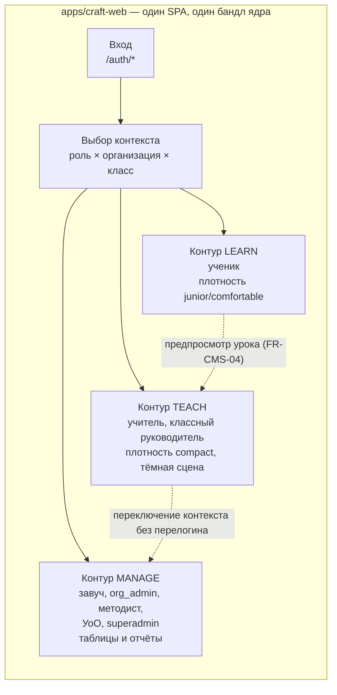
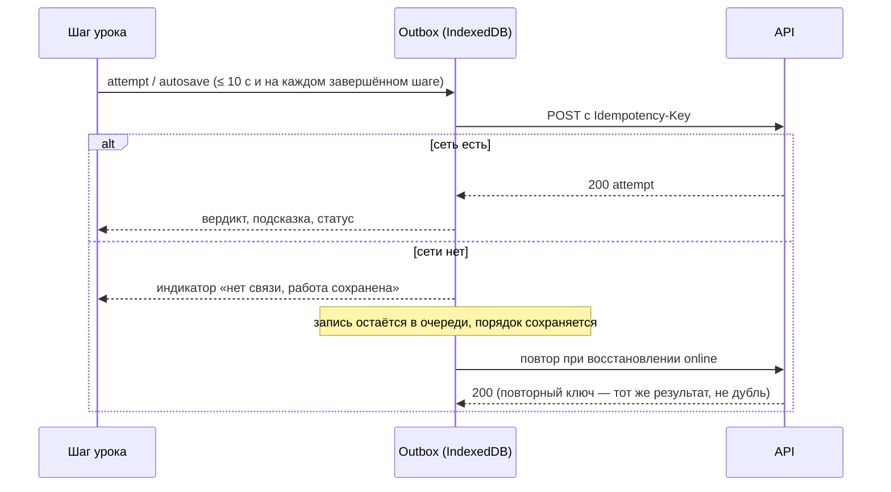

# Проектирование кабинета CRAFT AI (`apps/craft-web`)

**Задача.** Спроектировать рабочий кабинет платформы — единственное приложение
за авторизацией, в котором живут все роли из ТЗ: ученик, учитель, администрация
школы, методист, аналитик УоО, суперадминистратор. Документ отвечает на вопросы
«из каких экранов состоит кабинет», «как они разложены по маршрутам и
библиотекам Nx», «как устроены данные, сеть, состояние и i18n» — до того, как
написана первая фича.

**Смежные документы.**
[../tz/01-tz-platforma.md](../tz/01-tz-platforma.md) и
[../tz/02-tz-nfr-i-priemka.md](../tz/02-tz-nfr-i-priemka.md) — источник
требований (`FR-*`, `NFR-*`, `API-*`).
[01-bootstrap-platform.md](01-bootstrap-platform.md) — каркас `platform/`,
решение «одно SPA `craft-web`».
[02-moduli-matrix-builder-pisa.md](02-moduli-matrix-builder-pisa.md) — модули
backend и продуктовое деление фронтенда.
[03-design-system.md](03-design-system.md) — токены, плотности, инвентарь
компонентов.
[04-landing-migration.md](04-landing-migration.md) — публичный сайт
`apps/landing`, с которым кабинет делит воркспейс и токены, но не подход к
переводу (см. §11 и [ADR-0004](../adr/0004-runtime-i18n-kabineta.md)).

**Схема в HTML.** [05-kabinet-craft-web.html](05-kabinet-craft-web.html) — та же
структура наглядно: три контура с переключением, карта маршрутов, макеты
компоновки трёх ключевых экранов (шаг урока, дашборд учителя на тёмной сцене,
готовность к PISA) в реальных токенах `libs/shared/ui-tokens`. Открывается
файлом в браузере, сборки не требует. Это схемы компоновки, а не макеты
дизайнера: дизайн ключевых экранов делается на этапе 0 ТЗ.

**Результат этапа.** Утверждённая карта экранов и маршрутов, структура библиотек
с правилами границ, контракты клиентского слоя данных (сеть, офлайн, реальное
время), решения по i18n, плотности и бюджетам. Это вход для этапа 1 ТЗ
(MVP MATRIX).

**Что этот документ НЕ делает:** не рисует макеты (этап 0 ТЗ, зона дизайнера),
не описывает backend-модули (это [план 02](02-moduli-matrix-builder-pisa.md)),
не фиксирует OpenAPI-контракт (он рождается на backend и приходит сюда
генератором, §6.2), не переписывает дизайн-систему (это
[план 03](03-design-system.md)).

> **Замечание об устаревшем документе.** В корне `docs/` лежит `plan.html` с
> ранней B2C-концепцией («3D-хаб», «робот-питомец», «отчёт родителю в
> мессенджер»). Она противоречит действующему ТЗ: продукт B2B-школьный, кабинета
> родителя нет решением заказчика (FR-CORE-09). При проектировании кабинета
> `plan.html` источником не является.

---

## 1. Что уже решено и здесь не пересматривается

| Решение | Где зафиксировано |
|---|---|
| Angular + Nx + Tailwind v4, компоненты на Angular CDK без Material | [ADR-0002](../adr/0002-frontend-stack-angular-tailwind.md), [план 03 §5.1](03-design-system.md) |
| Кабинет — **одно** приложение `apps/craft-web`; роли — маршрутизацией, а не отдельными сборками | [план 01 §2.1](01-bootstrap-platform.md) |
| SSR в кабинете выключен (всё за авторизацией, SEO не нужен) | [план 01 §2.1](01-bootstrap-platform.md) |
| Фичи фронтенда делятся по продуктам (`matrix` / `builder` / `pisa`), backend — по модулям кода | [план 02 §5](02-moduli-matrix-builder-pisa.md) |
| Графики — свои SVG-компоненты, без Chart.js/ECharts | [план 03 §4.3](03-design-system.md) |
| Три плотности: `comfortable` / `compact` / `junior` | [план 03 §3.1](03-design-system.md) |
| Backend — модульный монолит .NET, REST + WebSocket | [ADR-0001](../adr/0001-backend-stack-dotnet.md), ТЗ §8 |

Новое решение этого документа — одно: **перевод интерфейса кабинета
переключается в рантайме, а не отдельной сборкой на локаль** (§11,
[ADR-0004](../adr/0004-runtime-i18n-kabineta.md)). Остальное — раскладка уже
принятых решений на экраны и файлы.

---

## 2. Три рабочих контура в одном приложении

Роли из ТЗ (§3.1) сводятся к трём контурам — не по названию должности, а по
характеру работы: что человек делает, как часто и с какой плотностью экрана.



**Почему не три приложения.** Учитель школы одновременно бывает классным
руководителем и методистом (FR-RBAC-01 прямо требует несколько ролей в разных
областях у одной учётной записи); завуч ведёт свои уроки. Разделение на сборки
означало бы три логина, три сессии и дубль дизайн-системы ради разной
навигации. Контур — это layout и меню, а не приложение.

**Почему контуры вообще выделены.** У них несовместимые требования к экрану:
ученику нужен один шаг урока на весь экран и крупные элементы (FR-MTX-05),
учителю — 35 строк класса без скролла и обновление раз в 5 секунд
(FR-MTX-11, FR-MTX-13), администрации — таблицы, фильтры и выгрузки. Общий
layout «шапка + сайдбар» для всех троих даст плохо всем.

| Контур | Роли | Layout | Плотность по умолчанию | Поверхность |
|---|---|---|---|---|
| `learn` | `student` | Один столбец, шаги во всю ширину, минимум хрома | `junior` (1–4 кл.) / `comfortable` | paper |
| `teach` | `teacher`, `homeroom` | Рабочая область + правая панель «кому помочь» | `compact` | paper, дашборд урока — ink ([план 03 §3.2](03-design-system.md)) |
| `manage` | `principal`, `org_admin`, `methodist`, `district`, `superadmin`, `support` | Сайдбар-навигация + таблицы | `compact` | paper |

**Переключение контекста.** Пользователь с несколькими ролями после входа
попадает на `/select-context`, если контекст не выбран и не запомнен. Выбранный
контекст (роль + организация + при необходимости класс) — часть состояния
сессии, влияет на меню и на заголовок `X-Org-Context` в запросах. Сервер всё
равно проверяет область видимости сам (FR-RBAC-02): клиентский контекст — это
UX, а не защита.

---

## 3. Карта маршрутов

Каждый маршрут — отдельный lazy-чанк (`loadChildren`), кроме `/auth/*` и общего
shell'а. Колонка «Библиотека» ссылается на §5.

### 3.1. Вход и служебные

| Маршрут | Кто | Библиотека | Требования |
|---|---|---|---|
| `/auth/login` | все | `shared/feature-auth` | FR-CORE-03 |
| `/auth/class-code` | ученики 1–4 кл.: класс → аватар → PIN, без e-mail | `shared/feature-auth` | FR-CORE-04, API `POST /auth/class-code` |
| `/auth/2fa` | `principal`, `org_admin`, `district`, `superadmin` | `shared/feature-auth` | FR-CORE-06 |
| `/auth/recovery` | восстановление через администратора организации | `shared/feature-auth` | FR-CORE-03 |
| `/select-context` | у кого больше одной роли/организации | `shared/feature-shell` | FR-RBAC-01 |
| `/profile`, `/settings` | все: язык интерфейса, язык контента, плотность, уведомления | `shared/feature-shell` | FR-CORE-07, FR-NTF-05 |
| `/offline`, `/403`, `/404` | все | `shared/feature-shell` | NFR-NET-02 |

### 3.2. Контур `learn` (ученик)

| Маршрут | Экран | Библиотека | Требования |
|---|---|---|---|
| `/learn` | Сегодня: активная сессия урока, следующая тема по КТП, дедлайны | `matrix/feature-student-home` | FR-MTX-01, FR-CNT-06 |
| `/learn/courses/:courseId` | Карта курса: разделы, темы, замки предусловий | `matrix/feature-course-map` | FR-CNT-01, FR-CNT-08 |
| `/learn/lessons/:lessonId` | Плеер урока (редирект на текущий шаг) | `matrix/feature-lesson` | FR-MTX-02 |
| `/learn/lessons/:lessonId/steps/:stepId` | Шаг: теория / симулятор / задание / тест / ИИ-практика / проект / рефлексия | `matrix/feature-lesson` | FR-CNT-02, FR-MTX-04, FR-MTX-06 |
| `/learn/progress` | Мой прогресс: пройденные ЦО, оценки F/P, статусы | `matrix/feature-student-progress` | FR-ASM-01 |
| `/learn/pisa` | Тренажёры трёх направлений + медиа/ИИ-грамотность | `pisa/feature-trainers` | FR-PSA-02, FR-PSA-03 |
| `/learn/pisa/runs/:runId` | Прохождение среза: таймер, блоки, автосдача | `pisa/feature-wave-run` | FR-PSA-12, FR-PSA-13 |
| `/learn/builder` | Курс BUILDER: 4 модуля | `builder/feature-course` | FR-BLD-01 |
| `/learn/builder/prompt/:taskId` | Тренажёр промптов | `builder/feature-prompt-trainer` | FR-BLD-03 |
| `/learn/builder/sandbox/:projectId` | Песочница вайб-кодинга (iframe на sandbox-origin) | `builder/feature-sandbox` | FR-BLD-04, FR-BLD-05 |
| `/learn/portfolio` | Портфолио: карточки артефактов, история итераций | `builder/feature-portfolio` | FR-BLD-06, FR-BLD-07 |

### 3.3. Контур `teach` (учитель, классный руководитель)

| Маршрут | Экран | Библиотека | Требования |
|---|---|---|---|
| `/teach` | Сегодня: расписание, кнопка «Начать урок», незакрытые проверки | `matrix/feature-teacher-home` | FR-MTX-10 |
| `/teach/sessions/:sessionId` | **Дашборд урока в реальном времени**: светофор класса, тепловая карта шагов, фильтры, карточка ученика | `matrix/feature-teacher-dashboard` | FR-MTX-11…18, NFR-PRF-03 |
| `/teach/sessions/:sessionId/projection` | Проекционный режим: обезличенно, крупно, тёмная сцена | `matrix/feature-teacher-dashboard` | FR-MTX-19 |
| `/teach/sessions/:sessionId/summary` | Итог урока: сводка, черновик оценок F | `matrix/feature-teacher-dashboard` | FR-MTX-18 |
| `/teach/classes/:classId` | Класс: прогресс, покрытие ЦО, ученики | `matrix/feature-class` | FR-MTX-22 |
| `/teach/classes/:classId/journal` | Журнал оценок: фильтры по теме и ЦО, корректировка с причиной, выгрузка XLSX | `assessment/feature-journal` | FR-ASM-04, FR-ASM-05 |
| `/teach/lessons/:lessonId/method-card` | Методическая карта + печать A4 | `matrix/feature-method-cards` | FR-MTX-20, FR-MTX-21 |
| `/teach/review` | Очередь проверки: открытые ответы, проекты по рубрикам | `assessment/feature-review` | FR-ASM-07, FR-BLD-09 |
| `/teach/pisa` | Свои срезы: запуск, ход, результаты класса | `pisa/feature-wave-admin` | FR-PSA-10, FR-PSA-14 |

### 3.4. Контур `manage` (администрация, методист, УоО)

| Маршрут | Экран | Библиотека | Требования |
|---|---|---|---|
| `/manage` | Дашборд организации: покрытие программы, зоны риска, динамика | `analytics/feature-org-dashboard` | FR-ANL-03 |
| `/manage/coverage` | Покрытие ТУП/ЦО по параллелям | `analytics/feature-coverage` | FR-MTX-22 |
| `/manage/pisa` | Готовность к PISA: тепловая карта рисков, динамика срезов, рекомендации | `pisa/feature-readiness` | FR-PSA-20…25 |
| `/manage/reports` | Конструктор и выгрузка отчётов PDF/XLSX | `analytics/feature-reports` | FR-ANL-05, FR-PSA-23 |
| `/manage/classes`, `/manage/users` | Классы, учебный год, перевод классов, роли | `org/feature-structure` | FR-CORE-02, FR-RBAC-04 |
| `/manage/import` | Импорт XLSX/CSV: предпросмотр, ошибки построчно, повторный импорт без дублей | `org/feature-import` | FR-CORE-08 |
| `/manage/consents` | Реестр согласий: факт, дата, версия текста, способ, скан; отзыв | `org/feature-consents` | FR-CORE-10 |
| `/manage/licenses` | Лицензия школы, лимиты, срок | `org/feature-license` | FR-CORE-12 |
| `/manage/ai-usage` | Расход токенов по школе и модулю, бюджеты | `ai/feature-usage` | FR-AI-06, FR-AI-11 |
| `/manage/audit` | Журнал аудита с фильтрами | `org/feature-audit` | FR-CORE-11 |
| `/studio/**` | Авторская студия: редактор урока, конструктор заданий, рабочий процесс публикации | `studio/feature-*` | FR-CMS-01…05 |
| `/district/**` | УоО: сравнение школ по обезличенным агрегатам | `analytics/feature-district` | FR-ANL-04, FR-ANL-07 |

`/studio/**` и `/district/**` в этапе 1 не реализуются — маршруты
зарезервированы, чтобы структура библиотек не переделывалась на этапах 2–4.

---

## 4. Guard'ы, резолверы и жизненный цикл экрана

| Guard | Что делает | Требование |
|---|---|---|
| `authGuard` | Нет живой сессии → `/auth/login` с `returnUrl` | API-02 |
| `contextGuard` | Контекст не выбран, а ролей больше одной → `/select-context` | FR-RBAC-01 |
| `roleGuard(roles, scope)` | Маршрут не для этой роли → `/403`. **Только UX:** сервер обязан проверить сам | FR-RBAC-02 |
| `consentGuard` | Ученик без действующего согласия → экран «доступ приостановлен», без учебного контента | FR-CORE-10 |
| `examGuard` | Идёт срез — навигация вне `/learn/pisa/runs/:runId` заблокирована, попытка ухода фиксируется | FR-PSA-13 |
| `unsavedGuard` (`CanDeactivate`) | Есть неотправленные попытки в очереди — предупредить, не терять | NFR-NET-02, NFR-I18N-03 |

Данные экрана грузятся **внутри компонента** (сигнальные ресурсы, §6.1), а не
резолвером: резолвер держит навигацию до ответа сервера, а по NFR-PRF-01 урок
обязан стать интерактивным за 3 секунды на школьном ПК — каркас экрана со
скелетоном показывается сразу. Резолвер используется ровно там, где без данных
маршрут не имеет смысла (например, редирект `/learn/lessons/:id` на текущий
шаг).

---

## 5. Структура библиотек Nx

Развёрнутое дерево из [плана 02 §5](02-moduli-matrix-builder-pisa.md) с
добавлением контуров, служебных библиотек и тегов.

```
platform/front/
├── apps/
│   ├── craft-web/                      # кабинет: bootstrap, роуты верхнего уровня, конфиг
│   ├── craft-web-e2e/
│   ├── landing/                        # публичный сайт (план 04)
│   └── landing-e2e/
└── libs/
    ├── shared/
    │   ├── ui/                 type:ui           # компоненты дизайн-системы (план 03)
    │   ├── ui-tokens/          type:ui           # токены, шрифты, reset, a11y-база
    │   ├── i18n/               type:util         # словари и сервис перевода (§11)
    │   ├── api-client/         type:data-access  # ГЕНЕРИРУЕТСЯ из OpenAPI, руками не правится
    │   ├── data-access/        type:data-access  # HTTP-ядро: интерцепторы, токены, ошибки, outbox, realtime
    │   ├── feature-auth/       type:feature      # вход, 2FA, вход по коду класса
    │   ├── feature-shell/      type:feature      # layout'ы контуров, меню, выбор контекста, профиль
    │   ├── util-testing/       type:util         # тестовые фабрики, harness'ы
    │   └── util-format/        type:util         # даты, числа, ФИО, казахская сортировка (NFR-I18N-04)
    ├── simulators/
    │   ├── runtime/            type:feature      # обёртка iframe и postMessage-контракт (§9)
    │   └── host-api/           type:util         # типы сообщений, общие для платформы и симулятора
    ├── matrix/                 scope:matrix
    │   ├── feature-lesson/                       # плеер урока и рендереры шагов
    │   ├── feature-course-map/
    │   ├── feature-student-home/
    │   ├── feature-student-progress/
    │   ├── feature-teacher-home/
    │   ├── feature-teacher-dashboard/
    │   ├── feature-class/
    │   ├── feature-method-cards/
    │   └── data-access/                          # доменные сервисы поверх api-client
    ├── assessment/             scope:assessment  # журнал, рубрики, очередь проверки
    ├── pisa/                   scope:pisa        # тренажёры, срез, готовность
    ├── builder/                scope:builder     # промпт-тренажёр, песочница, портфолио
    ├── ai/                     scope:ai          # клиент ИИ-практики, лимиты, расход токенов
    ├── org/                    scope:org         # структура школы, импорт, согласия, аудит, лицензии
    ├── analytics/              scope:analytics   # дашборды, отчёты, SVG-графики
    └── studio/                 scope:studio      # авторская студия (этап 2+)
```

### 5.1. Почему деление по продуктам, а контуры — только layout

Экран принадлежит продукту, а не роли: дашборд урока — это MATRIX, хотя им
пользуется учитель; портфолио — BUILDER, хотя его смотрят двое. Если делить
библиотеки по ролям (`teacher/*`, `student/*`), логика одного продукта
расползается по двум деревьям, а общие модели дублируются. Поэтому контур в
коде — это только `shared/feature-shell`: layout, меню и правила навигации.

### 5.2. Правила границ

К существующим `type:*`-ограничениям (`eslint.config.mjs`) добавляются
`scope:*`:

| Правило | Смысл |
|---|---|
| `scope:matrix` → только `scope:matrix`, `scope:shared`, `scope:simulators` | Продукты не знают друг о друге |
| То же для `pisa`, `builder`, `assessment`, `analytics`, `org`, `ai`, `studio` | — |
| `scope:shared` → только `scope:shared` | Общее не зависит от частного |
| `type:app` → только `type:feature`, `type:ui`, `type:data-access`, `type:util` | Уже настроено |
| Импорт `shared/api-client` вне `*/data-access` и `shared/data-access` запрещён | Компоненты не ходят в сеть напрямую |

Последнее правило — не декоративное: без него сгенерированный клиент начнёт
просачиваться в шаблоны, и смена контракта API станет правкой сотни файлов.
Проверяется отдельным `depConstraints`-блоком с `sourceTag: type:ui`/
`type:feature` и запретом на `type:data-access:generated`.

---

## 6. Данные и состояние

### 6.1. Сервер — источник правды, состояние клиента минимально

| Где живёт | Что | Чем |
|---|---|---|
| URL | Всё, что должно переживать перезагрузку и уходить в ссылку: текущий шаг урока, фильтр дашборда (`?status=red`), страница таблицы, вкладка | Роутер, `withComponentInputBinding()` |
| Сигнальный ресурс экрана | Ответ сервера + состояния `loading/error/empty` | `resource()` / `httpResource` (в 20.x помечены experimental — оборачиваются своей фабрикой в `shared/data-access`, чтобы точка отката была одна) |
| Сессионный стор | Профиль, контекст (роль/организация/класс), язык интерфейса, язык контента, плотность, состояние сети | Injectable-сервис на `signal` + `computed`, без NgRx |
| Локальное хранилище | Очередь неотправленных попыток (outbox), последний контекст, выбранный язык и плотность | IndexedDB + `localStorage` для скаляров |
| Нигде | Оценки, прогресс, результаты срезов | Только сервер; клиент их не «домысливает» |

**Почему без NgRx.** Кабинет — это CRUD-экраны и один реально сложный экран
(дашборд урока), состояние которого приходит по WebSocket и не редактируется
клиентом. Store-инфраструктура добавит слой, который придётся объяснять каждому
новому разработчику, ради «единого» состояния, которого у нас три независимых
куска: сессия, сервер и очередь. Если дашборд урока вырастет в сложности —
это локальное решение внутри `matrix/feature-teacher-dashboard`, а не смена
архитектуры приложения.

### 6.2. `shared/api-client` генерируется

Контракт описан в OpenAPI 3.1 (API-01) и публикуется вместе с релизом backend.
Клиент (типы + функции запросов) генерируется в CI из этого файла и коммитится
в репозиторий: генерация при каждой сборке делает сборку зависимой от доступности
backend-репозитория, а расхождение типов должно ломать PR фронтенда, а не ночную
сборку. Ручные правки в `api-client` запрещены линтером по пути.

Доменные сервисы (`matrix/data-access` и т. п.) — тонкая прослойка: собрать
параметры, вызвать клиент, отдать доменную модель. Здесь же живут маппинги,
которые не должны течь в компоненты (например, статус `green|yellow|red` →
текст + иконка, FR-MTX-17).

---

## 7. Сеть: интерцепторы, офлайн-очередь, реальное время

### 7.1. Цепочка интерцепторов

| Порядок | Интерцептор | Отвечает за |
|---|---|---|
| 1 | `requestId` | Генерирует `X-Request-Id`, кладёт в лог и в UI ошибки (API-03, NFR-OBS-01) |
| 2 | `context` | Заголовок текущей организации/класса и языка (`Accept-Language`) |
| 3 | `auth` | Access-токен в памяти (≤ 15 мин), прозрачное обновление по refresh с ротацией, единая очередь ожидающих запросов на время обновления (API-02) |
| 4 | `idempotency` | `Idempotency-Key` на всех записывающих запросах, инициированных клиентом (API-07) |
| 5 | `retry` | Повтор только идемпотентных запросов: сеть, 502/503/504; `429` — по `Retry-After` (API-05) |
| 6 | `errorMap` | Единый формат ошибки (код, тип, сообщение RU/KZ, поля) → доменная ошибка (API-04) |

Access-токен держится **в памяти**, refresh — в `httpOnly`-cookie: токен в
`localStorage` переживает XSS ровно до первого инцидента, а кабинет работает с
ПДн детей.

### 7.2. Очередь ответов при плохой сети (NFR-NET-02, FR-MTX-06)

Школьный интернет — расчётный сценарий, а не исключение: по NFR-PRF доля
успешных уроков при нестабильной сети ≥ 95 %.



Правила очереди: порядок внутри одного шага строгий; параллельно отправляются
только записи разных шагов; запись живёт до подтверждения или до явной отмены
учеником; при выходе из приложения с непустой очередью срабатывает
`unsavedGuard`. Автосохранение — не реже 10 секунд (FR-MTX-06).

### 7.3. Реальное время (API-08, FR-MTX-13)

WebSocket на `/sessions/{id}/live`, при недоступности — SSE, при недоступности
обоих — опрос раз в 10 секунд с явной пометкой в интерфейсе «обновление
замедлено». Сервер шлёт дельты (изменился ученик/шаг), клиент применяет их к
сигнальной модели дашборда; полная перезагрузка состояния — только при
реконнекте после разрыва дольше 30 секунд. Переподключение — экспоненциальное,
с джиттером, чтобы 35 клиентов одного класса не легли на сервер синхронно
(NFR-PRF-06).

---

## 8. Плеер урока — главный экран этапа 1

Урок состоит из шагов семи типов (FR-CNT-02). Плеер — это оболочка (прогресс,
навигация, панель подсказок, автосохранение) плюс рендерер под тип шага:

| Тип шага | Рендерер | Особенности |
|---|---|---|
| `theory` | Блок теории | Целевое чтение ≤ 5 минут (FR-MTX-02), медиа адаптивные (NFR-NET-03) |
| `simulator` | Обёртка симулятора | Отдельный origin, §9 |
| `task` | Конструктор ответа по типу задания | Автопроверка (FR-ASM-03) |
| `quiz` | Тест | Разбор ошибки, а не вердикт (FR-MTX-04) |
| `ai_practice` | Панель ИИ-практики | §10 |
| `project` | Сдача артефакта | Ведёт в BUILDER-портфолио (FR-BLD-02) |
| `reflection` | Короткая форма рефлексии | Не оценивается |

Единый цикл шага: `POST /progress/{stepId}/start` → n × `attempt` → `complete`.
После двух ошибок подряд плеер показывает подсказку сам (FR-MTX-04), после
третьей — статус ученика уходит в `red` и это видит учитель (Приложение А ТЗ).
Вердикт попытки приходит с сервера вместе с текстом на языке контента и
`studentStatus` — клиент статус не вычисляет.

---

## 9. Контракт обёртки симулятора (FR-SIM-01…05)

Симулятор исполняется в `iframe` на **отдельном origin** с
`sandbox="allow-scripts"`, без доступа к cookie и токенам платформы
(FR-SIM-02). Общение — `postMessage` с проверкой `origin` и идентификатора
экземпляра.

| Сообщение | Направление | Содержимое |
|---|---|---|
| `init` | платформа → симулятор | Конфигурация задания, язык, плотность, `reduced-motion`, «облегчённый режим» |
| `ready` | симулятор → платформа | Готов к работе; платформа снимает скелетон |
| `progress` | симулятор → платформа | Доля выполнения, для тепловой карты класса |
| `attempt` | симулятор → платформа | Ответ ученика; платформа отправляет его в outbox — симулятор сам в сеть не ходит |
| `verdict` | платформа → симулятор | Результат проверки, чтобы симулятор показал разбор |
| `complete` | симулятор → платформа | Шаг завершён |
| `error` | симулятор → платформа | Диагностика; платформа показывает деградацию, а не белый экран |

Бюджет загрузки симулятора — 3 секунды на школьном ПК и школьном канале
(FR-SIM-03): отсюда запрет на тяжёлые зависимости внутри симуляторов и
предзагрузка следующего симулятора темы во время чтения теории. При отсутствии
WebGL или включённом «облегчённом режиме» школы (NFR-NET-06) грузится
упрощённый вариант (FR-SIM-05); клавиатура и скринридер обязательны для
симуляторов, не требующих мелкой моторики (FR-SIM-04).

---

## 10. ИИ-практика и песочница на клиенте

Клиент **не знает** ни одного провайдера модели: всё идёт через ИИ-шлюз
платформы (FR-AI-01), деперсонализация и модерация — серверные (FR-AI-02,
FR-AI-03). На фронтенде остаётся четыре обязанности:

1. **Стриминг ответа** с возможностью отмены и индикатором ожидания дольше 8
   секунд (NFR-PRF-04, FR-AI-08 — при отказе провайдера показать переключение на
   резервную модель, а не ошибку).
2. **Предупреждение о ПДн до отправки**: если в поле ввода распознан шаблон
   имени, ИИН, телефона, адреса — показать мягкое предупреждение и подсветить
   фрагмент (клиентская половина FR-AI-05a; решение всё равно принимает сервер).
3. **Лимиты видимо**: остаток квоты на урок/сутки, понятный текст при
   исчерпании (FR-AI-06), без «что-то пошло не так».
4. **Учебные сценарии с галлюцинациями** (FR-AI-10): интерфейс различает ответ
   модели и заведомо ошибочный учебный ответ, который нужно разобрать —
   визуально и в разметке для скринридера.

Песочница вайб-кодинга (`builder/feature-sandbox`) — тот же принцип изоляции,
что у симуляторов, но строже: отдельный домен (открытый вопрос M-4 плана 02),
исполнение без сети, без доступа к платформе, с жёстким таймаутом (FR-BLD-05).
История итераций «промпт → результат → правка» пишется на сервере и приходит
в ленту (FR-BLD-06).

---

## 11. Перевод интерфейса — рантайм, а не сборка на локаль

Лендинг переведён через `@angular/localize`: две сборки под `/ru/` и `/kk/`,
переключение языка — навигация браузера с полной перезагрузкой
([план 04 §2.1](04-landing-migration.md)). Для витрины это правильно: SEO,
статическая раздача, нулевая цена рантайма.

Для кабинета этот подход прямо конфликтует с требованиями:

| Требование | Что мешает при сборочном i18n |
|---|---|
| NFR-I18N-03: переключение языка **не приводит к потере несохранённых данных и к перезагрузке урока** | Перезагрузка — ровно то, что делает переход между локальными сборками |
| FR-CORE-07: язык контента может отличаться от языка интерфейса | Одна сборка = одна локаль интерфейса; язык контента приходит с сервера и должен выбираться независимо |
| NFR-I18N-05: готовность к третьему языку без изменения кода | Третья сборка, третий деплой, третий baseHref |

**Решение:** словари загружаются в рантайме, перевод — сервис на сигналах,
ключи — по образцу `eighth-version/js/lang/*.js` (NFR-I18N-02 прямо ссылается на
этот образец). Словарь ядра грузится с бандлом, словари фич — вместе со своим
lazy-чанком. Язык интерфейса и язык контента — два независимых поля профиля.
Решение зафиксировано в [ADR-0004](../adr/0004-runtime-i18n-kabineta.md).

Общее с лендингом остаётся на уровне данных, а не кода: единый формат ключей и
единый глоссарий терминов RU/KZ, чтобы «урок», «срез», «попытка» назывались
одинаково в витрине и в кабинете.

---

## 12. Возраст, плотность и доступность

- Плотность выбирается автоматически по параллели ученика (`junior` для 1–4
  классов) и переопределяется вручную; значение хранится в профиле и
  применяется атрибутом `data-density` на корне ([план 03 §3.1](03-design-system.md)).
- Для 1–4 классов: вход без e-mail (FR-CORE-04), минимум текста, озвучивание
  инструкций (NFR-A11Y-07) — см. открытый вопрос K-2.
- Обязательный минимум на каждом экране, проверяемый в CI (NFR-MNT-03):
  контраст AA, полная работа с клавиатуры и видимый фокус, статус не только
  цветом (FR-MTX-17), корректная семантика модальных окон и таблиц,
  `prefers-reduced-motion`, масштаб 200 % без горизонтального скролла
  (NFR-A11Y-01…06).
- Мобильная адаптация: полный функционал ученика, дашборд учителя — в
  просмотровом режиме (NFR-NET-04).

---

## 13. Бюджеты производительности

NFR-PRF-07 требует ≤ 300 КБ gzip для начального бандла, NFR-PRF-01 — TTI урока
≤ 3 с. Текущие бюджеты `apps/craft-web/project.json` (`initial`: warning 300 КБ,
error 500 КБ) измеряют **несжатый** размер и к требованию отношения не имеют.

| Что | Бюджет | Как проверяется |
|---|---|---|
| Начальный бандл (ядро + shell + auth) | ≤ 300 КБ gzip | Шаг CI считает gzip по отчёту сборки и падает при превышении |
| Тот же бандл, несжатый | error 900 КБ | `budgets` в `project.json` — грубый предохранитель |
| Lazy-чанк одного экрана | ≤ 120 КБ gzip | Тот же шаг CI |
| Стили компонента | warning 4 КБ / error 8 КБ | Уже настроено |
| Трафик одного урока | ≤ 20 МБ без видео (NFR-NET-05) | Playwright-прогон с подсчётом переданного |

Следствия для кода: `three.js` и `gsap` — зависимости лендинга и в кабинет не
попадают; графики — свои SVG ([план 03 §4.3](03-design-system.md)); тяжёлые
экраны (студия, отчёты, песочница) — только lazy; шрифты self-hosted, подмножества
кириллицы и казахских глифов уже нарезаны в `ui-tokens`.

---

## 14. Ошибки, пустые состояния, деградация

Единый обработчик ошибок: доменная ошибка → тост с человеческим текстом на
языке интерфейса и `X-Request-Id` в разворачиваемой детали (поддержка просит
именно его). Белых экранов и «что-то пошло не так» без кода быть не должно.

| Ситуация | Поведение |
|---|---|
| Нет сети | Баннер «нет связи, работа сохранена», очередь пишет, навигация по загруженному работает |
| 401 после неудачного refresh | Возврат на `/auth/login` с `returnUrl`, черновики остаются в outbox |
| 403 | Экран `/403` с объяснением, какой роли не хватает |
| 429 | Сообщение с временем ожидания, автоповтор по `Retry-After` |
| Отказ ИИ-провайдера | Сообщение о переключении на резервную модель, урок продолжается (FR-AI-08, NFR-REL-04) |
| Отказ аналитики | Дашборды показывают заглушку, прохождение урока не затронуто (NFR-REL-05) |
| «Облегчённый режим» школы | Отключает WebGL/3D и тяжёлую графику на уровне всего приложения (NFR-NET-06) |

---

## 15. Тестирование

| Уровень | Чем | Что покрывает обязательно |
|---|---|---|
| Unit (Jest) | `shared/*`, доменные сервисы | Правила статусов, перевод баллов в отметку, очередь outbox, guard'ы, i18n-сервис — бизнес-логика оценивания, статусов и прав ≥ 80 % (NFR-MNT-01) |
| Компонентные | Angular TestBed + CDK harness | Плеер урока, строка дашборда, таблица журнала |
| Storybook | `shared/ui` | Каждый компонент: RU и KZ, три плотности, paper/ink, загрузка/ошибка/пустота ([план 03 §5.3](03-design-system.md)) |
| e2e (Playwright) | `craft-web-e2e` | Вход учеником 1 класса по PIN; урок целиком; дашборд обновляется ≤ 5 с; срез с таймером и автосдачей; выгрузка отчёта |
| Доступность | axe в CI | Ключевые экраны каждого контура (NFR-MNT-03) |
| Сеть | Playwright с эмуляцией офлайна | Ответы не теряются, дублей нет при повторной отправке |

---

## 16. Порядок реализации

Привязан к этапам ТЗ (§13.1). Каждый шаг заканчивается работающим экраном, а не
«слоем».

| Шаг | Содержание | Зависимость от backend | Требования |
|---|---|---|---|
| 1 | Каркас: shell трёх контуров, меню, выбор контекста, тема/плотность/язык, страницы ошибок | нет (моки) | §2, §11, §12 |
| 2 | Вход: логин, 2FA, вход по коду класса; интерцепторы, refresh, guard'ы | `Identity` | FR-CORE-03/04/06 |
| 3 | Каталог и карта курса, предусловия | `Content` | FR-CNT-01/08 |
| 4 | **Плеер урока**: теория, задание, тест, автосохранение, outbox, подсказки | `Learning` | FR-MTX-01…07 |
| 5 | Обёртка симулятора + первые 5 симуляторов темы | `Learning`, sandbox-origin | FR-SIM-01…05, FR-MTX-03 |
| 6 | Сессия урока и дашборд учителя (WS), карточка ученика, итог урока, проекционный режим | `Learning`, realtime | FR-MTX-10…19 |
| 7 | Журнал F/P, корректировка с причиной, выгрузка XLSX, покрытие ЦО | `Assessment` | FR-ASM-01…05, FR-MTX-22 |
| — | *Конец этапа 1 ТЗ: MVP MATRIX готов к пилоту* | | |
| 8 | PISA: тренажёры, срез с таймером, результаты | `Pisa` | FR-PSA-02…14 |
| 9 | PISA: готовность, тепловая карта рисков, отчёты PDF/XLSX | `Pisa`, `Analytics` | FR-PSA-20…25, FR-ANL-05 |
| 10 | BUILDER: тренажёр промптов, песочница, портфолио, рубрики | `AiGateway`, `Builder` | FR-BLD-01…10 |
| 11 | Администрирование: импорт, согласия, роли, аудит, лицензии, расход токенов | `Organizations`, `AiGateway` | FR-CORE-08/10/11/12, FR-AI-11 |
| 12 | Студия контента и дашборд УоО | `Content`, `Analytics` | FR-CMS-*, FR-ANL-04 |

Шаги 1–3 не блокируются backend: контракт берётся из OpenAPI-черновика, работа
идёт на сгенерированном клиенте с моками. Это единственное место, где моки
допустимы, — на шаге 4 они заменяются реальным API.

---

## 17. Открытые вопросы

| № | Вопрос | Рекомендация |
|---|---|---|
| K-1 | Отдельный origin для симуляторов — тот же, что для песочницы BUILDER (M-4 плана 02), или разные? | Один домен, разные пути: изоляция от платформы обеспечена, а второй сертификат и второй деплой не нужны |
| K-2 | Озвучивание инструкций для 1–4 классов (NFR-A11Y-07): браузерный `SpeechSynthesis` или предзаписанное аудио? | Проверить наличие казахского голоса в школьных браузерах; при отсутствии — предзаписанное аудио от методистов, синтез как запасной вариант для RU |
| K-3 | Нужен ли Service Worker / PWA-установка, или достаточно очереди ответов? | В v1 — только очередь (§7.2). Кеш учебного контента офлайн требует политики хранения ПДн на устройстве ученика — отдельное решение по ПДн |
| K-4 | Zoneless change detection (Angular 20) для кабинета? | Да, но решением после шага 1: каркас проверяет, что CDK-компоненты и тесты живут без zone.js. Сейчас `craft-web` собран с `zone.js`, как и лендинг |
| K-5 | Чем генерировать `shared/api-client` из OpenAPI 3.1 | Выбирается вместе с backend-командой при публикации первой версии контракта; критерий — поддержка 3.1 и генерация типов без рантайм-зависимости |
| K-6 | Проекционный режим (FR-MTX-19) — отдельное окно на второй экран или полноэкранный режим той же вкладки? | Полноэкранный режим той же вкладки: второе окно требует синхронизации двух WebSocket-подключений на один класс |
| K-7 | Роль `support` (FR-RBAC-03, временный грант ≤ 24 ч) — отдельный контур или ограниченный `manage`? | Ограниченный `manage` с постоянным баннером «доступ по гранту до HH:MM» — отдельный контур ради одной роли не окупается |
