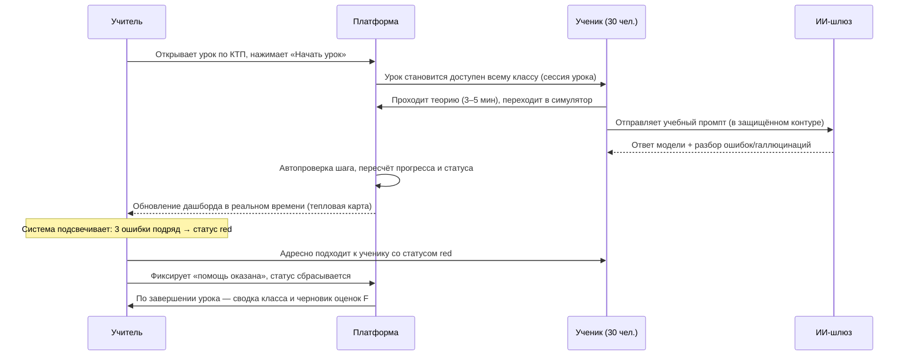
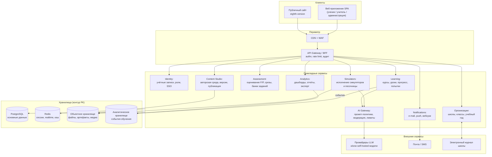

# Техническое задание
## Образовательная платформа CRAFT AI для школ Республики Казахстан
### Часть 1. Общие сведения, роли, архитектура, функциональные требования

| | |
|---|---|
| **Наименование системы** | Единая образовательная платформа CRAFT AI |
| **Условное обозначение** | CRAFT AI Platform (модули MATRIX, BUILDER, PISA) |
| **Версия документа** | 1.0 (черновик для согласования) |
| **Основание** | Продуктовая концепция экосистемы, зафиксированная в `eighth-version/` |
| **Заказчик** | CRAFT AI |
| **Конечные потребители** | Школы РК, управления образования (УоО), учителя, ученики 1–11 классов |

---

## Оглавление

1. [Общие сведения](#1-общие-сведения)
2. [Цели, задачи и метрики успеха](#2-цели-задачи-и-метрики-успеха)
3. [Пользователи, роли и права](#3-пользователи-роли-и-права)
4. [Ключевые пользовательские сценарии](#4-ключевые-пользовательские-сценарии)
5. [Общая архитектура решения](#5-общая-архитектура-решения)
6. [Функциональные требования](#6-функциональные-требования)

Продолжение — в [части 2](02-tz-nfr-i-priemka.md): модель данных, API,
нефункциональные требования, безопасность и ПДн, интеграции, тестирование,
этапы и приёмка, риски.

---

# 1. Общие сведения

## 1.1. Назначение документа

Документ определяет требования к разработке образовательной платформы CRAFT AI:
функциональность, архитектуру, нефункциональные ограничения, порядок приёмки и
этапность работ. Документ является основанием для оценки трудозатрат, заключения
договора на разработку и последующей приёмки результата.

Документ **не** описывает публичный маркетинговый сайт — он уже реализован
(`eighth-version/`) и в рамках данного ТЗ рассматривается только как точка входа
(заявки на демо, ссылка «Войти в кабинет»).

## 1.2. Краткое описание системы

CRAFT AI — веб-платформа (SaaS с размещением в контуре РК), объединяющая:

- **LMS-ядро** — учебные программы, уроки, прогресс, оценивание, отчётность;
- **среду интерактивных симуляторов** — практика по темам ИИ и цифровой грамотности;
- **защищённый ИИ-контур** — работа учеников с языковыми моделями без передачи
  персональных данных внешним сервисам;
- **аналитические дашборды** — реального времени для учителя, управленческие для
  директора/завуча и УоО.

Ключевая педагогическая модель: **«учитель не лектор, а тьютор»**. Система ведёт
ученика по индивидуальному темпу (self-paced), а учитель по дашборду адресно
помогает тем, кто «буксует».

## 1.3. Нормативная и методическая база

Система разрабатывается с учётом:

- Закона РК «О персональных данных и их защите» (в т.ч. требования о локализации
  и о согласии законных представителей для несовершеннолетних);
- Закона РК «Об образовании», ГОСО (Государственный общеобязательный стандарт
  образования) и Типовых учебных планов (ТУП);
- Инструктивно-методического письма (ИМП) МП РК на 2026–2027 учебный год,
  направление «Цифровая грамотность и ИИ»;
- критериев формативного (F) и суммативного (P) оценивания для 2–4 классов и
  балльных шкал для 5–11 классов;
- открытых рамок оценивания OECD PISA (Assessment and Analytical Framework),
  включая спецификацию цикла 2029 (Media & AI Literacy).

> **Оговорка о товарных знаках.** PISA — зарегистрированный товарный знак OECD.
> Платформа CRAFT AI является независимым образовательным продуктом и не
> аффилирована с OECD. В интерфейсах модуля CRAFT PISA обязателен дисклеймер
> (текст уже зафиксирован в `eighth-version/js/lang/pisa.js`, ключ `pisa.disclaimer`).

## 1.4. Термины и сокращения

| Термин | Определение |
|---|---|
| **ЦО** | Цель обучения — единица учебной программы ГОСО, к которой привязывается контент |
| **ТУП** | Типовой учебный план |
| **ИМП** | Инструктивно-методическое письмо МП РК |
| **УоО** | Управление образования (районное/городское/областное) |
| **Организация** (tenant) | Школа как единица арендатора в мультитенантной платформе |
| **Курс** | Учебная программа модуля для конкретной параллели (например, «MATRIX 7 класс») |
| **Урок (тема)** | Единица прохождения, состоящая из шагов |
| **Шаг** | Атомарный элемент урока: теория, симулятор, задание, тест, рефлексия |
| **Симулятор** | Интерактивный практикум с автоматической проверкой и подсказками |
| **Попытка (attempt)** | Факт прохождения шага учеником с результатом и телеметрией |
| **Статус ученика** | Светофорная метка темпа: `green` / `yellow` / `red` |
| **F / P** | Формативное / суммативное (промежуточное) оценивание |
| **ИИ-шлюз** | Внутренний сервис-посредник между платформой и языковыми моделями |
| **Защищённый учебный контур** | Режим работы с ИИ, при котором в модель не попадают ПДн ученика |
| **Методическая карта** | Готовый поурочный сценарий для учителя |
| **Срез (диагностика)** | Плановое тестирование класса/параллели с фиксированным набором заданий |

## 1.5. Границы проекта

### Входит в объём работ (v1.0 + v1.1)

- Личные кабинеты: ученик, учитель, завуч/директор, методист школы, администратор
  организации, аналитик УоО, суперадминистратор платформы.
- Модули MATRIX, BUILDER, PISA (объём контента и глубина — см. раздел 6).
- Авторская студия контента (создание уроков, симуляторов, банков заданий).
- ИИ-шлюз, дашборды, отчётность, экспорт.
- Локализация RU / KZ на всём объёме интерфейса и учебного контента.
- Мобильная адаптация (responsive web), без нативных приложений.

### Не входит в v1 (кандидаты на последующие релизы)

- Нативные мобильные приложения iOS/Android.
- Кабинет родителя с полноценной аналитикой (в v1 — только уведомления и
  просмотр итоговых отчётов, см. FR-CORE-09).
- Видеоконференции и онлайн-уроки в реальном времени.
- Маркетплейс стороннего контента и монетизация авторов.
- Полная замена школьного электронного журнала (реализуется интеграция, не замена).
- Прокторинг с видеонаблюдением при тестировании.

---

# 2. Цели, задачи и метрики успеха

## 2.1. Бизнес-цели

| № | Цель | Как проверяется |
|---|---|---|
| BG-1 | Школа получает готовый цифровой комплекс по предмету «Цифровая грамотность и ИИ», не требующий от учителя написания планов и поиска заданий | Учитель проводит урок, не создавая ни одного материала вручную |
| BG-2 | Администрация школы получает объективную картину готовности к PISA-2029 и внутренним срезам | Отчёт по параллели формируется за ≤ 1 минуту без бумажных срезов |
| BG-3 | Ученик выходит с портфолио работающих цифровых проектов | ≥ 3 артефакта в портфолио выпускника курса BUILDER |
| BG-4 | Платформа соответствует нормативам РК и проходит проверку по ПДн | Пакет комплаенс-документов, аудит, размещение данных в РК |

## 2.2. Продуктовые цели по ролям

- **Ученик:** проходить темы в своём темпе, безопасно практиковаться с ИИ, видеть
  собственный прогресс и собирать портфолио.
- **Учитель:** видеть класс «одним экраном», получать сигнал о том, кому нужна
  помощь **сейчас**, не тратить время на ручную проверку и планирование.
- **Завуч / директор:** контролировать покрытие программы, качество и динамику
  параллелей, формировать отчётность в один клик.
- **Методист:** создавать и адаптировать контент под ЦО, не привлекая разработчиков.
- **УоО:** сравнивать школы района по объективным метрикам функциональной грамотности.

## 2.3. Метрики успеха (KPI платформы)

| Метрика | Целевое значение (первый учебный год) |
|---|---|
| Доля уроков, проведённых без ручного создания материалов | ≥ 90 % |
| Среднее время учителя на подготовку к уроку | ≤ 10 минут |
| Доля учеников со статусом `red` дольше 2 уроков подряд | ≤ 5 % |
| Время реакции учителя на статус `red` (от сигнала до действия) | ≤ 5 минут (медиана) |
| Доля автоматически проверенных заданий (без ручной проверки) | ≥ 80 % |
| Прирост среднего балла по диагностике PISA (входной → итоговый срез) | ≥ 15 % |
| Доступность сервиса в учебное время (08:00–18:00 по времени школы) | ≥ 99,5 % |
| Доля успешных уроков при нестабильном интернете школы | ≥ 95 % (см. NFR-NET) |

---

# 3. Пользователи, роли и права

## 3.1. Перечень ролей

| Роль | Код | Область видимости | Ключевые задачи |
|---|---|---|---|
| Ученик | `student` | Только собственные данные | Проходит уроки, симуляторы, тесты, ведёт портфолио |
| Учитель | `teacher` | Свои классы и предметы | Ведёт урок, видит дашборд класса, проверяет, оценивает |
| Классный руководитель | `homeroom` | Свой класс целиком (все предметы платформы) | Сводный прогресс класса, коммуникация с родителями |
| Методист школы | `methodist` | Контент организации | Адаптирует уроки, создаёт задания, календарно-тематическое планирование |
| Завуч / директор | `principal` | Вся организация | Аналитика, срезы, отчётность, назначение ролей |
| Администратор организации | `org_admin` | Вся организация (техническая часть) | Импорт списков, классы, учётные записи, интеграции |
| Аналитик УоО | `district` | Несколько организаций (район/город/область) | Сравнительная аналитика, выгрузки |
| Родитель | `parent` | Свой ребёнок (ограниченно) | Согласия на обработку ПДн, итоговые отчёты, уведомления |
| Контент-редактор платформы | `author` | Глобальная библиотека контента | Разработка курсов, симуляторов, банков заданий |
| Суперадминистратор | `superadmin` | Вся платформа | Тенанты, лицензии, конфигурация, аудит |
| Служба поддержки | `support` | Ограниченный доступ по тикету | Диагностика проблем (без доступа к содержимому работ учеников по умолчанию) |

## 3.2. Требования к модели доступа

- **FR-RBAC-01.** Модель доступа — ролевая (RBAC) с обязательной привязкой к
  области действия (scope): платформа → УоО → организация → класс → ученик.
  Одна учётная запись может иметь несколько ролей в разных областях
  (например, `teacher` в 7«А» и `methodist` в организации).
- **FR-RBAC-02.** Все запросы к данным ученика обязаны проходить проверку области
  видимости на серверной стороне. Ролевые проверки только на клиенте — недопустимы.
- **FR-RBAC-03.** Роль `support` получает доступ к персональным данным только по
  явному временно́му гранту (не более 24 часов), с обязательной записью в журнал
  аудита и уведомлением администратора организации.
- **FR-RBAC-04.** Любая смена роли, выдача и отзыв доступа фиксируются в
  неизменяемом журнале аудита (см. NFR-SEC-07 в части 2).
- **FR-RBAC-05.** Учителю запрещён доступ к чернового рода данным ученика вне
  учебного контекста: черновики промптов доступны в агрегированном виде и в виде
  конкретной попытки по текущему заданию, но не как сквозной поиск по переписке.

## 3.3. Матрица прав (фрагмент)

| Действие | student | teacher | methodist | principal | org_admin | district | superadmin |
|---|:--:|:--:|:--:|:--:|:--:|:--:|:--:|
| Проходить урок | ✓ | ✓ (демо) | ✓ (демо) | — | — | — | — |
| Видеть дашборд класса | — | ✓ | — | ✓ | — | — | ✓ |
| Видеть ФИО ученика | своё | ✓ | — | ✓ | ✓ | — | ✓ |
| Видеть агрегаты без ФИО | — | ✓ | ✓ | ✓ | ✓ | ✓ | ✓ |
| Выставлять оценку | — | ✓ | — | ✓ (корр.) | — | — | — |
| Запускать срез PISA | — | ✓ | ✓ | ✓ | — | — | ✓ |
| Создавать/править контент организации | — | — | ✓ | ✓ | — | — | ✓ |
| Публиковать контент в глобальную библиотеку | — | — | — | — | — | — | ✓ (`author`) |
| Импорт списков учеников | — | — | — | — | ✓ | — | ✓ |
| Выгружать отчёты по школе | — | ✓ (класс) | ✓ | ✓ | ✓ | ✓ (агрегат) | ✓ |

Полная матрица прав по всем ролям и объектам утверждается на этапе 0 (см. раздел 13
части 2) и поддерживается в актуальном состоянии как часть проектной документации.

---

# 4. Ключевые пользовательские сценарии

## 4.1. Сценарий «Урок с CRAFT MATRIX» (основной)

Соответствует трёхшаговому сценарию, зафиксированному на странице `matrix.html`.

**Критерий успеха сценария:** учитель ни разу не открыл сторонние материалы,
статус `red` у любого ученика был замечен не позднее чем через 60 секунд после
возникновения.

## 4.2. Сценарий «Практика BUILDER: от идеи до артефакта»

1. Ученик выбирает модуль курса (1 — архитектура LLM, 2 — промпт-инжиниринг,
   3 — вайб-кодинг, 4 — автономные агенты).
2. Проходит теорию и тренажёр промптов: собирает промпт из блоков-критериев
   (роль, стек и структура, краевые сценарии, шум) и получает оценку качества
   промпта с объяснением, чего не хватает.
3. В песочнице вайб-кодинга описывает задачу на естественном языке, получает код,
   запускает его в изолированном превью, находит ошибки, итеративно исправляет.
4. Сдаёт артефакт (сайт/бот/агент) в портфолио: платформа автоматически собирает
   историю итераций, промпты и результат.
5. Учитель проверяет по рубрике; артефакт становится публикуемым (по решению
   ученика и учителя) в школьном портфолио.

## 4.3. Сценарий «Диагностика PISA и отчёт для УоО»

1. Завуч запускает срез: выбирает параллель, направления (математическая,
   естественно-научная, читательская грамотность, медиа/ИИ-грамотность),
   окно проведения и длительность.
2. Ученики проходят срез в назначенное время; задания подбираются из банка
   с контролем сложности и без повторов внутри параллели.
3. Платформа считает результаты по шкалам и уровням, строит тепловую карту
   рисков по темам и мыслительным навыкам.
4. Завуч выгружает отчёт (PDF/XLSX) с динамикой «входной срез vs текущий» и
   рекомендациями алгоритма (например: «усилить блок естественно-научных
   гипотез в 8–9 классах»).
5. Аналитик УоО видит агрегат по району без персональных данных учеников.

## 4.4. Сценарий «Подключение школы»

1. Заявка с публичного сайта (`eighth-version`) попадает в CRM-очередь.
2. Менеджер создаёт организацию (tenant), выдаёт лицензию и учётную запись
   `org_admin`.
3. `org_admin` импортирует классы и списки учеников (XLSX/CSV или интеграция
   с электронным журналом), рассылает приглашения учителям.
4. Собираются согласия законных представителей на обработку ПДн (см. FR-CORE-10).
5. Школа получает демо-класс с преднастроенным контентом для тренировки учителей.

---

# 5. Общая архитектура решения

## 5.1. Логическая архитектура

## 5.2. Состав подсистем и зона ответственности

| Подсистема | Ответственность | Критичность |
|---|---|---|
| Identity | Аутентификация, сессии, роли, SSO, восстановление доступа | Критичная |
| Organizations | Иерархия «УоО → школа → параллель → класс → ученик», учебный год, расписание | Критичная |
| Learning | Каталог курсов, прохождение, прогресс, статусы, сессии урока | Критичная |
| Assessment | Критерии F/P, баллы 5–11, банки заданий, срезы, антисписывание | Критичная |
| Simulators | Запуск интерактивных практикумов, песочница кода, изоляция исполнения | Критичная |
| AI Gateway | Единая точка обращения к моделям, деперсонализация, модерация, лимиты, кэш | Критичная |
| Analytics | Дашборды, тепловые карты, отчёты, экспорт | Высокая |
| Content Studio | Создание/версионирование/публикация контента | Высокая |
| Notifications | Уведомления учителю, ученику, родителю | Средняя |
| Admin | Тенанты, лицензии, импорт, конфигурация | Высокая |

## 5.3. Рекомендуемый технологический стек

Стек — рекомендация; допустимы обоснованные альтернативы при сохранении
нефункциональных требований (часть 2, раздел 8).

| Слой | Рекомендация | Обоснование | Допустимые альтернативы |
|---|---|---|---|
| Frontend | TypeScript + React (либо Svelte), сборка Vite | Зрелая экосистема, доступность, i18n, большое комьюнити в РК | Vue 3, Svelte/SvelteKit |
| Стиль | Дизайн-токены из `eighth-version/styles.css`, CSS-переменные | Преемственность бренда и WCAG-проверенной палитры | — |
| Симуляторы | Vanilla JS/Canvas/WebGL-компоненты без тяжёлых зависимостей | Требование работы на слабых школьных ПК | — |
| Backend | .NET 8 (ASP.NET Core) **или** Node.js + NestJS | Производительность, типизация, доступность кадров | Go, Java Spring |
| БД | PostgreSQL 16 | Реляционная целостность учебных данных, JSONB для контента | — |
| Кэш/realtime | Redis + WebSocket (или SSE) | Дашборд учителя в реальном времени | — |
| Аналитика | ClickHouse (или партиционированный PostgreSQL на старте) | Событийная телеметрия обучения | — |
| Файлы | S3-совместимое объектное хранилище в РК | Артефакты, медиа, выгрузки | — |
| Песочница кода | Изолированные контейнеры/микро-ВМ с жёсткими лимитами, без доступа в сеть | Безопасность выполнения ученического кода | WebContainer/WASM-рантайм на клиенте |
| Инфраструктура | Kubernetes или управляемые сервисы облака, размещённого в РК | Масштабирование под пиковую школьную нагрузку | — |
| Наблюдаемость | OpenTelemetry + Prometheus + Grafana + централизованные логи | Диагностика инцидентов в учебное время | — |

## 5.4. Окружения

| Окружение | Назначение | Данные |
|---|---|---|
| `dev` | Разработка | Только синтетические |
| `staging` | Приёмочное тестирование, обучение учителей | Обезличенные/синтетические |
| `demo` | Демонстрации школам и УоО | Демо-класс, синтетические ученики |
| `prod` | Промышленная эксплуатация | Реальные ПДн, контур РК |

**Требование:** копирование реальных ПДн из `prod` в любое другое окружение
запрещено. Для отладки используется обезличивание с необратимой заменой ФИО.

---

# 6. Функциональные требования

Требования пронумерованы для трассируемости: `FR-<подсистема>-<номер>`.
Приоритеты: **M** (must, v1.0), **S** (should, v1.1), **C** (could, backlog).

## 6.0. Ядро платформы

| ID | Приоритет | Требование |
|---|---|---|
| FR-CORE-01 | M | Мультитенантность: каждая школа — изолированная организация; данные организаций не пересекаются на уровне запросов и на уровне выгрузок. |
| FR-CORE-02 | M | Иерархия сущностей: УоО → организация → параллель → класс → ученик. Класс привязан к учебному году; при переходе на новый учебный год выполняется процедура перевода классов с сохранением истории. |
| FR-CORE-03 | M | Аутентификация: логин/пароль, вход по коду-приглашению для учеников младших классов (короткий код + PIN без ввода e-mail), восстановление доступа через администратора организации. |
| FR-CORE-04 | M | Для учеников 1–4 классов — упрощённый вход: класс выбирается из списка, ученик — по аватару/имени, подтверждение PIN-кодом из 4 цифр. Ввод e-mail не требуется. |
| FR-CORE-05 | S | SSO: OAuth 2.0/OIDC для интеграции с региональными системами и корпоративными аккаунтами школ. |
| FR-CORE-06 | M | Двухфакторная аутентификация обязательна для ролей `principal`, `org_admin`, `district`, `superadmin`. |
| FR-CORE-07 | M | Полная локализация RU/KZ: интерфейс, учебный контент, отчёты, уведомления, письма. Язык выбирается пользователем и запоминается; язык контента может отличаться от языка интерфейса. |
| FR-CORE-08 | M | Импорт учеников и классов из XLSX/CSV с валидацией, предпросмотром и отчётом об ошибках построчно; повторный импорт не создаёт дублей (сопоставление по ИИН/внешнему идентификатору). |
| FR-CORE-09 | S | Кабинет родителя: просмотр прогресса и итоговых отчётов ребёнка, получение уведомлений, управление согласиями. Без доступа к содержимому работ и переписке с ИИ. |
| FR-CORE-10 | M | Учёт согласий: система хранит факт, дату, версию текста согласия законного представителя на обработку ПДн ребёнка; без действующего согласия учётная запись ученика не активируется. |
| FR-CORE-11 | M | Журнал аудита действий: вход, смена ролей, доступ к ПДн, изменение оценок, выгрузки, административные операции. Записи неизменяемы, срок хранения — не менее 3 лет. |
| FR-CORE-12 | S | Лицензирование: тип лицензии школы (модули, число учеников, срок), контроль лимитов, уведомление за 30 дней до истечения. |
| FR-CORE-13 | M | Демо-режим: изолированный демо-класс с синтетическими учениками для обучения учителей и демонстраций; данные демо-класса не попадают в аналитику школы. |

## 6.1. Подсистема контента (LMS-ядро)

### 6.1.1. Модель контента

| ID | Приоритет | Требование |
|---|---|---|
| FR-CNT-01 | M | Иерархия контента: **Модуль** (MATRIX/BUILDER/PISA) → **Курс** (модуль + параллель) → **Раздел** → **Урок (тема)** → **Шаг**. |
| FR-CNT-02 | M | Типы шагов: `theory` (теория/медиа), `simulator` (интерактивный практикум), `task` (задание с проверкой), `quiz` (тест), `ai_practice` (практика с ИИ), `project` (проектная работа), `reflection` (рефлексия). |
| FR-CNT-03 | M | Каждый урок и каждое задание обязательно привязаны к одной или нескольким **целям обучения (ЦО)** ГОСО с указанием кода ЦО. Публикация урока без привязки к ЦО невозможна. |
| FR-CNT-04 | M | Контент версионируется. Опубликованная версия неизменяема; правки создают новую версию. Ученики, начавшие прохождение, дорабатывают тему на своей версии до конца урока. |
| FR-CNT-05 | M | Двуязычность контента: каждая единица контента имеет варианты RU и KZ. Публикация урока разрешена только при наличии обеих версий (или при явной отметке «временно только RU» с предупреждением). |
| FR-CNT-06 | M | Календарно-тематическое планирование (КТП): автоматически формируется из курса по ТУП; методист/учитель может переставлять темы и сдвигать даты. |
| FR-CNT-07 | S | Наследование контента: школа может создать локальную копию урока (fork) и адаптировать её, сохраняя связь с исходной версией и получая уведомления об обновлениях оригинала. |
| FR-CNT-08 | M | Предусловия: урок может требовать завершения предыдущих тем; ученик видит заблокированные темы с объяснением условия разблокировки. |

### 6.1.2. Авторская студия (Content Studio)

| ID | Приоритет | Требование |
|---|---|---|
| FR-CMS-01 | M | Визуальный редактор урока: добавление и перестановка шагов, вставка текста, изображений, видео, формул, кода — без участия разработчиков. |
| FR-CMS-02 | M | Конструктор заданий с автопроверкой: одиночный/множественный выбор, соответствие, упорядочивание, заполнение пропусков, числовой ответ с допуском, короткий текстовый ответ (проверка по эталону/регулярному выражению), перетаскивание. |
| FR-CMS-03 | M | Конструктор критериев оценивания: дескрипторы, баллы, привязка к ЦО, тип оценивания (F/P). |
| FR-CMS-04 | M | Предпросмотр урока в роли ученика (в т.ч. на мобильном разрешении) до публикации. |
| FR-CMS-05 | M | Рабочий процесс публикации: черновик → на рецензии → опубликовано → снято с публикации. Публикация в глобальную библиотеку доступна только роли `author`/`superadmin`. |
| FR-CMS-06 | S | Импорт/экспорт контента в открытом формате (JSON-схема платформы), а также импорт вопросов из QTI/XLSX. |
| FR-CMS-07 | S | ИИ-ассистент методиста: генерация черновиков заданий по указанной ЦО с обязательной ручной проверкой перед публикацией. Автопубликация сгенерированного контента запрещена. |

## 6.2. CRAFT MATRIX — учебный модуль для уроков (1–11 класс)

### 6.2.1. Прохождение учеником

| ID | Приоритет | Требование |
|---|---|---|
| FR-MTX-01 | M | Self-paced прохождение: ученик идёт по теме в собственном темпе, не дожидаясь класса; сильный ученик получает доступ к следующему шагу сразу после успешного завершения текущего. |
| FR-MTX-02 | M | Структура темы: короткий теоретический блок (целевое время чтения ≤ 5 минут) → интерактивный симулятор → задание с автопроверкой → короткий тест. |
| FR-MTX-03 | M | Библиотека интерактивных симуляторов по ключевым темам, минимально: «Принципы работы нейросетей», «Распознавание образов», «Правила безопасного промптинга», «Фактчекинг и анализ достоверности данных». Каждый симулятор — самостоятельный компонент с единым контрактом (см. FR-SIM-01). |
| FR-MTX-04 | M | Подсказки: при ошибке ученик получает объяснение, а не только вердикт «неверно». После 2 ошибок — пошаговая подсказка, после 3 — предложение обратиться к учителю и сигнал на дашборд. |
| FR-MTX-05 | M | Возрастная дифференциация интерфейса: 1–4 классы — крупные элементы, озвучка инструкций, минимум текста, игровые метафоры; 5–8 — стандартный; 9–11 — плотный «инженерный» режим. |
| FR-MTX-06 | M | Автосохранение прогресса не реже чем каждые 10 секунд и при каждом завершённом шаге; при обрыве связи ученик продолжает с последнего сохранённого шага. |
| FR-MTX-07 | S | Режим «тренировка»: повторное прохождение темы без влияния на оценку, с другим набором вариантов заданий. |

### 6.2.2. Сессия урока и дашборд учителя

| ID | Приоритет | Требование |
|---|---|---|
| FR-MTX-10 | M | Учитель запускает **сессию урока**: выбирает класс и тему, система открывает доступ ученикам и начинает сбор телеметрии в реальном времени. |
| FR-MTX-11 | M | Дашборд класса отображает по каждому ученику: ФИО и класс, текущую тему/шаг, прогресс в процентах, статус (`green`/`yellow`/`red`), краткую причину статуса, рекомендуемое действие учителя. |
| FR-MTX-12 | M | Правила расчёта статуса (конфигурируемые, значения по умолчанию): `green` — темп в пределах нормы или выше; `yellow` — отставание от медианы класса > 25 % по времени шага **или** 2 неверные попытки подряд; `red` — 3 и более неверных попыток подряд, **или** бездействие > 5 минут, **или** отставание > 50 %. |
| FR-MTX-13 | M | Обновление дашборда в реальном времени с задержкой не более 5 секунд от события ученика. |
| FR-MTX-14 | M | Фильтры дашборда: все / `green` / `yellow` / `red`; поиск по имени ученика; сортировка по прогрессу и по статусу. |
| FR-MTX-15 | M | Действие учителя: карточка ученика открывает детали (какие шаги, какие ошибки, последняя попытка) и кнопки «Помощь оказана», «Дать подсказку», «Отправить на повтор». |
| FR-MTX-16 | M | Тепловая карта класса по шагам темы: видно, на каком именно шаге застревает большинство — сигнал о проблеме в контенте, а не в учениках. |
| FR-MTX-17 | M | Доступность статуса не только цветом: обязательны текстовая подпись и иконка (требование для дальтоников и скринридеров — уже зафиксировано в дизайн-системе). |
| FR-MTX-18 | M | Итог урока: автоматическая сводка (кто завершил, кто нет, средний прогресс, проблемные шаги) и черновик формативных оценок для подтверждения учителем. |
| FR-MTX-19 | S | Проекционный режим: обезличенный вид дашборда для показа на интерактивной доске (без ФИО, только агрегаты). |

### 6.2.3. Методическое сопровождение учителя

| ID | Приоритет | Требование |
|---|---|---|
| FR-MTX-20 | M | К каждому уроку прилагается методическая карта: цели обучения, хронометраж, ожидаемые трудности, критерии оценивания, домашнее задание, дифференциация для сильных/слабых учеников. |
| FR-MTX-21 | M | Печатная версия методической карты и раздаточных материалов (PDF, A4, корректная кириллица и казахские глифы). |
| FR-MTX-22 | M | Автоматическое соответствие ТУП: отчёт «покрытие программы» показывает, какие ЦО пройдены классом, какие — нет, и укладывается ли класс в календарный план. |
| FR-MTX-23 | S | Банк альтернативных заданий по каждой ЦО для повторного и дополнительного объяснения. |

## 6.3. CRAFT BUILDER — практический курс ИИ-инженерии

| ID | Приоритет | Требование |
|---|---|---|
| FR-BLD-01 | M | Курс состоит из 4 модулей: (1) архитектура и принципы работы LLM; (2) продвинутый промпт-инжиниринг и работа с контекстом; (3) вайб-кодинг — разработка приложений через ИИ-ассистента; (4) создание и запуск автономных ИИ-агентов. |
| FR-BLD-02 | M | Каждый модуль завершается созданием работающего цифрового артефакта, попадающего в портфолио ученика. |
| FR-BLD-03 | M | **Тренажёр промптов:** ученик собирает промпт из блоков (роль эксперта, стек и структура, краевые сценарии, «шум»), система оценивает качество промпта в процентах и объясняет, какие критерии выполнены, а какие нет. Оценка считается по детерминированной рубрике (контекст, технические требования, критерии валидации), а не «на усмотрение модели». |
| FR-BLD-04 | M | **Песочница вайб-кодинга:** ученик формулирует задачу на естественном языке, получает код, запускает его в изолированном превью, видит ошибки, итеративно исправляет. Поддерживаемый стек v1: HTML/CSS/JavaScript (клиентские веб-страницы и мини-приложения). |
| FR-BLD-05 | M | Исполнение ученического кода полностью изолировано: без доступа к сети платформы, без доступа к другим пользователям, с лимитами по CPU, памяти и времени выполнения. Изоляция — обязательное условие приёмки модуля. |
| FR-BLD-06 | M | История итераций: платформа сохраняет цепочку «промпт → результат → правка», чтобы учитель оценивал процесс мышления, а не только итог. |
| FR-BLD-07 | M | **Портфолио ученика:** карточка проекта (название, описание, скриншот/превью, ссылка на запуск, использованные промпты, дата), экспорт портфолио в PDF и публичная ссылка «только по ссылке» (включается учеником, модерируется учителем). |
| FR-BLD-08 | S | Модуль 4 (агенты): визуальный конструктор сценария агента (триггер → шаги → инструменты → ответ) с ограниченным набором безопасных инструментов (калькулятор, работа с загруженным файлом, поиск по учебной базе знаний). Публикация телеграм-ботов — только через контролируемый шлюз платформы. |
| FR-BLD-09 | M | Рубрики оценивания проектов: работоспособность, соответствие задаче, качество промптов, самостоятельность итераций, оформление. Учитель оценивает по рубрике в 2–3 клика. |
| FR-BLD-10 | M | Проверка академической честности: система отмечает проекты, полностью совпадающие с чужими, и артефакты, созданные без единой итерации правки (см. также FR-INT-05 в части 2). |
| FR-BLD-11 | S | Витрина школьных проектов: лучшие работы класса/школы для участия в конкурсах («Дарын», МАН, хакатоны). |

## 6.4. CRAFT PISA — функциональная грамотность и диагностика

### 6.4.1. Банк заданий и тренажёры

| ID | Приоритет | Требование |
|---|---|---|
| FR-PSA-01 | M | Оцифрованный банк заданий по открытым материалам прошлых циклов PISA с полнотекстовым поиском, фильтрами по направлению, уровню сложности, году и когнитивному навыку. |
| FR-PSA-02 | M | Тренажёры по трём направлениям: математическая грамотность (практические задачи в жизненном контексте), естественно-научная (гипотезы, виртуальные эксперименты, анализ данных), читательская (критико-аналитические тексты, выделение сути, фактчекинг). |
| FR-PSA-03 | M | **Спецмодуль PISA-2029 «Медиа- и ИИ-грамотность»:** распознавание фейков и дипфейков; анализ ошибок и галлюцинаций ИИ (поиск логических неувязок и предвзятости); работа с мультимодальной информацией (синтез графиков, таблиц и ИИ-сводок). |
| FR-PSA-04 | M | Автоматический разбор решения: после ответа ученик получает детальное объяснение ошибки и пошаговые подсказки, а не только «верно/неверно». |
| FR-PSA-05 | M | Поддержка составных заданий PISA-типа: один стимул (текст, график, набор источников) + несколько связанных вопросов разных форматов. |
| FR-PSA-06 | M | Все задания имеют метаданные: направление, когнитивный процесс, контекст, уровень по шкале, ожидаемое время выполнения. |
| FR-PSA-07 | S | Адаптивный подбор: следующее задание выбирается по текущей оценке уровня ученика (упрощённая IRT-модель или пороговая логика — решение фиксируется в ADR). |

### 6.4.2. Срезы и диагностика

| ID | Приоритет | Требование |
|---|---|---|
| FR-PSA-10 | M | Планирование среза: выбор параллели/классов, направлений, числа заданий, длительности, окна проведения. Поддержка входного, промежуточного и итогового срезов внутри учебного года. |
| FR-PSA-11 | M | Автоматическая генерация индивидуальных вариантов из банка с контролем: равная суммарная сложность, отсутствие повторов внутри параллели, перемешивание порядка вопросов и вариантов ответа. |
| FR-PSA-12 | M | Режим проведения среза: таймер, запрет возврата к сданным блокам (конфигурируемо), автосдача по истечении времени, сохранение ответов при обрыве связи и корректное возобновление. |
| FR-PSA-13 | M | Антисписывание базового уровня: индивидуальные варианты, фиксация переключения вкладок, аномально быстрых ответов и совпадения паттернов ответов. Видеопрокторинг в v1 не реализуется. |
| FR-PSA-14 | M | Результаты: балл и уровень по каждому направлению, сравнение с предыдущим срезом, с классом, параллелью и школой. |

### 6.4.3. Управленческий дашборд

| ID | Приоритет | Требование |
|---|---|---|
| FR-PSA-20 | M | Сквозная диагностика готовности: уровень функциональной грамотности каждого класса и параллели рассчитывается автоматически, без бумажных срезов. |
| FR-PSA-21 | M | Тепловая карта рисков: система подсвечивает темы, разделы и мыслительные навыки с системным проседанием, с возможностью провалиться до списка учеников (для ролей, имеющих право видеть ФИО). |
| FR-PSA-22 | M | График динамики готовности параллелей: сравнение контрольных срезов (входной vs текущий) с доверительной пометкой о числе участников. |
| FR-PSA-23 | M | Отчёты для УоО в один клик: выгрузка в PDF и XLSX с динамикой прироста, распределением по уровням и рекомендациями. Отчёты для УоО формируются в обезличенном виде. |
| FR-PSA-24 | M | Алгоритмические рекомендации: текстовые выводы вида «усилить блок естественно-научных гипотез в 8–9 классах», формируемые по правилам на основе статистики, с обязательным указанием оснований (какие показатели и на какой выборке). |
| FR-PSA-25 | S | Прогноз баллов PISA: оценка ожидаемого результата школы с явным указанием, что это модельная оценка, а не официальный результат OECD. |

## 6.5. Оценивание

| ID | Приоритет | Требование |
|---|---|---|
| FR-ASM-01 | M | Поддержка формативного (F) и суммативного (P) оценивания с критериями и дескрипторами, встроенными в контент, для 2–4 классов. |
| FR-ASM-02 | M | Поддержка балльных шкал для 5–11 классов с настраиваемым переводом баллов в отметку по правилам школы. |
| FR-ASM-03 | M | Автоматическая проверка заданий закрытого типа и большинства практических шагов симуляторов; ручная проверка — только для открытых ответов и проектов. |
| FR-ASM-04 | M | Учитель может скорректировать любую автоматическую оценку с обязательным указанием причины; исходное значение сохраняется в истории. |
| FR-ASM-05 | M | Журнал оценок класса с фильтрами по теме и ЦО, выгрузка в XLSX. |
| FR-ASM-06 | S | Автоматическая генерация проверочных карточек по теме (варианты для класса) с ключами для учителя. |
| FR-ASM-07 | S | Проверка открытых ответов с помощью ИИ как **подсказка учителю**: система предлагает балл и обоснование по рубрике, окончательное решение всегда за учителем. Автоматическое выставление итоговой оценки моделью запрещено. |

## 6.6. Симуляторы: единый контракт

| ID | Приоритет | Требование |
|---|---|---|
| FR-SIM-01 | M | Все симуляторы реализуют единый контракт: получают конфигурацию задания, сообщают платформе события (`started`, `step_completed`, `error`, `hint_used`, `finished`) и итоговый результат с деталями попытки. |
| FR-SIM-02 | M | Симулятор работает в изолированном контексте (iframe с ограничительной политикой) и не имеет прямого доступа к токенам пользователя и API платформы. |
| FR-SIM-03 | M | Ограничение веса: интерактивный симулятор загружается не более 3 секунд на школьном ПК и канале 10 Мбит/с; тяжёлые зависимости не используются. |
| FR-SIM-04 | M | Полная работоспособность с клавиатуры и корректная работа со скринридером для симуляторов, не требующих точной моторики; для остальных — обязательная текстовая альтернатива задания. |
| FR-SIM-05 | M | Деградация: при `prefers-reduced-motion` анимации отключаются; при отсутствии WebGL используется упрощённый вариант визуализации. |

## 6.7. ИИ-слой (AI Gateway)

| ID | Приоритет | Требование |
|---|---|---|
| FR-AI-01 | M | Все обращения к языковым моделям идут **только** через внутренний ИИ-шлюз. Прямые вызовы провайдеров с клиента запрещены; ключи провайдеров никогда не попадают в браузер. |
| FR-AI-02 | M | **Деперсонализация:** в запрос к модели не передаются ФИО, ИИН, e-mail, телефон, школа, класс и любые иные идентифицирующие данные ученика. Передаётся только псевдонимный идентификатор сессии и учебный контекст. |
| FR-AI-03 | M | Двусторонняя модерация: фильтрация ввода ученика и ответа модели на недопустимый контент (насилие, самоповреждение, сексуальный контент, буллинг, экстремизм). При срабатывании — безопасный ответ ученику, событие в журнал и уведомление учителя. Порог и словари конфигурируются и учитывают русский и казахский языки. |
| FR-AI-04 | M | Возрастные профили безопасности: для 1–4 классов используется наиболее ограничительный профиль (белый список тем, короткие ответы, запрет свободного диалога вне задания). |
| FR-AI-05 | M | Системные промпты и учебные политики хранятся на сервере, версионируются и не доступны ученику. Защита от prompt injection: инструкции ученика не могут переопределить системную политику; содержимое загруженных файлов трактуется как данные, а не как инструкции. |
| FR-AI-06 | M | Лимиты: квоты запросов на ученика/класс/школу за урок и за сутки, лимит длины запроса и ответа, защита от зацикливания. При исчерпании — понятное сообщение и возможность продолжить урок без ИИ-шага. |
| FR-AI-07 | M | Полное журналирование: запрос, ответ, модель, стоимость, время, вердикт модерации. Срок хранения журналов диалогов — согласуется с политикой ПДн (по умолчанию 12 месяцев), доступ — по ролям и с аудитом. |
| FR-AI-08 | M | Отказоустойчивость: при недоступности провайдера — переключение на резервную модель; при недоступности всех — учебный шаг переводится в офлайн-режим с заранее подготовленными эталонными ответами, урок не срывается. |
| FR-AI-09 | S | Кэширование ответов на типовые учебные запросы для снижения стоимости и задержки. |
| FR-AI-10 | M | Учебные сценарии с намеренными галлюцинациями: платформа умеет предъявлять ученику заведомо ошибочный ответ модели (из подготовленного банка) для отработки навыка фактчекинга, с явной методической пометкой для учителя. |
| FR-AI-11 | M | Контроль стоимости: панель расхода токенов по школе и модулю, оповещение при превышении бюджета, автоматическое понижение до более дешёвой модели по правилу. |
| FR-AI-12 | S | Возможность подключения self-hosted модели, развёрнутой в контуре РК, как основного провайдера — без изменения кода прикладных сервисов. |

## 6.8. Аналитика и отчётность

| ID | Приоритет | Требование |
|---|---|---|
| FR-ANL-01 | M | Событийная модель обучения: каждое значимое действие ученика фиксируется как событие с меткой времени, контекстом (курс, урок, шаг, попытка) и результатом. |
| FR-ANL-02 | M | Дашборд учителя (реальное время) — см. FR-MTX-11…19. |
| FR-ANL-03 | M | Дашборд завуча/директора: покрытие программы, средний прогресс параллелей, доля учеников в зоне риска, качество по предметам, активность учителей. |
| FR-ANL-04 | M | Дашборд УоО: сравнение школ района по обезличенным агрегатам с указанием размера выборки; запрет на выгрузку данных отдельных учеников. |
| FR-ANL-05 | M | Экспорт отчётов в PDF и XLSX с корректным отображением кириллицы и казахских глифов (Ә, Ғ, Қ, Ң, Ө, Ұ, Ү, І, Һ). |
| FR-ANL-06 | S | Планировщик отчётов: автоматическая рассылка еженедельной сводки директору и классному руководителю. |
| FR-ANL-07 | M | Все агрегаты с выборкой менее 5 учеников не отображаются во внешних (обезличенных) отчётах во избежание деанонимизации. |

## 6.9. Уведомления

| ID | Приоритет | Требование |
|---|---|---|
| FR-NTF-01 | M | Каналы: внутриплатформенные уведомления, e-mail. SMS и мессенджеры — опционально (v1.1). |
| FR-NTF-02 | M | Учителю: ученик в статусе `red` дольше N минут; проект сдан на проверку; срез завершён. |
| FR-NTF-03 | M | Ученику: назначено задание; получена оценка; получен комментарий учителя; приближается дедлайн. |
| FR-NTF-04 | S | Родителю: недельная сводка прогресса, завершение курса, запрос согласия. |
| FR-NTF-05 | M | Настройки уведомлений на уровне пользователя и организации; уведомления по умолчанию не отправляются вне учебного времени (08:00–20:00 по времени организации). |

## 6.10. Публичный сайт и заявки

| ID | Приоритет | Требование |
|---|---|---|
| FR-WEB-01 | M | Публичный сайт (`eighth-version/`) сохраняется как витрина; в шапку добавляется кнопка «Войти в кабинет», ведущая на приложение платформы. |
| FR-WEB-02 | M | Форма «Запросить демо для школы» сохраняет заявку в CRM-очередь платформы (ФИО, школа, e-mail, телефон), с защитой от спама и подтверждением по e-mail. |
| FR-WEB-03 | M | Дизайн-система платформы наследует токены, типографику и палитру из `eighth-version/styles.css` и `DESIGN.md`; контраст — не ниже WCAG 2.1 AA. |
| FR-WEB-04 | S | Кнопка «Скачать презентацию экосистемы» отдаёт актуальный PDF, версионируемый в админ-панели. |
