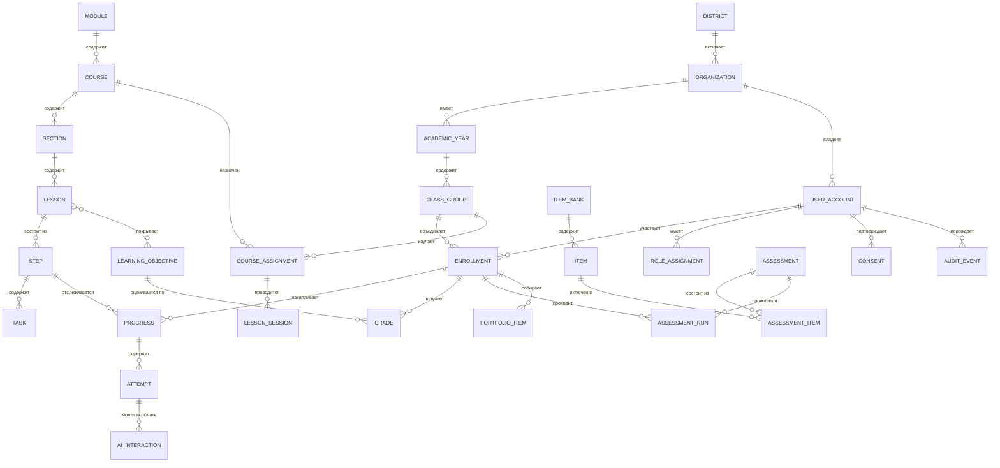
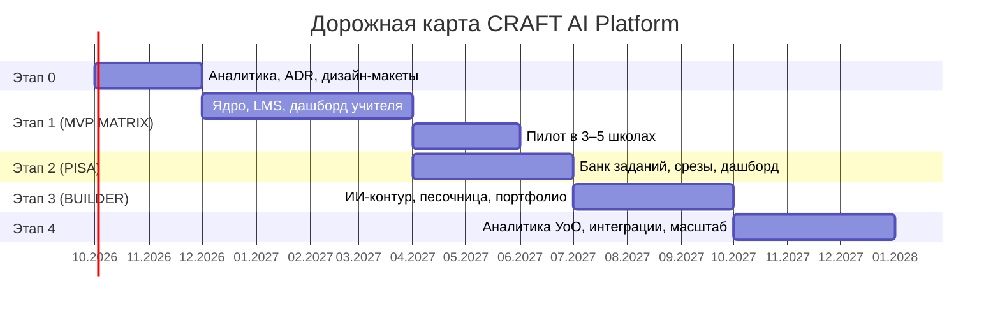

# Техническое задание
## Образовательная платформа CRAFT AI для школ Республики Казахстан
### Часть 2. Модель данных, API, нефункциональные требования, безопасность, этапы и приёмка

Продолжение [части 1](01-tz-platforma.md).

---

## Оглавление

7. [Модель данных](#7-модель-данных)
8. [Программные интерфейсы (API)](#8-программные-интерфейсы-api)
9. [Нефункциональные требования](#9-нефункциональные-требования)
10. [Безопасность и персональные данные](#10-безопасность-и-персональные-данные)
11. [Интеграции](#11-интеграции)
12. [Тестирование и приёмка](#12-тестирование-и-приёмка)
13. [Этапы разработки и команда](#13-этапы-разработки-и-команда)
14. [Риски и открытые вопросы](#14-риски-и-открытые-вопросы)
15. [Приложения](#15-приложения)

---

# 7. Модель данных

## 7.1. Концептуальная схема



## 7.2. Основные сущности

| Сущность | Ключевые атрибуты | Примечания |
|---|---|---|
| `organization` | id, название, БИН, регион, район, тип, часовой пояс, лицензия, статус | Тенант платформы |
| `academic_year` | id, org_id, начало, окончание, статус | Основа перевода классов |
| `class_group` | id, org_id, year_id, параллель (1–11), литера, язык обучения, куратор | «7 «А»» |
| `user_account` | id, org_id, тип, ФИО, внешний id (ИИН — шифрованно), контакты, язык, статус | ПДн — по разделу 10 |
| `role_assignment` | id, user_id, роль, scope_type, scope_id, срок действия | Основа RBAC |
| `enrollment` | id, class_id, student_id, дата зачисления/отчисления | История сохраняется |
| `module` / `course` / `section` / `lesson` / `step` | id, код, версия, язык, статус публикации, порядок | Версионируемый контент |
| `learning_objective` | id, код ЦО, предмет, класс, формулировка RU/KZ, источник (ГОСО/ТУП) | Справочник |
| `task` | id, step_id, тип, условие, эталон/ключ, критерии, баллы, время | Единица проверки |
| `lesson_session` | id, class_id, lesson_id, teacher_id, начало, окончание, статус | «Урок идёт» |
| `progress` | id, enrollment_id, step_id, статус, процент, время, статус-светофор, обновлён | Основа дашборда |
| `attempt` | id, progress_id, номер, ответ, вердикт, баллы, длительность, подсказки | Телеметрия |
| `ai_interaction` | id, attempt_id, псевдо-id, промпт, ответ, модель, токены, вердикт модерации | Без ПДн |
| `grade` | id, enrollment_id, objective_id, тип (F/P), значение, шкала, автор, история изменений | Оценивание |
| `item` / `item_bank` | id, направление, когнитивный навык, сложность, стимул, вопросы, метаданные | Банк PISA/MATRIX |
| `assessment` / `assessment_run` | id, тип среза, параметры, окно проведения; прохождение учеником | Срезы |
| `portfolio_item` | id, enrollment_id, тип артефакта, ссылка, превью, история итераций, видимость | BUILDER |
| `consent` | id, subject_user_id, представитель, версия текста, дата, канал, отзыв | ПДн |
| `audit_event` | id, actor_id, действие, объект, ip, время, результат | Неизменяемо |

## 7.3. Требования к данным

- **DM-01.** Все временны́е метки хранятся в UTC; отображение — в часовом поясе организации.
- **DM-02.** Удаление данных ученика — «мягкое» (soft delete) с последующим необратимым
  обезличиванием по истечении срока хранения (см. раздел 10).
- **DM-03.** История прогресса и оценок не перезаписывается: любое изменение создаёт новую
  запись с указанием автора и причины.
- **DM-04.** Учебный контент хранится в структурированном виде (JSON-схема платформы),
  а не как HTML-строки, чтобы обеспечить переиспользование, локализацию и экспорт.
- **DM-05.** ИИН и иные особо чувствительные атрибуты хранятся в зашифрованном виде
  (шифрование на уровне поля), поиск по ним — по детерминированному хэшу.

---

# 8. Программные интерфейсы (API)

## 8.1. Общие требования

| ID | Требование |
|---|---|
| API-01 | REST/JSON с версионированием в пути (`/api/v1/...`); контракт описан в OpenAPI 3.1 и публикуется вместе с релизом. |
| API-02 | Аутентификация — короткоживущий access-токен (≤ 15 минут) + refresh-токен с ротацией; токены привязаны к устройству и отзываются при смене пароля. |
| API-03 | Все ответы содержат идентификатор запроса (`X-Request-Id`) для сквозной диагностики. |
| API-04 | Ошибки — в едином формате (код, машинный тип, сообщение RU/KZ, детали по полям). |
| API-05 | Ограничение частоты запросов на пользователя и организацию; отдельные, более жёсткие лимиты — для ИИ-эндпоинтов. |
| API-06 | Пагинация курсорная для всех коллекций; максимальный размер страницы — 100. |
| API-07 | Идемпотентность для операций записи, инициируемых клиентом (заголовок `Idempotency-Key`). |
| API-08 | Реальное время — WebSocket (fallback: Server-Sent Events) для дашборда учителя и статуса сессии урока. |

## 8.2. Ключевые группы эндпоинтов

| Группа | Примеры | Назначение |
|---|---|---|
| Auth | `POST /auth/login`, `POST /auth/refresh`, `POST /auth/class-code` | Вход, в т.ч. упрощённый для младших классов |
| Организации | `GET /orgs/{id}/classes`, `POST /orgs/{id}/import` | Структура школы, импорт |
| Контент | `GET /courses`, `GET /lessons/{id}`, `GET /lessons/{id}/steps` | Выдача учебного материала |
| Обучение | `POST /progress/{stepId}/start`, `POST /progress/{stepId}/attempt`, `POST /progress/{stepId}/complete` | Прохождение и автопроверка |
| Сессия урока | `POST /sessions`, `GET /sessions/{id}/dashboard`, `WS /sessions/{id}/live` | Урок и дашборд реального времени |
| ИИ | `POST /ai/complete`, `POST /ai/evaluate-prompt`, `POST /ai/sandbox/run` | Через шлюз, с политиками и лимитами |
| Оценивание | `GET /grades`, `POST /grades`, `PATCH /grades/{id}` | Журнал, корректировки |
| Срезы | `POST /assessments`, `POST /assessments/{id}/runs`, `GET /assessments/{id}/results` | PISA-диагностика |
| Портфолио | `GET /portfolio`, `POST /portfolio/items` | BUILDER-артефакты |
| Аналитика | `GET /analytics/class/{id}`, `GET /analytics/org/{id}`, `POST /reports/export` | Дашборды и выгрузки |
| Администрирование | `GET /audit`, `POST /licenses`, `GET /ai/usage` | Аудит, лицензии, расход токенов |

## 8.3. Пример контракта попытки

```http
POST /api/v1/progress/{stepId}/attempt
Content-Type: application/json
Idempotency-Key: 7c9f…

{
  "sessionId": "sess_01H…",
  "answer": { "type": "prompt_builder", "blocks": ["role", "format", "cases"] },
  "clientElapsedMs": 48210,
  "hintsUsed": 1
}
```

```json
{
  "attemptId": "att_01H…",
  "verdict": "partially_correct",
  "score": { "value": 65, "max": 100 },
  "feedback": {
    "ru": "Хорошая база, но не хватает строгих ограничений…",
    "kz": "Жақсы негіз, бірақ қатаң шектеулер жетіспейді…"
  },
  "missingCriteria": ["validation_criteria"],
  "nextAction": "retry",
  "studentStatus": "yellow"
}
```

---

# 9. Нефункциональные требования

## 9.1. Производительность и нагрузка

| ID | Требование |
|---|---|
| NFR-PRF-01 | Время до интерактивности (TTI) страницы урока — ≤ 3 с на школьном ПК среднего уровня (4 ГБ ОЗУ, интегрированная графика) при канале 10 Мбит/с. |
| NFR-PRF-02 | Время отклика API для операций чтения — ≤ 300 мс (p95), для записи — ≤ 600 мс (p95), не считая обращений к LLM. |
| NFR-PRF-03 | Задержка обновления дашборда учителя — ≤ 5 с (p95) от события ученика. |
| NFR-PRF-04 | Ответ ИИ-шлюза — ≤ 8 с (p95); при превышении показывается индикатор и возможность продолжить без ИИ-шага. |
| NFR-PRF-05 | Расчётная нагрузка v1: 200 школ, 60 000 учеников, 5 000 одновременно активных в пиковый академический час; целевой запас — трёхкратный. |
| NFR-PRF-06 | Одновременный старт урока классом из 35 учеников не приводит к деградации: все получают доступ за ≤ 5 с. |
| NFR-PRF-07 | Размер начального JS-бандла приложения — ≤ 300 КБ gzip; контент и симуляторы догружаются по требованию. |

## 9.2. Доступность сервиса и надёжность

| ID | Требование |
|---|---|
| NFR-REL-01 | Доступность в учебное время (пн–сб, 07:30–19:00 по времени организации) — ≥ 99,5 % в месяц. |
| NFR-REL-02 | Плановые работы — только вне учебного времени, с уведомлением школ за 3 рабочих дня. |
| NFR-REL-03 | RPO ≤ 15 минут, RTO ≤ 2 часа. Резервное копирование — ежедневное полное + непрерывное журналирование транзакций; ежеквартальная проверка восстановления с протоколом. |
| NFR-REL-04 | Отказ ИИ-провайдера не приводит к недоступности урока (см. FR-AI-08). |
| NFR-REL-05 | Отказ подсистемы аналитики не влияет на прохождение уроков (слабая связанность). |

## 9.3. Клиентские устройства и школьная сеть

| ID | Требование |
|---|---|
| NFR-NET-01 | Поддерживаемые браузеры: Chrome/Edge (2 последние версии), Firefox ESR и новее, Safari 16+. Internet Explorer не поддерживается. |
| NFR-NET-02 | Устойчивость к нестабильной сети: ответы ученика ставятся в локальную очередь и досылаются при восстановлении связи; ученик видит статус «нет связи, работа сохранена локально». |
| NFR-NET-03 | Работа при канале от 2 Мбит/с на класс: медиа адаптивные, видео — опционально, обязательный текстовый вариант любого объяснения. |
| NFR-NET-04 | Мобильная адаптация: полный функционал ученика и просмотровый режим дашборда учителя на экранах от 360 px. Авторская студия — от 1024 px. |
| NFR-NET-05 | Расход трафика на один урок — ≤ 20 МБ без учёта видео. |
| NFR-NET-06 | Опциональный «облегчённый режим» школы: отключение 3D/WebGL-эффектов и тяжёлой графики на уровне организации. |

## 9.4. Доступность (accessibility) и UX

| ID | Требование |
|---|---|
| NFR-A11Y-01 | Соответствие WCAG 2.1 уровня AA: контраст ≥ 4,5:1 для основного текста, ≥ 3:1 для крупного и элементов UI. |
| NFR-A11Y-02 | Полная работа с клавиатуры, видимый фокус, корректный порядок табуляции, «пропустить к содержанию». |
| NFR-A11Y-03 | Статусы и результаты не кодируются одним лишь цветом — обязательны текст и иконка. |
| NFR-A11Y-04 | Корректная семантика ARIA для модальных окон, вкладок, аккордеонов, таблиц дашборда; фокус-ловушка и возврат фокуса при закрытии модалок. |
| NFR-A11Y-05 | Уважение `prefers-reduced-motion`: отключение анимаций и параллакса. |
| NFR-A11Y-06 | Поддержка масштабирования до 200 % без потери функциональности и горизонтальной прокрутки. |
| NFR-A11Y-07 | Для 1–4 классов: озвучивание инструкций (TTS) на русском и казахском языках. |

## 9.5. Локализация

| ID | Требование |
|---|---|
| NFR-I18N-01 | Полная поддержка казахской кириллицы (Ә, Ғ, Қ, Ң, Ө, Ұ, Ү, Һ, І) во всех шрифтах, полях ввода, поиске, сортировке и экспортах (PDF/XLSX). |
| NFR-I18N-02 | Отсутствие «зашитых» строк в коде: весь текст — из словарей, с ключами по образцу `eighth-version/js/lang/`. |
| NFR-I18N-03 | Переключение языка не приводит к потере несохранённых данных и к перезагрузке урока. |
| NFR-I18N-04 | Форматы дат, чисел и имён — по локали; поддержка сортировки казахского алфавита. |
| NFR-I18N-05 | Архитектурная готовность к добавлению третьего языка (английский) без изменения кода. |

## 9.6. Сопровождаемость и качество кода

| ID | Требование |
|---|---|
| NFR-MNT-01 | Покрытие автотестами: бизнес-логика оценивания, статусов и прав доступа — ≥ 80 %; критические сценарии — E2E-тесты. |
| NFR-MNT-02 | CI: линт, типизация, unit- и интеграционные тесты, сборка, проверка уязвимостей зависимостей — на каждый pull request. |
| NFR-MNT-03 | Автоматическая проверка доступности (axe) для ключевых экранов в CI. |
| NFR-MNT-04 | Документация: OpenAPI, схема БД, ADR по ключевым решениям, руководство разработчика, runbook эксплуатации. |
| NFR-MNT-05 | Развёртывание без простоя (rolling update), обратимость релиза (rollback) за ≤ 15 минут. |
| NFR-MNT-06 | Все миграции БД — версионируемые и обратимые. |

## 9.7. Наблюдаемость

| ID | Требование |
|---|---|
| NFR-OBS-01 | Централизованные структурированные логи без ПДн в теле сообщений; корреляция по `X-Request-Id`. |
| NFR-OBS-02 | Метрики: доступность, задержки API, ошибки, длина очередей, расход токенов LLM, число активных сессий уроков. |
| NFR-OBS-03 | Алертинг: деградация в учебное время эскалируется дежурному в течение 5 минут. |
| NFR-OBS-04 | Продуктовая аналитика по обезличенным событиям обучения, отдельно от журналов эксплуатации. |

---

# 10. Безопасность и персональные данные

## 10.1. Общие требования безопасности

| ID | Требование |
|---|---|
| NFR-SEC-01 | Весь трафик — только HTTPS (TLS 1.2+), HSTS, безопасные заголовки (CSP, X-Content-Type-Options, Referrer-Policy). |
| NFR-SEC-02 | Пароли — с современным алгоритмом хэширования (Argon2id/bcrypt), проверкой на утечки, минимальными требованиями сложности; для младших классов — PIN с жёстким ограничением попыток и привязкой к классу. |
| NFR-SEC-03 | Защита от OWASP Top 10; обязательная параметризация запросов, экранирование вывода, CSRF-защита, строгая CSP для пользовательского контента. |
| NFR-SEC-04 | Изоляция пользовательского кода (песочница BUILDER): отдельный домен-песочница, отсутствие сетевого доступа, лимиты CPU/памяти/времени, запрет доступа к cookie и API платформы. |
| NFR-SEC-05 | Загружаемые файлы: проверка типа и размера, антивирусное сканирование, хранение вне корня веб-сервера, выдача по подписанным ссылкам с ограниченным сроком. |
| NFR-SEC-06 | Шифрование данных при хранении (диски, резервные копии) и шифрование чувствительных полей на уровне приложения. |
| NFR-SEC-07 | Неизменяемый журнал аудита доступа к ПДн; выгрузка журнала доступна администратору организации. |
| NFR-SEC-08 | Управление секретами — через хранилище секретов; секреты не хранятся в репозитории и не попадают в логи. |
| NFR-SEC-09 | Ежегодный внешний тест на проникновение и устранение критических находок до начала учебного года. |
| NFR-SEC-10 | План реагирования на инциденты: фиксация, оценка, уведомление уполномоченного органа и затронутых школ в установленные сроки. |

## 10.2. Персональные данные (Закон РК)

| ID | Требование |
|---|---|
| PD-01 | Все базы данных с ПДн граждан РК и резервные копии размещаются **на территории Республики Казахстан**. |
| PD-02 | Обработка ПДн несовершеннолетних осуществляется при наличии зафиксированного согласия законного представителя (см. FR-CORE-10) с сохранением версии текста согласия. |
| PD-03 | Принцип минимизации: платформа собирает только данные, необходимые для учебного процесса. Сбор биометрии, геолокации и доступа к камере/микрофону без отдельного явного согласия запрещён. |
| PD-04 | Персональные данные учеников **не передаются** сторонним сервисам, включая провайдеров языковых моделей (обеспечивается FR-AI-02). |
| PD-05 | Сроки хранения: учебные результаты — на период обучения + 3 года; журналы ИИ-диалогов — 12 месяцев; журнал аудита — 3 года. По истечении — необратимое обезличивание. |
| PD-06 | Реализованы права субъекта: получение сведений об обработке, исправление, отзыв согласия, удаление (с учётом установленных сроков хранения). Заявки обрабатываются через администратора организации в срок ≤ 15 рабочих дней. |
| PD-07 | Ведётся реестр операций обработки ПДн и перечень обрабатываемых категорий данных; политика конфиденциальности публикуется на русском и казахском языках. |
| PD-08 | Любая передача данных подрядчикам (хостинг, почта, аналитика) оформляется договором на обработку с ограничением целей; перечень подрядчиков публичен. |
| PD-09 | [ОТКРЫТЫЙ ВОПРОС] Согласование итоговой архитектуры ИИ-контура: (а) внешние провайдеры LLM с деперсонализацией и договором, либо (б) self-hosted модель в контуре РК. Решение влияет на стоимость, качество и сроки — фиксируется отдельным ADR до старта этапа 3. |

## 10.3. Академическая честность и этика ИИ

| ID | Требование |
|---|---|
| FR-INT-01 | В интерфейсе ученика ИИ явно обозначен как инструмент, ответы которого требуют проверки; предупреждение о возможных галлюцинациях присутствует в ИИ-шагах. |
| FR-INT-02 | Обязательный учебный блок по этике и академической честности перед первым доступом к ИИ-практике (для 5–11 классов). |
| FR-INT-03 | Артефакты, созданные с помощью ИИ, помечаются в портфолио как «создано с ИИ-ассистентом» с сохранением истории промптов. |
| FR-INT-04 | Учитель видит долю самостоятельных действий ученика (число итераций, правок, самостоятельных проверок) — как показатель процесса, а не как обвинение. |
| FR-INT-05 | Детектор аномалий: одинаковые работы у нескольких учеников, отсутствие итераций, аномально быстрое выполнение. Система формирует сигнал учителю, но **не выносит автоматических обвинений и санкций**. |
| FR-INT-06 | Соблюдение авторских прав: контент платформы лицензируется явно; загружаемые учениками материалы сопровождаются подтверждением правомерности использования. |

---

# 11. Интеграции

| ID | Приоритет | Интеграция | Требование |
|---|---|---|---|
| INT-01 | M | Электронная почта | Транзакционные письма (приглашения, восстановление, отчёты) через провайдера с доставкой в РК; SPF/DKIM/DMARC настроены. |
| INT-02 | S | Электронный школьный журнал (Күнделік/BilimAl и аналоги) | Односторонний экспорт итоговых оценок и двусторонняя синхронизация списков классов через API либо файловый обмен. Конкретный протокол уточняется по итогам переговоров с оператором журнала. |
| INT-03 | S | SSO региональных систем образования | OIDC/SAML 2.0 для входа учителей и администрации. |
| INT-04 | M | Провайдеры LLM | Через ИИ-шлюз, с абстракцией провайдера и возможностью замены без изменения прикладного кода (см. FR-AI-12). |
| INT-05 | S | SMS-шлюз | Уведомления родителям и восстановление доступа. |
| INT-06 | C | Видеохостинг | Размещение учебных видео с адаптивным качеством; допускается собственный CDN в РК. |
| INT-07 | M | CRM/очередь заявок | Приём заявок с публичного сайта, ведение воронки подключения школ. |
| INT-08 | S | Экспорт в открытых форматах | Выгрузка результатов в XLSX/CSV; поддержка стандарта xAPI для событий обучения — кандидат на v1.1. |

---

# 12. Тестирование и приёмка

## 12.1. Виды тестирования

| Вид | Объём | Ответственный |
|---|---|---|
| Модульное | Бизнес-логика оценивания, статусов, прав | Разработка |
| Интеграционное | API, БД, ИИ-шлюз, песочница | Разработка |
| E2E | Ключевые сценарии раздела 4 части 1 | QA |
| Нагрузочное | Пиковый академический час, старт урока классом 35 чел. | QA/DevOps |
| Тестирование доступности | WCAG 2.1 AA, скринридер, клавиатура | QA + внешний аудит |
| Безопасность | SAST/DAST, проверка зависимостей, пентест | Внешний подрядчик |
| Локализационное | RU/KZ, казахские глифы во всех выгрузках | QA + методист |
| Полевое (пилот) | 3–5 школ, реальные уроки | Заказчик + методисты |
| Тестирование на школьном оборудовании | Реальные ПК и сеть школы-пилота | QA |

## 12.2. Критерии приёмки релиза v1.0

Релиз принимается при одновременном выполнении:

1. Реализованы **все** требования приоритета **M** соответствующего этапа; отклонения согласованы письменно.
2. Успешно пройден сквозной сценарий «Урок с CRAFT MATRIX» (раздел 4.1 части 1) на классе из 30 учеников в реальной школе: ни один ученик не потерял прогресс, статус `red` отражён на дашборде за ≤ 60 с.
3. Нагрузочный тест подтверждает NFR-PRF-05 и NFR-PRF-06 с трёхкратным запасом.
4. Отчёт по доступности: 0 нарушений уровня A, 0 критических нарушений AA на ключевых экранах.
5. Пентест: отсутствуют неустранённые уязвимости критического и высокого уровня.
6. Комплаенс: подтверждено размещение данных в РК, работает механизм согласий, журнал аудита ведётся, политика конфиденциальности опубликована на двух языках.
7. Проверено, что ни в одном обращении к LLM не передаются ПДн (автотест + ручная проверка журналов ИИ-шлюза).
8. Локализация: 100 % ключей интерфейса и учебного контента этапа имеют RU и KZ версии; PDF/XLSX-выгрузки корректно отображают казахские глифы.
9. Передана документация: OpenAPI, схема БД, ADR, руководства администратора школы, учителя и ученика (RU/KZ), runbook эксплуатации.
10. Проведено обучение: не менее 2 сессий для учителей и 1 сессии для администраторов школ-пилотов.

## 12.3. Гарантийные обязательства

- Срок гарантии — 12 месяцев с даты подписания акта приёмки.
- Время реакции на инциденты в учебное время: критический (сервис недоступен / урок сорван) — 30 минут, высокий — 4 часа, средний — 2 рабочих дня.
- Устранение критических дефектов — в течение одного рабочего дня.

---

# 13. Этапы разработки и команда

## 13.1. Этапы



| Этап | Содержание | Результат этапа |
|---|---|---|
| **0. Подготовка** (2 мес.) | Уточнение требований, ADR по ИИ-контуру и стеку, дизайн-макеты ключевых экранов, прототип симулятора, схема данных | Утверждённый дизайн, ADR, детальная оценка |
| **1. MVP MATRIX** (4 мес.) | Ядро (FR-CORE), LMS (FR-CNT), прохождение (FR-MTX-01…07), сессия урока и дашборд (FR-MTX-10…19), оценивание F/P, 5 симуляторов, авторская студия (базовая), RU/KZ | Готовность к пилоту в школе |
| **1П. Пилот** (2 мес.) | Реальные уроки в 3–5 школах, сбор обратной связи, доработка | Подтверждение педагогической модели |
| **2. CRAFT PISA** (3 мес.) | Банк заданий, тренажёры 3 направлений, спецмодуль 2029, срезы, управленческий дашборд, отчёты | Диагностика готовности школы |
| **3. CRAFT BUILDER** (3 мес.) | ИИ-шлюз в полном объёме, тренажёр промптов, песочница вайб-кодинга, портфолио, рубрики, агенты (базово) | Практический курс ИИ-инженерии |
| **4. Масштабирование** (3 мес.) | Дашборд УоО, интеграции с журналами и SSO, кабинет родителя, нагрузочная оптимизация, наполнение контентом 1–11 | Готовность к массовому внедрению |

> Оценка длительности — предварительная, для команды состава 13.2. Уточняется по итогам этапа 0.

## 13.2. Рекомендуемый состав команды

| Роль | Кол-во | Этапы |
|---|---|---|
| Технический руководитель / архитектор | 1 | 0–4 |
| Backend-разработчик | 2–3 | 1–4 |
| Frontend-разработчик | 2–3 | 1–4 |
| Разработчик симуляторов (интерактив) | 1–2 | 1–4 |
| ИИ-инженер (шлюз, промпт-политики, модерация) | 1 | 2–4 |
| DevOps / SRE | 1 | 0–4 |
| QA-инженер (в т.ч. автотесты и доступность) | 1–2 | 1–4 |
| Дизайнер (UI/UX, дизайн-система) | 1 | 0–2 |
| Методист / автор контента | 2+ | 0–4 |
| Product manager | 1 | 0–4 |

## 13.3. Требования к передаче результата

- Исходный код в репозитории заказчика, с историей и инструкцией по развёртыванию «с нуля».
- Инфраструктура как код (IaC) для всех окружений.
- Права на разработанный контент и код — у заказчика; используемые сторонние компоненты имеют совместимые открытые лицензии (перечень прилагается).

---

# 14. Риски и открытые вопросы

| № | Риск | Влияние | Меры снижения |
|---|---|---|---|
| R-1 | Противоречие между обещанием «данные не покидают РК» и использованием внешних LLM | Высокое (репутация, комплаенс) | Деперсонализация (FR-AI-02), приоритет self-hosted модели в контуре РК, отдельный ADR (PD-09) |
| R-2 | Слабое оборудование и нестабильный интернет в школах | Высокое (срыв уроков) | Облегчённый режим (NFR-NET-06), офлайн-очередь (NFR-NET-02), лёгкие симуляторы (FR-SIM-03) |
| R-3 | Стоимость обращений к LLM при массовом внедрении | Среднее (экономика) | Квоты (FR-AI-06), кэш (FR-AI-09), контроль бюджета (FR-AI-11), дешёвые модели для типовых шагов |
| R-4 | Неготовность учителей к роли тьютора | Высокое (внедрение) | Методические карты (FR-MTX-20), демо-класс (FR-CORE-13), обязательное обучение при подключении |
| R-5 | Изменение требований ИМП/ГОСО в новом учебном году | Среднее | Привязка контента к справочнику ЦО (FR-CNT-03), версионирование контента (FR-CNT-04) |
| R-6 | Неопределённость спецификации PISA-2029 | Среднее | Модуль строится на открытых рамках OECD, архитектура банка заданий допускает переразметку метаданных |
| R-7 | Небезопасный или неуместный ответ ИИ ребёнку | Критическое (репутация, безопасность) | Двусторонняя модерация (FR-AI-03), возрастные профили (FR-AI-04), журналирование и уведомление учителя |
| R-8 | Выполнение вредоносного кода в песочнице BUILDER | Высокое | Полная изоляция (NFR-SEC-04), отсутствие сети, лимиты ресурсов, отдельный домен |
| R-9 | Наполнение контентом 1–11 классов не успевает за разработкой | Высокое (пустая платформа) | Параллельный поток методистов с этапа 0, авторская студия как продукт первого этапа, ИИ-ассистент методиста (FR-CMS-07) |
| R-10 | Сложность интеграции со школьными журналами | Среднее | Файловый обмен как гарантированный запасной вариант (INT-02) |

## Открытые вопросы, требующие решения заказчика

| № | Вопрос | Срок решения |
|---|---|---|
| Q-1 | Архитектура ИИ-контура: внешние провайдеры или self-hosted в РК (см. PD-09) | До этапа 3 |
| Q-2 | Целевой хостинг-провайдер в РК и модель размещения (облако / собственные мощности) | До этапа 1 |
| Q-3 | Модель лицензирования и коммерческие лимиты (число учеников, модули, срок) | До этапа 1 |
| Q-4 | Объём кабинета родителя в v1 (уведомления и согласия vs полная аналитика) | До этапа 4 |
| Q-5 | Приоритет интеграции с конкретным электронным журналом | До этапа 4 |
| Q-6 | Источник и правовой статус заданий для банка PISA (открытые материалы, собственная разработка, лицензирование) | До этапа 2 |
| Q-7 | Backend-стек: .NET или Node.js — с учётом доступности кадров у заказчика | До этапа 1 |

---

# 15. Приложения

## Приложение А. Правила расчёта статуса ученика (значения по умолчанию)

| Статус | Условие (любое из) | Действие системы |
|---|---|---|
| `green` | Время на шаге ≤ медианы класса + 25 %, ошибок подряд ≤ 1 | Ничего |
| `yellow` | Время на шаге > медианы + 25 %, **или** 2 неверные попытки подряд, **или** использовано ≥ 2 подсказки | Подсветка на дашборде, автоматическая подсказка ученику |
| `red` | ≥ 3 неверных попыток подряд, **или** бездействие > 5 минут, **или** время > медианы + 50 % | Приоритет в списке учителя, уведомление, предложение ученику позвать учителя |
| `done` | Шаг завершён успешно | Открытие следующего шага |

Все пороги настраиваются на уровне организации и на уровне отдельного урока
(например, для сложных тем допускается больше попыток).

## Приложение Б. Требования к отчётам

| Отчёт | Получатель | Формат | Содержание |
|---|---|---|---|
| Сводка урока | Учитель | Экран, PDF | Прогресс класса, проблемные шаги, черновик оценок F |
| Прогресс класса за период | Учитель, классный руководитель | PDF, XLSX | По ученикам и по ЦО |
| Покрытие программы | Завуч | PDF, XLSX | Пройденные/непройденные ЦО, отклонение от КТП |
| Результаты среза PISA | Завуч, директор | PDF, XLSX | Уровни по направлениям, динамика, тепловая карта |
| Отчёт для УоО | Аналитик УоО | PDF, XLSX | Обезличенные агрегаты по школам района |
| Портфолио ученика | Ученик, родитель | PDF, ссылка | Артефакты, описания, оценки |

Все отчёты содержат: дату формирования, период, размер выборки, ФИО
сформировавшего (кроме обезличенных) и пометку о конфиденциальности.

## Приложение В. Соответствие продуктовых обещаний сайта требованиям ТЗ

| Обещание на публичном сайте (`eighth-version`) | Требования ТЗ |
|---|---|
| «Учителю не нужно писать планы и искать задания» | FR-CNT-06, FR-MTX-20, FR-MTX-21, FR-ASM-06 |
| «В реальном времени видит, кто из детей отстаёт» | FR-MTX-11…16, NFR-PRF-03 |
| «Полное соответствие ТУП и ИМП 2026–2027» | FR-CNT-03, FR-MTX-22 |
| «Ученики проходят тему в собственном темпе» | FR-MTX-01, FR-MTX-06 |
| «Защищённый учебный контур без риска утечки данных» | FR-AI-01, FR-AI-02, PD-01, PD-04, NFR-SEC-04 |
| «Вшитые критерии F и P, балльные шкалы 5–11» | FR-ASM-01, FR-ASM-02, FR-CMS-03 |
| «Портфолио: 3–4 рабочих IT-проекта» | FR-BLD-02, FR-BLD-07 |
| «Тренажёр промптов: от хаоса к точному результату» | FR-BLD-03 |
| «Вайб-кодинг: описал идею — получил и отладил продукт» | FR-BLD-04, FR-BLD-05, FR-BLD-06 |
| «Автономные ИИ-агенты» | FR-BLD-08 |
| «Архив реальных заданий PISA с автопроверкой» | FR-PSA-01, FR-PSA-04 |
| «Спецмодуль PISA-2029: фейки, дипфейки, галлюцинации» | FR-PSA-03, FR-AI-10 |
| «Тепловая карта рисков» | FR-PSA-21 |
| «Готовые отчёты для УоО в один клик» | FR-PSA-23, FR-ANL-04, FR-ANL-05 |
| «Данные хранятся на территории РК» | PD-01, PD-04 |
| «Не передаём данные детей сторонним сервисам» | FR-AI-02, PD-04, PD-08 |
| «Соблюдение академической честности» | FR-INT-01…06, FR-BLD-10 |
| Двуязычие RU/KZ, доступность интерфейса | NFR-I18N-01…05, NFR-A11Y-01…07 |

## Приложение Г. Список требований по приоритетам (сводка)

- **Must (v1.0):** FR-CORE-01…04, 06…08, 10, 11, 13; FR-RBAC-01…05; FR-CNT-01…06, 08;
  FR-CMS-01…05; FR-MTX-01…06, 10…18, 20…22; FR-BLD-01…07, 09, 10; FR-PSA-01…06, 10…14, 20…24;
  FR-ASM-01…05; FR-SIM-01…05; FR-AI-01…08, 10, 11; FR-ANL-01…05, 07; FR-NTF-01…03, 05;
  FR-WEB-01…03; FR-INT-01…06; все NFR и PD.
- **Should (v1.1):** FR-CORE-05, 09, 12; FR-CNT-07; FR-CMS-06, 07; FR-MTX-07, 19, 23;
  FR-BLD-08, 11; FR-PSA-07, 25; FR-ASM-06, 07; FR-AI-09, 12; FR-ANL-06; FR-NTF-04;
  FR-WEB-04; INT-02, 03, 05, 08.
- **Could (backlog):** INT-06; нативные приложения; маркетплейс контента; прокторинг.
